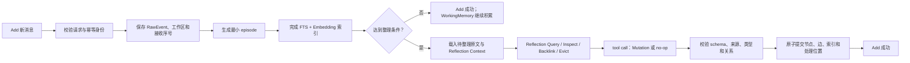
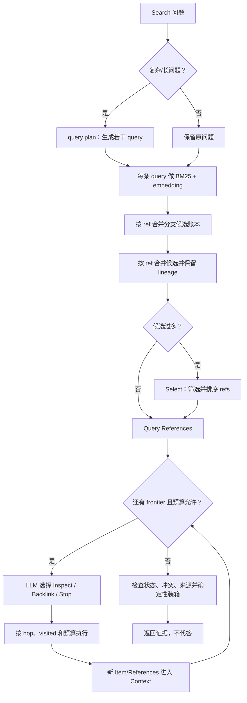
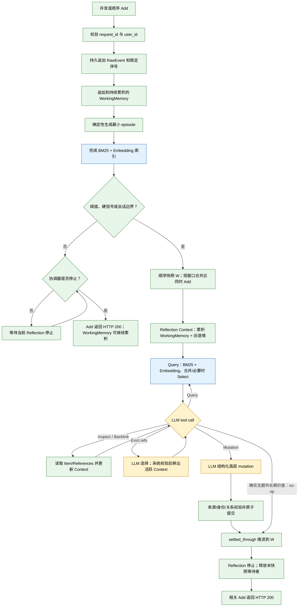
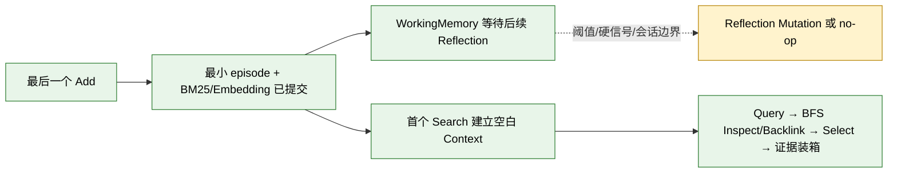

# AM-Link Add/Search 设计总览

更新日期：2026-10-11。本文是当前方法的持续更新入口，说明已经实现的二期本地链路、已有实验能支持的结论，以及仍待验证的设计目标。接口与默认值以 [`amlink/README.md`](./amlink/README.md)、[`amlink/PROTOCOL.md`](./amlink/PROTOCOL.md) 和源码为准；本文不替代它们。

## 范围与原则

结合 TinySoul 设计和当前案例完成的重构方案见[方法改进计划](./docs/phase-2/method-improvement-plan.md)。当前 `amlink/` 0.2.0 已实现并通过本地联合测试；旧二期初版归档在 `archive/phase-2/amlink-0.1.0/`。标准 Search 与 Add 内部 Reflection 复用部分算子，但拥有独立循环和语境：Search 每次从空白语境开始，只读取结构化 MemoryItem；Add Reflection 由阈值、硬信号或会话边界触发，跨 Add 维护 Reflection Workspace，因此不是每次 Add 都调用模型。每个成功 Add 先生成最小 `episode` 并完成词法/向量索引，保证 HTTP 200 后立即可检索；WorkingMemory 仍可等待后续 Reflection。若最后一次 Add 未触发 Reflection，首个 Search 直接查询它的 episode，不读取或排空 WorkingMemory，也不需要一次性阶段处理。真实模型回归已覆盖单案例和 100 问题 LoCoMo 研究切片，尚未部署或参加官方 Smoke。

AM-Link 只实现比赛约定的 **Add** 与 **Search**，由主办方执行 Answer/Eval。Search 返回有来源的证据，不生成最终答案，也不把靶场诊断 Answer 当作官方成绩。二期 0.2.0 已可在本地运行，尚未部署或参加官方 Smoke。

- 原始消息及其来源是事实依据；整理出的记忆必须能追溯到原文。
- 按 `user_id` 隔离；Add 幂等。重构目标以跨 Add 缓冲减少 Reflection 次数；每个成功 Add 先建立可检索的最小 episode，再决定是否触发 Reflection，Search 只查询已提交的结构化 MemoryItem。
- 正文保留可读叙事；类型、稳定 ref、来源和关系用于组织与校验，不要求每段消息都生成完整知识图。
- 工作过程有界，错误显式返回；服务不自行重试模型、embedding 或后台补偿。比赛调用方负责按官方规则重试。
- 区分设计、实现、实测与未知，不根据 HTTP 成功、候选召回或合成测试推断端到端正确。

## 记忆对象

| 对象 | 当前含义 | 生命周期与边界 |
| --- | --- | --- |
| `RawEvent` | 带角色、会话、顺序和可选来源时间的原始消息 | 持久保留并建立词法索引；是派生记忆的证据来源 |
| `WorkingMemory` | Add 侧尚在整理中的原文工作视图 | 当前 0.2.0 跨 Add 延续；不是标准 Search 的直接候选来源；每个 Add 的最小 episode 已承担立即可检索投影 |
| Reflection `MemoryContext` | Add 内部 Reflection 当前可见的 MemoryItem、关系、References、命中叙事、WorkingMemory 和未决线索 | 可由 `Inspect`/`Backlink` 增量扩展；LLM 可选择逐出当前可逐出的内容，系统另做预算回收；不是事实库 |
| `Reflection Workspace`（当前/目标） | 每次 Add 之间延续的 refs、来源、query 分支、图路径和未决线索 | 可压缩的派生上下文；不删除或替代 RawEvent/MemoryItem，节点状态变化后需刷新 |
| `MemoryItem` | Reflection 整理出的可引用记忆节点 | 与原文共享来源引用；多个原文可形成一个节点，一条原文也可形成多个节点 |
| `MemoryRef` | raw 或 memory 内容的稳定地址 | 用于精确读取、关联和追溯；读取时仍检查用户作用域 |
| 关系边 | 节点间的有向或对称关联 | 只表示已保存的关系，不凭可达路径推断因果或事实 |

节点类型为 `episode/person/entity/concept/event/fact`；关系为 `about/contains/supersedes/contradicts/same_event_as`。`source_refs` 是来源真源，不另存重复的 `derived_from` 业务边。`episode` 是由连续原文切分、重组出的高保真情景日志，保留 speaker、局部顺序、条件和叙事上下文；它承担结构化检索中的情景入口，但不替代 RawEvent，也不是一句抽象摘要。`daily` 是有日期的 episode 视图，不是额外节点类型；人物也不要求重复建立 entity 节点。时间表达和归一日期是可选信息，不能把接收时间冒充事件时间。

**WorkingMemory 与 MemoryItem 的关系**：WorkingMemory 像待整理的收件盘，MemoryItem 像整理后可长期引用的记忆卡。Reflection 读取新原文和相关旧卡片，再创建或更新节点与边；收件盘推进不删除原始消息。

## 当前二期实现：Add：先保存，再有界整理



1. 请求通过 schema、用户作用域及 `request_id` 幂等检查后，原文、请求状态和接收序号先落库。
2. 每条 Add 确定性生成最小 episode，完成 FTS 和 embedding 索引；这是 HTTP 200 前的必需阶段，保证未触发 Reflection 的尾部也能被标准 Search 发现。
3. 默认在待整理达到 8 条或 6000 字符时触发，更新/遗忘线索或会话尾部等信号可提前触发；未触发时 WorkingMemory 继续累积。
4. 触发后 Reflection 使用跨 Add Context，通过 tool call 选择 Query、Inspect、Backlink、Evict、Mutation 或 no-op；校验通过后才提交派生节点、边、必要向量与处理位置。这些是本地初值，不是官方规格或容量结论。

完整成功请求以相同 payload 重放时返回缓存结果，不重复调用模型；失败重放可继续尚未完成的阶段。触发且必需的阶段失败会显式返回错误，Search 对该用户返回 `425`，另一条不同 Add 返回 `409`。不把“原文已写入”伪装成完整整理成功，也不在服务内部重试。

当前 0.2.0 已按图执行：RawEvent 追加、最小 episode 建立和词法/向量索引先于 HTTP 200；只有触发条件满足时才进入跨 Add Reflection。旧 0.1.0 图和源码仍在归档中，不能作为当前实现事实。WorkingMemory 仍是 Reflection 的缓冲，不是 Search 的直接来源。

## 当前二期实现：Search：从问题找到证据闭包



1. 当前 0.2.0 Search 只在结构化 MemoryItem（包括逐 Add 的最小 episode）上做词法和向量发现；RawEvent 仅作为被选 Item 的来源回溯，不参加 Query，也没有 WorkingMemory fallback。
2. Search 是完整复合原语：query 分支先按语义 ref 合并；候选过多时由 `select` 筛选并排序；随后进入模型决定的多轮 BFS，Inspect 读取正向引用，Backlink 读取真实入边，Backlink 候选过多时再次 Select，最后确定性装箱。Reflection 内部复用这些算子但使用自己的持续语境，不与标准 Search 共享 loop。
3. 图扩展是一个有界 BFS：从 Query References 逐层读取出边和入边，再把新节点放进下一层 frontier；默认最多 3 跳、最多新增 32 个节点、每个入口最多 8 个邻居。它不会在每一跳自动重新跑 lexical 或 embedding；超限、截断和来源路径进入本地观测。当前复杂/长查询最多执行一次 query plan，Select 由候选数量和图模式触发。
4. 输出前处理 superseded、contradicts、same-event、来源和撤回状态，返回可读证据内容。最终分数用于结果排序，不应解读为事实置信度。

当前 0.2.0 默认启用结构化节点上的 lexical + embedding；embedding 是 Add 索引和 Search Query 的必需阶段。raw 只作为已选 Item 的来源回溯，不进入 Search Query，也不作为无 Item 时的 fallback。模型语境和 Select 候选都有显式上限，截断原因会进入观测；完整输入仍保留在运行档案。日期目前保留原话和可选日期字段，没有完整的区间/有效期过滤器。遗忘采用保守的整条来源屏蔽，不等于物理擦除或全局语义遗忘。SQLite 当前只支持单进程写入，向量检索线性扫描；规模与并发尚未校准。

### 已实现的 Search 与 Reflection 分开编排

两条链路复用 Query、Inspect、Backlink、BFS 和 Select 等内部算子，但上下文和生命周期不同。标准 Search 是无状态的请求级循环；Reflection 是跨 Add 延续的有状态整理循环。目标 Search 复合原语为：

```text
Query(question)
  → References（分支先按语义 ref 合并；过多时 Select）
  → LLM 驱动 BFS（Inspect / Backlink / 停止）
  → Backlink References（合并后过多时 Select）
  → Inspect 选中的 refs，得到 Item content
  → 返回最终 References + Item content
```

```mermaid
flowchart TD
  A[question + 本次空白语境] --> B{可选 Query Expansion}
  B -->|LLM：q -> q1...qn| C[Query 分支]
  B -->|原问题| C
  C --> D[BM25 + Embedding]
  D --> E[References：语义 ref + 模型可读叙事]
  E --> F[按 ref 合并分支，保留 lineage]
  F --> G{超过候选预算？}
  G -->|LLM Select| H[有序 References 子集]
  G -->|否| I[Query References]
  H --> J[进入本次 Search 语境 + frontier]
  I --> J
  J --> K{LLM tool call}
  K -->|Inspect(ref)| L[Item content + 正向 refs]
  L --> J
  K -->|Backlink(ref)| M[反向 References；过多时 LLM Select]
  M --> J
  K -->|Stop| N[活跃 Context]
  N --> O[确定性装箱并展开 Item content]
  O --> P[返回证据，不代答]

  classDef llm fill:#fff3cd,stroke:#b8860b,color:#000
  classDef deterministic fill:#e8f5e9,stroke:#2e7d32,color:#000
  class B,H,K llm
  class A,C,D,E,F,G,I,J,L,M,N,O,P deterministic
```

Query 的多个表达式如果启用，只是多个发现分支；它们在进入下一阶段前按语义 ref 合并，并保留每个分支的命中片段和方法来源。Backlink 在每一层也先合并真实入边，再在候选过多时调用 Select。Inspect 只读取已知 ref 和正向引用，本身不 Select。每个工具结果立即写入 `MemoryContext`，所以 `Inspect(ref1) → ref2 → Inspect(ref2)` 与 `Backlink(ref1) → Select → ref2 → Inspect(ref2)` 都是同一套可观测的轻量工具循环。

BFS 的“层”由编排器维护：`frontier`、`visited`、hop 和全局预算始终是系统状态；模型只从当前 frontier 选择要探索的 ref、方向和是否停止。工具产生的新 refs 进入下一层，同层可以保留多个待探索 ref。这样既保留多跳 BFS 的边界，又允许模型根据已经加入的 MemoryContext 动态决定下一步。

当前 0.2.0 中，LLM 参与 Query Expansion（可选）、Select、BFS action、显式 Evict 的选择和 MemoryItem Mutation；BM25、Embedding、分支合并、Inspect、Backlink、BFS 边界、Evict 的安全校验/执行、预算回收和最终装箱由系统确定性处理。最终装箱不再追加 Select，完整的算子输入输出表见[方法改进计划](./docs/phase-2/method-improvement-plan.md)。

停止后的 Item content 展开只是输出物化：优先复用 Context 中已有内容，否则按最终候选 ref 确定性读取正文和来源，不新增 frontier、不调用 LLM，也不重新筛选候选。

标准 Search 每次从空白请求语境开始，query expansion（若启用）、Query 候选和 BFS 结果只在本次调用中存在。Reflection 内部则对累积的 WorkingMemory 做 orientation Query，并将结果加入该用户跨 Add 保留的 Reflection 语境；模型可继续内部 Query、Inspect、Backlink 或 Evict，再进入 Mutation 或明确 no-op。二者的 operators 相似，但不是同一个 Search loop，也不共享 context。最小 episode 已在 Add 200 前进入结构化候选和索引，首次 Search 不需要额外读取或整理 WorkingMemory。`seed_refs` 不再作为用户或主编排层的概念；模型从已知引用继续探索时，直接调用 `Inspect` 或 `Backlink` 并将引用作为参数。

### 候选融合与 Refs 精炼

- 当前实现是 FTS5/BM25 搜索 raw 和 MemoryItem，embedding 只覆盖已整理的 MemoryItem；两路按倒数排名融合后共用候选窗口。
- 目标版本把 lexical + embedding 视为结构化节点发现方式：每个 query 在六类 MemoryItem 上发现候选，主体是已提交节点，包括每个 Add 的最小 episode。候选携带 kind、正文、关系和来源语义，进入 LLM 驱动的 Inspect/Backlink BFS，再做 `source_refs` 展开。raw 不作为 Search 候选，也不承担无结构化节点 fallback；要让情景可检索，由 Add 的最低 episode 投影或后续 Reflection 形成更高层 `episode`。
- 当前实现会在 Query 分支合并后、以及每一层 Backlink 候选合并后，候选超过预算时调用 `select`。它决定该候选集保留哪些 refs 及其顺序；最终装箱不再追加 Select，也不新增名为 rerank 的操作。
- `episode` 是默认情景入口，`fact/event` 偏向精确事实和状态，`person/entity/concept` 偏向身份与导航；这些是交给模型判断 BFS 起点和 select 的语义标签，不是固定最低比例或预过滤条件。
- 当前 observation v1 对新运行使用 `operation="select"`；旧运行中的 `rerank` 仅作为历史兼容类别，不再生成新的 rerank span。

### 已实现的 Add 与 Reflection 顺序状态

Add 先做有序、幂等的持久追加，并为每个请求生成最低可检索投影。WorkingMemory 跨多次 Add 累积；每个 Add 的 RawEvent 进入工作区后，系统确定性生成一个保留角色、顺序、会话、局部原文和 `source_refs` 的最小 `episode`，完成 BM25 与向量索引，再判断是否启动 Reflection。只有待整理规模、明确更正/遗忘等硬信号或会话边界满足时，才启动 Reflection。触发后，模型在积累的原文和跨 Add 保留的记忆语境上决定高层 Mutation 或真正 no-op。短并发合并窗口只合并近同时请求，不作为“批次完成”判断。



图中黄色为 LLM 参与，蓝色调用 Embedding，绿色为系统执行。最小 episode 和两路索引在 Reflection 触发判断前完成，所以非触发 Add 可以把 WorkingMemory 留给后续 Add 积累，同时已经满足 Add 200 的立即可检索要求；触发的快照按序 Reflection。`settled_through` 只表示高层 Reflection 已完成，不表示最低 episode 才刚刚可见。模型 no-op 表示不产生额外语义 Mutation，不会撤销最小 episode。

#### Add 完成后进入 Search

比赛虽然先完成全部 Add、再执行 Search，但这只影响调用顺序，不增加一个隐含的阶段收束 API。每个成功 Add 已经提交最小 episode 并完成 BM25/Embedding 索引；最后一个 Add 即使没有触发 Reflection，首个 Search 也直接建立新的空白 Context，从 episode 和其它已提交 MemoryItem 开始 Query。WorkingMemory 可继续留在 Reflection Workspace，标准 Search 不读取、消费或临时改写它。



因此不存在持久提交与临时 overlay 的阶段决策，也不存在首个 Search 的特殊尾部处理；Search 只返回证据，不代答。


## 当前二期实现：Reflection 如何复用旧记忆

整理时会把跨 Add 的工作区和已有 Reflection Context 组成检索语境，在结构化 MemoryItem 上执行 Query、候选合并/Select，并由 bounded tool loop 继续 Inspect、Backlink 或 Evict。每次结果立即写回 Reflection Context，下一步可以沿新出现的 ref 多跳；模型最后用结构化 mutation 或 no-op 终结本轮。[相关代码](./amlink/engine.py)

Reflection 提示要求先读 NEW 与 OLD，复用身份有依据的 person/concept ref，复用已有边端点，区分更新和冲突。校验器可拦截完全相同 kind/text/time 且旧来源被新来源包含的重复节点，并禁止事实/事件原地改写。[Reflection 约束](./amlink/reflection.py)

这不是全图语义去重保证：候选、Select、模型语境和 Reflection 步数都有预算；去重保护是精确相等，不合并“意思相近但措辞不同”的节点。跨会话身份辨认、别名归并、近义重复和模型漏建关系仍可能发生。单案例真实回归已经产生可检索的高层节点和完整观测；大规模运行仍需继续分析关系质量和长程冲突。

## 运行观测能看到什么

通过靶场的 `--target native --factory amlink.native:factory`，当前观测可按 Add/Search 请求检查：

- Add 原文输入、Reflection 读到的 sources/memories/edges、模型公开输出、校验后的 mutation、embedding 输入 refs、节点/关系提交产物；
- Search query plan、分开的 `discover.lexical` 和 `discover.embedding` 候选及各自分数、Inspect 正向链接、backlinks 入边、图扩展路径/访问节点/预算截断；
- `select references` 的正文候选预览、rank、score、`selected` 标记和候选预算截断，以及最终组装后的证据、阶段耗时、模型调用与 provider 用量（若返回）。

2026-10-08 LM04 真实档案中确有 query plan、多个词法/向量发现步骤、Inspect/backlinks、图遍历和模型精炼；其中精炼输入 5 个候选、输出选中 4 个。该次图遍历访问 1 个 seed、没有路径、没有截断，说明轨迹能显示“流程执行过”也能显示“没有扩展到关系”，不能把 span 存在本身解释为图推理成功。

观测仍有明确缺口：词法候选记的是 BM25 排序产生的倒数排名分数，而非原始 BM25 数值；向量候选会记录 cosine，但两路融合后的独立候选表和各路贡献没有单独 artifact。检索分数不能直接横向比较。当前统一术语是 `select`，不再使用 `rerank` 作为运行步骤名。HTTP 服务默认不连接内部 recorder；完整流程需要 native 靶场轨迹。模型输入语境和候选窗口会做有界叙事投影，原始完整内容仍在本地观测 artifact 中；页面也可按 `--max-queries` 和 `--max-spans` 降低浏览投影而不丢失运行档案。

## TinySoul 的设计影响

TinySoul 提供了“缓存与持久记忆分开”“Reflection 整理”“ref 是可定位内容”“Search 从 query 发现”“Inspect 从已知 ref 渐进读取”“反向链接补充关系”的设计启发。AM-Link 将 Markdown 文件体系改为 SQLite 中的原文、节点、边和派生索引；连续消息通过处理位置与阈值整理，而非日历驱动的 daily 任务。它没有移植 TinySoul 完整 Agent 循环、Jev 或文档写入运行时。比赛仍只有 Add/Search，Inspect/backlinks 是内部步骤。

参考：[TinySoul 记忆设计](./reference/TinySoul-Agent/docs/design/memory.md)、[Inspect/Search 原语讨论](./reference/TinySoul-Agent/docs/chat/04%20context-inspect-and-search-design.md)、[AM-Link 最小可行设计](./amlink/MVP.md)。

## 案例：理论链路与真实观察

**LM04 支出与重复提及。** 理想 Add 要识别三笔独立购买并保留金额与原文；重复的车灯提及应指向同一购买事件。Search 找齐三项及去重证据后，Answer 才计算总额。已有切片覆盖 4/4 标注来源，诊断 Answer 正确给出 `$185`；raw 基线也覆盖 4/4，当前运行没有证明图关系带来增益。[运行分析](./docs/doing/2026-10-08-amlink-answer-research.md)

**LoCoMo L04 多人物、多兴趣。** 理想路径是分别关联 Joanna 与 Nate，再检查电影和甜点两个共同兴趣及其来源。当前 top-5 覆盖 7/7 来源，但诊断 Answer 漏掉甜点；成功运行中的真实业务边为 0。因此这是“证据找齐但答案槽位不完整”，不能称作真实多跳成功。

**BEAM B02 冲突。** 理想 Add 保留两条相反事实并建立 `contradicts`；Search 同时返回两端与来源，Answer 应先说明冲突并请求澄清。实测找回了双方，但没有冲突边，Answer 先肯定再补充保留，表达仍不安全。

**LM02 时间口径。** 原始时间戳支持精确经过时长，而数据集答案按日历日计数。记忆需保留时间来源，回答还要说清问题采用的口径；否则完整召回也会被判不一致。

**遗忘短例。** 明确要求遗忘的指令和确认回声已被屏蔽，但更早的园艺建议仍能返回。当前结果证明局部来源屏蔽有效，不证明长历史中的同义偏好已彻底消失。

这些是有限切片和诊断回答，不是总体准确率或官方成绩。完整范围、Add 阶段失败及运行限制见[二期实现记录](./docs/doing/2026-10-08-amlink-implementation.md)和[Answer 复核](./docs/doing/2026-10-08-amlink-answer-research.md)。

## 验证状态与更新约定

截至本次整理，核心 Add/Search、引用校验、边界、预算、失败状态与 native 观测均已实现；相关测试最近复跑为 96 项通过、1 条依赖弃用提示。真实小样本证明了部分来源召回和简单计算，但成功样本中的图关系尚不稳定；另外已有 Reflection schema/关系校验失败导致 Add/Search 中断的档案。二期仍未部署、未参加官方 Smoke，费用也未获 provider 账单核验。

后续更新本文时：

- 每次记录日期与版本，并明确标注“已实现”“已观察”或“待验证”。
- 接口、默认预算、失败语义变化时，同步更新对应流程和 `amlink/README.md`；案例结论变化时链接具体运行与案例，不把诊断结果写成官方分数。
- 新增或改变记忆类型/关系前，说明它解决的案例难点、来源约束、预算成本及对 Reflection 输出稳定性的影响。
- 保留失败与旧轨迹；不以新的成功运行覆盖既有反例，不把未采集或未执行步骤写成成功。

实现入口：[amlink/engine.py](./amlink/engine.py)、[amlink/reflection.py](./amlink/reflection.py)、[amlink/store.py](./amlink/store.py)、[benchmark/OBSERVABILITY.md](./benchmark/OBSERVABILITY.md)。
