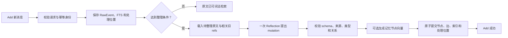
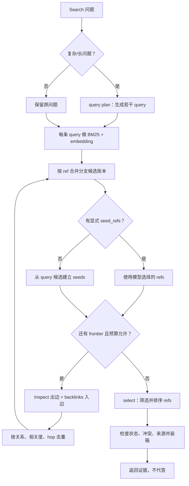
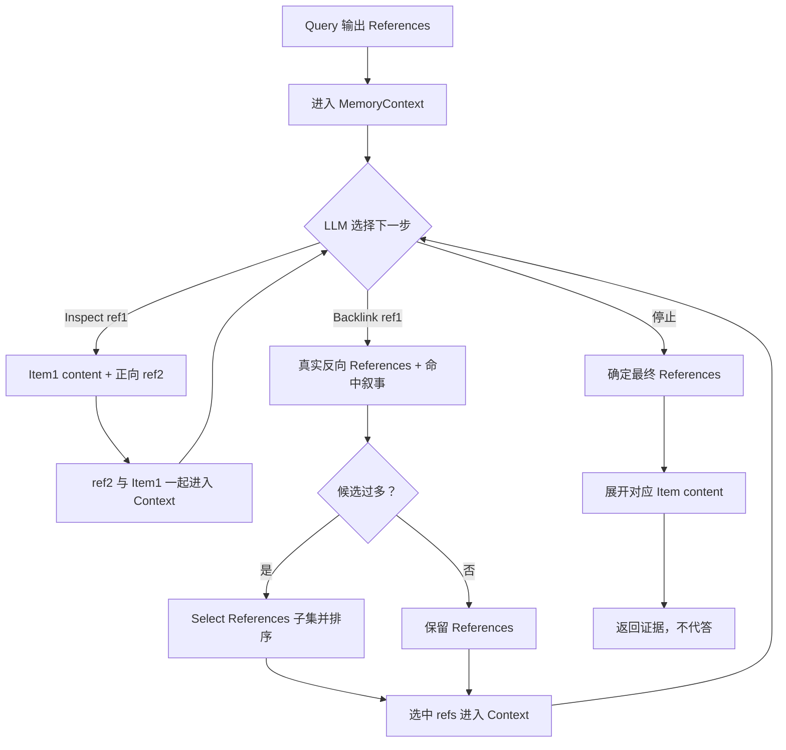
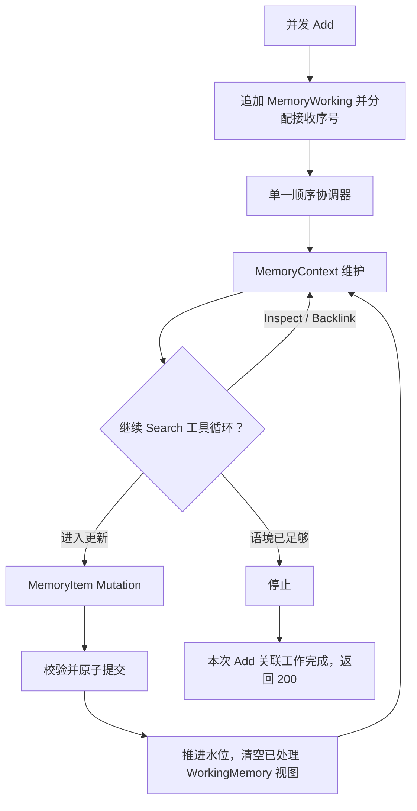

# AM-Link Add/Search 设计总览

更新日期：2026-10-10。本文是当前方法的持续更新入口，说明已经实现的二期本地链路、已有实验能支持的结论，以及仍待验证的设计目标。接口与默认值以 [`amlink/README.md`](./amlink/README.md)、[`amlink/PROTOCOL.md`](./amlink/PROTOCOL.md) 和源码为准；本文不替代它们。

## 范围与原则

结合 TinySoul 设计和当前案例提出的下一轮重构讨论稿见[方法改进计划](./docs/phase-2/method-improvement-plan.md)。本轮新增的目标是：以 `MemoryContext` 承载跨 Add 的活跃语境，以统一 `Search` 编排 Query、BFS 多跳 `Inspect/Backlink` 和 `Select`，并让 Reflection 作为顺序消费 `MemoryWorking` 的三状态协调器。下面明确区分当前二期代码与尚未实施的重构目标。

AM-Link 只实现比赛约定的 **Add** 与 **Search**，由主办方执行 Answer/Eval。Search 返回有来源的证据，不生成最终答案，也不把靶场诊断 Answer 当作官方成绩。二期 0.1.0 已可在本地运行，尚未部署或参加官方 Smoke。

- 原始消息及其来源是事实依据；整理出的记忆必须能追溯到原文。
- 按 `user_id` 隔离；Add 幂等，成功后可立即 Search。
- 正文保留可读叙事；类型、稳定 ref、来源和关系用于组织与校验，不要求每段消息都生成完整知识图。
- 工作过程有界，错误显式返回；服务不自行重试模型、embedding 或后台补偿。比赛调用方负责按官方规则重试。
- 区分设计、实现、实测与未知，不根据 HTTP 成功、候选召回或合成测试推断端到端正确。

## 记忆对象

| 对象 | 当前含义 | 生命周期与边界 |
| --- | --- | --- |
| `RawEvent` | 带角色、会话、顺序和可选来源时间的原始消息 | 持久保留并建立词法索引；是派生记忆的证据来源 |
| `WorkingMemory` | 某用户/会话尚未整理的原文工作视图 | 由 `processed_through` 处理位置和原文推导，不是另一份事实库；整理提交后推进位置 |
| `MemoryContext`（重构目标） | Reflection 和内部 LLM 调用当前可见的 MemoryItem、关系、References、命中叙事和未决线索 | 可由 `Inspect`/`Backlink` 增量扩展，也可由 `Evit` 压缩；不是事实库 |
| `Reflection Workspace`（当前/目标） | 每次 Add 之间延续的 refs、来源、query 分支、图路径和未决线索 | 可压缩的派生上下文；不删除或替代 RawEvent/MemoryItem，节点状态变化后需刷新 |
| `MemoryItem` | Reflection 整理出的可引用记忆节点 | 与原文共享来源引用；多个原文可形成一个节点，一条原文也可形成多个节点 |
| `MemoryRef` | raw 或 memory 内容的稳定地址 | 用于精确读取、关联和追溯；读取时仍检查用户作用域 |
| 关系边 | 节点间的有向或对称关联 | 只表示已保存的关系，不凭可达路径推断因果或事实 |

节点类型为 `episode/person/entity/concept/event/fact`；关系为 `about/contains/supersedes/contradicts/same_event_as`。`source_refs` 是来源真源，不另存重复的 `derived_from` 业务边。`episode` 是由连续原文切分、重组出的高保真情景日志，保留 speaker、局部顺序、条件和叙事上下文；它承担结构化检索中的情景入口，但不替代 RawEvent，也不是一句抽象摘要。`daily` 是有日期的 episode 视图，不是额外节点类型；人物也不要求重复建立 entity 节点。时间表达和归一日期是可选信息，不能把接收时间冒充事件时间。

**WorkingMemory 与 MemoryItem 的关系**：WorkingMemory 像待整理的收件盘，MemoryItem 像整理后可长期引用的记忆卡。Reflection 读取新原文和相关旧卡片，再创建或更新节点与边；收件盘推进不删除原始消息。

## 当前二期实现：Add：先保存，再有界整理



1. 请求通过 schema、用户作用域及 `request_id` 幂等检查后，原文、请求状态和 FTS 先落库。
2. 未达到整理条件时，原文仍可直接检索；默认在待整理达到 8 条或 6000 字符时触发，更新/遗忘线索或会话尾部等信号可提前触发。
3. 整理上下文包括新原文及通过词法/可选向量发现的相关旧节点与邻接内容。模型保留叙事正文，输出受严格 schema 约束的节点、关系与来源引用。
4. 校验通过后才提交派生节点、边、必要向量与处理位置；当前每批最多 32 条/18000 字符，每次 Add 最多 8 批。这些是本地初值，不是官方规格或容量结论。

完整成功请求以相同 payload 重放时返回缓存结果，不重复调用模型；失败重放可继续尚未完成的阶段。触发且必需的阶段失败会显式返回错误，Search 对该用户返回 `425`，另一条不同 Add 返回 `409`。不把“原文已写入”伪装成完整整理成功，也不在服务内部重试。

这张图描述的是 `amlink/` 0.1.0 的历史基线。下一轮重构不再把“达到阈值后的一次 Reflection”当成 Add 的完成条件，而是让 Add 追加到 `MemoryWorking` 后等待顺序协调器完成本轮必要的 `MemoryContext` 维护和 `MemoryItem` mutation；只有状态回到停止且数据可检索时才返回 `200`。完整状态机见下方“下一轮重构目标”。

## 当前二期实现：Search：从问题找到证据闭包



1. Search 先确认用户没有未完成 Add；之后在六类结构化 MemoryItem 上做 lexical 与 embedding 发现，候选携带 `episode/person/entity/concept/event/fact` kind、正文和关系语义。Search 不设置固定 kind 准入闸门；`raw` 默认不作为平行候选池，必要时由 selected nodes 的 `source_refs` 展开，或在尚无结构化节点时 fallback。
2. Search 是完整复合原语：query 分支先按 ref 合并；默认从 query 候选建立 seeds，也可以接收模型从当前上下文选择的 `seed_refs`。Inspect 沿出边读取已知节点，backlinks 查询真实入边；它们在内部组成多轮 BFS，随后加载必要来源并执行一次 select。Reflection 的 `memory.search` 和官方 Search 共用这条链，不把每个分支或每一跳单独 select。
3. 图扩展是一个有界 BFS：从 seeds 逐层读取出边和入边，再把新节点放进下一层 frontier；默认最多 3 跳、最多新增 32 个节点、每个入口最多 8 个邻居。它不会在每一跳自动重新跑 lexical 或 embedding；超限、截断和来源路径进入本地观测。当前复杂/长查询最多执行一次 query plan，select 仍只在有候选且模型开关启用时执行。
4. 输出前处理 superseded、contradicts、same-event、来源和撤回状态，返回可读证据内容。最终分数用于结果排序，不应解读为事实置信度。

embedding 默认关闭；显式开启后是必需阶段。目标版本默认在结构化节点上启用 lexical + embedding；raw 仍保留 FTS 用于来源回溯和未整理 fallback，不与节点类型争夺默认配额。日期目前保留原话和可选日期字段，没有完整的区间/有效期过滤器。遗忘采用保守的整条来源屏蔽，不等于物理擦除或全局语义遗忘。SQLite 当前只支持单进程写入，向量检索线性扫描；规模与并发尚未校准。

### 下一轮重构目标：统一 Search 与 Reflection

目标版本把 Search 明确为一个复合原语，不再把 orientation、seed 或固定的一次性 BFS 当作额外主流程：

```text
Query(question)
  → References（分支先按语义 ref 合并；过多时 Select）
  → LLM 驱动 BFS（Inspect / Backlink / 停止）
  → Backlink References（合并后过多时 Select）
  → Inspect 选中的 refs，得到 Item content
  → 返回最终 References + Item content
```



Query 的多个表达式如果启用，只是多个发现分支；它们在进入下一阶段前按语义 ref 合并，并保留每个分支的命中片段和方法来源。Backlink 在每一层也先合并真实入边，再在候选过多时调用 Select。Inspect 只读取已知 ref 和正向引用，本身不 Select。每个工具结果立即写入 `MemoryContext`，所以 `Inspect(ref1) → ref2 → Inspect(ref2)` 与 `Backlink(ref1) → Select → ref2 → Inspect(ref2)` 都是同一套可观测的轻量工具循环。

BFS 的“层”由编排器维护：`frontier`、`visited`、hop 和全局预算始终是系统状态；模型只从当前 frontier 选择要探索的 ref、方向和是否停止。工具产生的新 refs 进入下一层，同层可以保留多个待探索 ref。这样既保留多跳 BFS 的边界，又允许模型根据已经加入的 MemoryContext 动态决定下一步。

目标版本的 Reflection 不再额外抽取一套 orientation 算子。每次 Add 的新叙事作为一次普通 Query 输入，结果进入跨 Add 的 `MemoryContext`；模型可以继续调用 Search 子步骤，直到上下文足够、预算用尽或决定进入 mutation。`seed_refs` 不再作为用户或主编排层的概念；如果模型要从已知引用继续探索，直接调用 `Inspect` 或 `Backlink` 并把引用作为工具参数。

### 候选融合与 Refs 精炼

- 当前实现是 FTS5/BM25 搜索 raw 和 MemoryItem，embedding 只覆盖已整理的 MemoryItem；两路按倒数排名融合后共用候选窗口。
- 目标版本把 lexical + embedding 视为结构化节点发现方式：每个 query 在六类 MemoryItem 上发现候选，候选携带 kind、正文、关系和来源语义；候选进入 LLM 驱动的 Inspect/Backlink BFS，再做 source_refs 展开。raw 不再作为默认平行候选池，只承担来源回溯和无结构化节点 fallback。
- Search 的完整链路在分支合并、BFS 和来源展开之后调用一次 `select`。它决定哪些 refs 保留及其顺序；不新增名为 rerank 的操作或第二种排序阶段。
- `episode` 是默认情景入口，`fact/event` 偏向精确事实和状态，`person/entity/concept` 偏向身份与导航；这些是交给模型判断 BFS 起点和 select 的语义标签，不是固定最低比例或预过滤条件。
- 当前 observation v1 受控类别仍使用 `operation="rerank"`，具体 span 名为 `select evidence refs`；目标 observation v2 应统一改成 select，旧轨迹不可改写。

### 下一轮重构目标：Add 与 Reflection 的顺序状态



Add 可以并发接收，但同一记忆空间的 Reflection 按稳定接收序号消费。第一版重构不按 `user_id` 建复杂并行池；`user_id` 只承担官方要求的隔离语义，连续同值 Add 共享一张图，更换值才进入另一空间。Add 只有在属于本次请求的 MemoryContext 维护和必需 Mutation 完成、协调器回到停止，且已经可 Search 时才返回 `200`。这会让单次 Add 等待更长，但不会引入未获批的 `202` 状态语义。

## 当前二期实现：Reflection 如何复用旧记忆

整理时会把本批新原文拼成检索 query，在现有原文/记忆中发现最多 24 个候选；从中选出 MemoryItem，并补入它们的一跳正向/反向邻居，预算允许时同时带入旧来源原文和端点都已加载的边。模型上下文因此确实包含相关旧节点、ref、来源和关系，而不是只对新消息做孤立抽取。[相关代码](./amlink/engine.py)

Reflection 提示要求先读 NEW 与 OLD，复用身份有依据的 person/concept ref，复用已有边端点，区分更新和冲突。校验器可拦截完全相同 kind/text/time 且旧来源被新来源包含的重复节点，并禁止事实/事件原地改写。[Reflection 约束](./amlink/reflection.py)

这不是全图语义去重保证：旧候选受 24 项检索预算、来源竞争和模型上下文字符预算限制；去重保护是精确相等，不合并“意思相近但措辞不同”的节点。跨会话身份辨认、别名归并、近义重复、模型漏建关系仍可能发生。真实成功切片尚未稳定产生业务边，因此目前只能确认“上下文与校验机制已实现”，不能确认“重复节点和关联问题已解决”。

重构目标是在这段已有能力之上，把“相关旧记忆”从一次性 discover 结果提升为跨 Add 的 `MemoryContext`：首轮 Query 发现候选后，LLM 可以沿正向或反向引用继续扩展，直到形成足够的更新证据，再提交 MemoryItem mutation。当前代码尚未实现这套状态机。

## 运行观测能看到什么

通过靶场的 `--target native --factory amlink.native:factory`，当前观测可按 Add/Search 请求检查：

- Add 原文输入、Reflection 读到的 sources/memories/edges、模型公开输出、校验后的 mutation、embedding 输入 refs、节点/关系提交产物；
- Search query plan、分开的 `discover.lexical` 和 `discover.embedding` 候选及各自分数、Inspect 正向链接、backlinks 入边、图扩展路径/访问节点/预算截断；
- `select evidence refs` 的正文候选预览、rank、score 和 `selected` 标记，以及最终组装后的证据、阶段耗时、模型调用与 provider 用量（若返回）。

2026-10-08 LM04 真实档案中确有 query plan、多个词法/向量发现步骤、Inspect/backlinks、图遍历和模型精炼；其中精炼输入 5 个候选、输出选中 4 个。该次图遍历访问 1 个 seed、没有路径、没有截断，说明轨迹能显示“流程执行过”也能显示“没有扩展到关系”，不能把 span 存在本身解释为图推理成功。

观测仍有明确缺口：词法候选记的是 BM25 排序产生的倒数排名分数，而非原始 BM25 数值；向量候选会记录 cosine，但两路融合后的独立候选表和各路贡献没有单独 artifact。检索分数不能直接横向比较。原始界面还将 `rerank` 类别统一显示为“重新排序”，与当前实际执行的 select 不完全一致。HTTP 服务默认不连接内部 recorder；完整流程需要 native 靶场轨迹。页面预览有长度限制，完整产物留在本地运行目录供按哈希核验。

## TinySoul 的设计影响

TinySoul 提供了“缓存与持久记忆分开”“Reflection 整理”“ref 是可定位内容”“Search 从 query 发现”“Inspect 从已知 ref 渐进读取”“反向链接补充关系”的设计启发。AM-Link 将 Markdown 文件体系改为 SQLite 中的原文、节点、边和派生索引；连续消息通过处理位置与阈值整理，而非日历驱动的 daily 任务。它没有移植 TinySoul 完整 Agent 循环、Jev 或文档写入运行时。比赛仍只有 Add/Search，Inspect/backlinks 是内部步骤。

参考：[TinySoul 记忆设计](./reference/TinySoul-Agent/docs/design/memory.md)、[Inspect/Search 原语讨论](./reference/TinySoul-Agent/docs/chat/04%20context-inspect-and-search-design.md)、[AM-Link 最小可行设计](./amlink/MVP.md)。

## 案例：理论链路与真实观察

**LM04 支出与重复提及。** 理想 Add 要识别三笔独立购买并保留金额与原文；重复的车灯提及应指向同一购买事件。Search 找齐三项及去重证据后，Answer 才计算总额。已有切片覆盖 4/4 标注来源，诊断 Answer 正确给出 `$185`；raw 基线也覆盖 4/4，当前运行没有证明图关系带来增益。[运行分析](./docs/doing/2026-10-08-amlink-answer-research.md)

**LoCoMo L04 多人物、多兴趣。** 理想路径是分别关联 Joanna 与 Nate，再检查电影和甜点两个共同兴趣及其来源。当前 top-5 覆盖 7/7 来源，但诊断 Answer 漏掉甜点；成功运行中的真实业务边为 0。因此这是“证据找齐但答案槽位不完整”，不能称作真实多跳成功。

**BEAM B02 冲突。** 理想 Add 保留两条相反事实并建立 `contradicts`；Search 同时返回两端与来源，Answer 应先说明冲突并请求澄清。实测找回了双方，但没有冲突边，Answer 先肯定再补充保留，表达仍不安全。

**LM02 时间口径。** 原始时间戳支持精确经过时长，而数据集答案按日历日计数。记忆需保留时间来源，回答还要说清问题采用的口径；否则完整召回也会被判不一致。

**遗忘短例。** 明确要求遗忘的指令和确认回声已被屏蔽，但更早的园艺建议仍能返回。当前结果证明局部来源屏蔽有效，不证明长历史中的同义偏好已彻底消失。

这些是有限切片和诊断回答，不是总体准确率或官方成绩。完整范围、Add 阶段失败及运行限制见[二期实现记录](./docs/doing/2026-10-08-amlink-implementation.md)和[Answer 复核](./docs/doing/2026-10-08-amlink-answer-research.md)。

## 验证状态与更新约定

截至本次整理，核心 Add/Search、引用校验、边界、预算、失败状态与 native 观测均已实现；相关测试最近复跑为 96 项通过、1 条依赖弃用提示。真实小样本证明了部分来源召回和简单计算，但成功样本中的图关系尚不稳定；另外已有 Reflection schema/关系校验失败导致 Add/Search 中断的档案。二期仍未部署、未参加官方 Smoke，费用也未获 provider 账单核验。

后续更新本文时：

- 每次记录日期与版本，并明确标注“已实现”“已观察”或“待验证”。
- 接口、默认预算、失败语义变化时，同步更新对应流程和 `amlink/README.md`；案例结论变化时链接具体运行与案例，不把诊断结果写成官方分数。
- 新增或改变记忆类型/关系前，说明它解决的案例难点、来源约束、预算成本及对 Reflection 输出稳定性的影响。
- 保留失败与旧轨迹；不以新的成功运行覆盖既有反例，不把未采集或未执行步骤写成成功。

实现入口：[amlink/engine.py](./amlink/engine.py)、[amlink/reflection.py](./amlink/reflection.py)、[amlink/store.py](./amlink/store.py)、[benchmark/OBSERVABILITY.md](./benchmark/OBSERVABILITY.md)。
