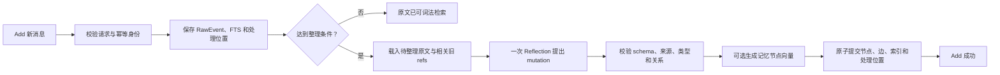
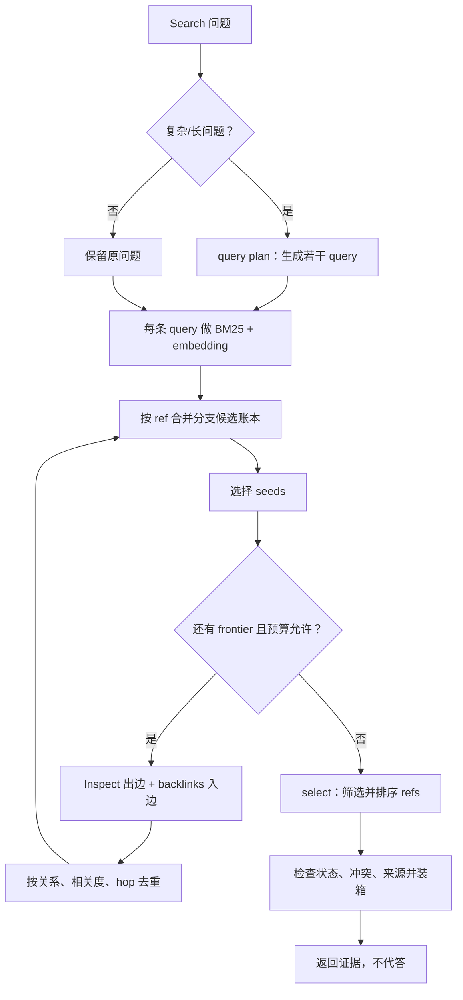

# AM-Link Add/Search 设计总览

更新日期：2026-10-09。本文是当前方法的持续更新入口，说明已经实现的二期本地链路、已有实验能支持的结论，以及仍待验证的设计目标。接口与默认值以 [`amlink/README.md`](./amlink/README.md)、[`amlink/PROTOCOL.md`](./amlink/PROTOCOL.md) 和源码为准；本文不替代它们。

## 范围与原则

结合 TinySoul 设计和当前案例提出的下一轮改进讨论稿见[方法改进计划](./docs/phase-2/method-improvement-plan.md)。向量与 select 默认开启、select 同时负责筛选和排序、Reflection 使用多 query/多轮 Search/多跳邻接、tool calling 优先，已作为设计要求或方向记录，但尚未改入代码；证据到答案辅助明确延后。本文以下继续描述当前事实。

AM-Link 只实现比赛约定的 **Add** 与 **Search**，由主办方执行 Answer/Eval。Search 返回有来源的证据，不生成最终答案，也不把靶场诊断 Answer 当作官方成绩。二期 0.1.0 已可在本地运行，尚未部署或参加官方 Smoke。

- 原始消息及其来源是事实依据；整理出的记忆必须能追溯到原文。
- 按 `user_id` 隔离；Add 幂等，成功后可立即 Search。
- 正文保留可读叙事；类型、稳定 ref、来源和关系用于组织与校验，不要求每段消息都生成完整知识图。
- 工作过程有界，错误显式返回；服务不自行重试模型、embedding 或后台补偿。比赛调用方负责按官方规则重试。
- 区分设计、实现、实测与未知，不根据 HTTP 成功、候选召回或合成测试推断端到端正确。

## 记忆对象

| 对象 | 当前含义 | 生命周期与边界 |
| --- | --- | --- |
| `RawEvent` | 带角色、会话、顺序和可选来源时间的原始消息 | 持久保留并建立词法索引；是派生记忆的证据来源 |
| `WorkingMemory` | 某用户/会话尚未整理的原文工作视图 | 由 `processed_through` 处理位置和原文推导，不是另一份事实库；整理提交后推进位置 |
| `Reflection Workspace`（目标） | 每次 Add 之间延续的 refs、来源、query 分支、图路径和未决线索 | 可压缩的派生上下文；不是事实库；不删除或替代 RawEvent/MemoryItem，节点状态变化后需刷新 |
| `MemoryItem` | Reflection 整理出的可引用记忆节点 | 与原文共享来源引用；多个原文可形成一个节点，一条原文也可形成多个节点 |
| `MemoryRef` | raw 或 memory 内容的稳定地址 | 用于精确读取、关联和追溯；读取时仍检查用户作用域 |
| 关系边 | 节点间的有向或对称关联 | 只表示已保存的关系，不凭可达路径推断因果或事实 |

节点类型为 `episode/person/entity/concept/event/fact`；关系为 `about/contains/supersedes/contradicts/same_event_as`。`source_refs` 是来源真源，不另存重复的 `derived_from` 业务边。`daily` 是有日期的 episode 视图，不是额外节点类型；人物也不要求重复建立 entity 节点。时间表达和归一日期是可选信息，不能把接收时间冒充事件时间。

**WorkingMemory 与 MemoryItem 的关系**：WorkingMemory 像待整理的收件盘，MemoryItem 像整理后可长期引用的记忆卡。Reflection 读取新原文和相关旧卡片，再创建或更新节点与边；收件盘推进不删除原始消息。

## Add：先保存，再有界整理

1. 请求通过 schema、用户作用域及 `request_id` 幂等检查后，原文、请求状态和 FTS 先落库。
2. 未达到整理条件时，原文仍可直接检索；默认在待整理达到 8 条或 6000 字符时触发，更新/遗忘线索或会话尾部等信号可提前触发。
3. 整理上下文包括新原文及通过词法/可选向量发现的相关旧节点与邻接内容。模型保留叙事正文，输出受严格 schema 约束的节点、关系与来源引用。
4. 校验通过后才提交派生节点、边、必要向量与处理位置；当前每批最多 32 条/18000 字符，每次 Add 最多 8 批。这些是本地初值，不是官方规格或容量结论。

完整成功请求以相同 payload 重放时返回缓存结果，不重复调用模型；失败重放可继续尚未完成的阶段。触发且必需的阶段失败会显式返回错误，Search 对该用户返回 `425`，另一条不同 Add 返回 `409`。不把“原文已写入”伪装成完整整理成功，也不在服务内部重试。

## Search：从问题找到证据闭包

1. Search 先确认用户没有未完成 Add；之后对原文和节点做 BM25，显式启用 embedding 时也对已整理节点做向量召回，再融合候选。
2. 候选以稳定 refs 和实际正文预览为中心。Inspect 沿出边读取已知节点，backlinks 查询真实入边；Search 在预算内组合这些原语，不暴露成额外比赛 API。
3. 图扩展是一个有界 BFS：从 seeds 逐层读取出边和入边，再把新节点放进下一层 frontier；默认最多 3 跳、最多新增 32 个节点、每个入口最多 8 个邻居。它不会在每一跳自动重新跑 BM25 或 embedding；超限、截断和来源路径进入本地观测。当前复杂/长查询最多执行一次 query plan，select 仍只在有候选且模型开关启用时执行。
4. 输出前处理 superseded、contradicts、same-event、来源和撤回状态，返回可读证据内容。最终分数用于结果排序，不应解读为事实置信度。

embedding 默认关闭；显式开启后是必需阶段。原文通道使用词法检索，尚未整理的尾部原文没有语义向量。日期目前保留原话和可选日期字段，没有完整的区间/有效期过滤器。遗忘采用保守的整条来源屏蔽，不等于物理擦除或全局语义遗忘。SQLite 当前只支持单进程写入，向量检索线性扫描；规模与并发尚未校准。

### Search 的多跳事实

上图中的回边对应当前 `amlink.engine._expand`：它维护 `frontier` 和 `visited`，对每层节点分别调用 `inspect` 与 `backlinks`，按照关系和问题词面排序邻居，再进入下一层。测试已覆盖两跳 forward/backlinks。这里的“多跳”是已知 refs 上的邻接读取；它不是 Reflection 需要补上的“多轮 query”。Reflection 当前仍是一次 `_discover` 加一跳直接边，目标改进见方法计划。

### 每次 Add 的 Reflection 工作区（目标）

官方仍只调用 Add/Search；工作区是 Add 内部的连续状态，不是新增外部 API。原文先落库，之后每次 Add 都加载用户的 `WorkingMemory` 和上一次的 Reflection 工作区。工作区保留已召回的 MemoryItem/raw refs、来源、query 分支、Inspect/backlinks 路径以及尚未解决的身份或冲突线索；它可以 compact，但不删除 RawEvent、MemoryItem 或边。

当前代码只有在待处理消息达到 8 条、约 6000 字符，或出现遗忘/更新/跨会话信号时规划 Reflection。目标方案保留这些条件作为硬信号，但不再把“本批新消息一次性检索后丢弃旧上下文”当作唯一流程：每次 Add 先做有界 orientation 并更新工作区；硬信号或上下文压力出现时进入 tool-driven Reflection。Add 没有外部 Search 问题，orientation 的 query 由当前新增叙事、工作区未决线索和已知实体/时间锚点派生；官方后续 Search 的用户问题仍是独立输入。模型可以继续 Search、Inspect、backlinks，或通过 `reflection.defer/compact` 保存有来源的紧凑状态，最后才用 `reflection.finish` 提交结构化节点和关系。已提交后工作区继续保留新旧 canonical refs，供下一次 Add 延续。

### 候选融合与 Refs 精炼

- FTS5/BM25 对原文和节点检索；embedding 只覆盖已整理的 MemoryItem 节点，不覆盖待整理 raw。候选按两路排名做倒数排名融合，当前候选上限 64。
- 查询复杂度满足条件且 `search_model=true` 时，先做一次 query plan，再调用一次 `select`。模型读取带实际正文的候选预览，返回有序 refs 子集；AM-Link 随后会过滤掉未选 refs。
- 这一步在语义上更接近 TinySoul 的 **select**：它决定哪些 refs 保留及其顺序；不是严格意义上对全部候选打分后完整重排的 **rerank**。当前 observation v1 受控类别使用 `operation="rerank"`，具体 span 名为 `select evidence refs`，网页阶段标签会显示“重新排序”。因此查看运行时应以 span 名和模型返回 refs 为准；该显示标签容易造成误解。
- 当前没有节点类型或关系类型的最低召回配额。候选融合按词法/语义相关度排序；若存在 MemoryItem 候选，会优先从中选图遍历 seeds，再受每入口邻居数和总节点数限制。此策略减轻 raw 占据图遍历入口，但不保证 `person/fact/event` 或 `about/contains/contradicts` 的平衡；`about/contains` 也没有额外关系分数加成。

## Reflection 如何复用旧记忆

整理时会把本批新原文拼成检索 query，在现有原文/记忆中发现最多 24 个候选；从中选出 MemoryItem，并补入它们的一跳正向/反向邻居，预算允许时同时带入旧来源原文和端点都已加载的边。模型上下文因此确实包含相关旧节点、ref、来源和关系，而不是只对新消息做孤立抽取。[相关代码](./amlink/engine.py)

Reflection 提示要求先读 NEW 与 OLD，复用身份有依据的 person/concept ref，复用已有边端点，区分更新和冲突。校验器可拦截完全相同 kind/text/time 且旧来源被新来源包含的重复节点，并禁止事实/事件原地改写。[Reflection 约束](./amlink/reflection.py)

这不是全图语义去重保证：旧候选受 24 项检索预算、来源竞争和模型上下文字符预算限制；去重保护是精确相等，不合并“意思相近但措辞不同”的节点。跨会话身份辨认、别名归并、近义重复、模型漏建关系仍可能发生。真实成功切片尚未稳定产生业务边，因此目前只能确认“上下文与校验机制已实现”，不能确认“重复节点和关联问题已解决”。

## 运行观测能看到什么

通过靶场的 `--target native --factory amlink.native:factory`，当前观测可按 Add/Search 请求检查：

- Add 原文输入、Reflection 读到的 sources/memories/edges、模型公开输出、校验后的 mutation、embedding 输入 refs、节点/关系提交产物；
- Search query plan、分开的 `discover.lexical` 和 `discover.embedding` 候选及各自分数、Inspect 正向链接、backlinks 入边、图扩展路径/访问节点/预算截断；
- `select evidence refs` 的正文候选预览、rank、score 和 `selected` 标记，以及最终组装后的证据、阶段耗时、模型调用与 provider 用量（若返回）。

2026-10-08 LM04 真实档案中确有 query plan、多个词法/向量发现步骤、Inspect/backlinks、图遍历和模型精炼；其中精炼输入 5 个候选、输出选中 4 个。该次图遍历访问 1 个 seed、没有路径、没有截断，说明轨迹能显示“流程执行过”也能显示“没有扩展到关系”，不能把 span 存在本身解释为图推理成功。

观测仍有明确缺口：词法候选记的是 BM25 排序产生的倒数排名分数，而非原始 BM25 数值；向量候选会记录 cosine，但两路融合后的独立候选表和各路贡献没有单独 artifact。检索分数不能直接横向比较。原始界面还将 `rerank` 类别统一显示为“重新排序”，与当前实际执行的 select 不完全一致。HTTP 服务默认不连接内部 recorder；完整流程需要 native 靶场轨迹。页面预览有长度限制，完整产物留在本地运行目录供按哈希核验。

## TinySoul 的设计影响

TinySoul 提供了“缓存与持久记忆分开”“Reflection 整理”“ref 是可定位内容”“Search 从 query 发现”“Inspect 从已知 ref 渐进读取”“反向链接补充关系”的设计启发。AM-Link 将 Markdown 文件体系改为 SQLite 中的原文、节点、边和派生索引；连续消息通过处理位置与阈值整理，而非日历驱动的 daily 任务。它没有移植 TinySoul 完整 Agent 循环、Jev 或文档写入运行时。比赛仍只有 Add/Search，Inspect/backlinks 是内部步骤。

参考：[TinySoul 记忆设计](./reference/TinySoul-Agent/docs/design/memory.md)、[Inspect/Search 原语讨论](./reference/TinySoul-Agent/docs/chat/04%20context-inspect-and-search-design.md)、[AM-Link 最小可行设计](./amlink/MVP.md)。

## 案例：理论链路与真实观察

**LM04 支出与重复提及。** 理想 Add 要识别三笔独立购买并保留金额与原文；重复的车灯提及应指向同一购买事件。Search 找齐三项及去重证据后，Answer 才计算总额。已有切片覆盖 4/4 标注来源，诊断 Answer 正确给出 `$185`；raw 基线也覆盖 4/4，当前运行没有证明图关系带来增益。[运行分析](./docs/doing/2026-10-08-amlink-answer-research.md)

**LoCoMo L04 多人物、多兴趣。** 理想路径是分别关联 Joanna 与 Nate，再检查电影和甜点两个共同兴趣及其来源。当前 top-5 覆盖 7/7 来源，但诊断 Answer 漏掉甜点；成功运行中的真实业务边为 0。因此这是“证据找齐但答案槽位不完整”，不能称作真实多跳成功。

**BEAM B02 冲突。** 理想 Add 保留两条相反事实并建立 `contradicts`；Search 同时返回两端与来源，Answer 应先说明冲突并请求澄清。实测找回了双方，但没有冲突边，Answer 先肯定再补充保留，表达仍不安全。

**LM02 时间口径。** 原始时间戳支持精确经过时长，而数据集答案按日历日计数。记忆需保留时间来源，回答还要说清问题采用的口径；否则完整召回也会被判不一致。

**遗忘短例。** 明确要求遗忘的指令和确认回声已被屏蔽，但更早的园艺建议仍能返回。当前结果证明局部来源屏蔽有效，不证明长历史中的同义偏好已彻底消失。

这些是有限切片和诊断回答，不是总体准确率或官方成绩。完整范围、Add 阶段失败及运行限制见[二期实现记录](./docs/doing/2026-10-08-amlink-implementation.md)和[Answer 复核](./docs/doing/2026-10-08-amlink-answer-research.md)。

## 验证状态与更新约定

截至本次整理，核心 Add/Search、引用校验、边界、预算、失败状态与 native 观测均已实现；相关测试最近复跑为 96 项通过、1 条依赖弃用提示。真实小样本证明了部分来源召回和简单计算，但成功样本中的图关系尚不稳定；另外已有 Reflection schema/关系校验失败导致 Add/Search 中断的档案。二期仍未部署、未参加官方 Smoke，费用也未获 provider 账单核验。

后续更新本文时：

- 每次记录日期与版本，并明确标注“已实现”“已观察”或“待验证”。
- 接口、默认预算、失败语义变化时，同步更新对应流程和 `amlink/README.md`；案例结论变化时链接具体运行与案例，不把诊断结果写成官方分数。
- 新增或改变记忆类型/关系前，说明它解决的案例难点、来源约束、预算成本及对 Reflection 输出稳定性的影响。
- 保留失败与旧轨迹；不以新的成功运行覆盖既有反例，不把未采集或未执行步骤写成成功。

实现入口：[amlink/engine.py](./amlink/engine.py)、[amlink/reflection.py](./amlink/reflection.py)、[amlink/store.py](./amlink/store.py)、[benchmark/OBSERVABILITY.md](./benchmark/OBSERVABILITY.md)。
