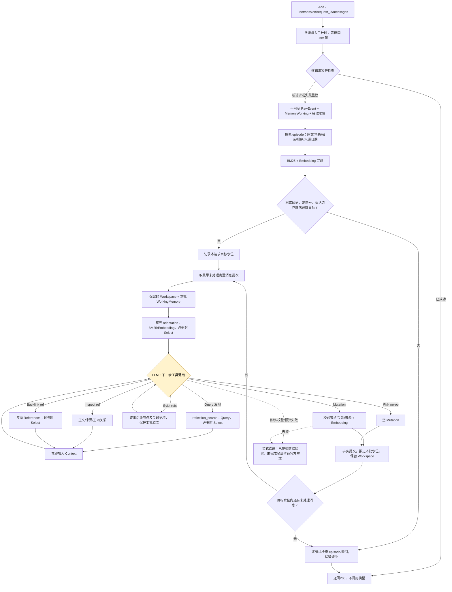
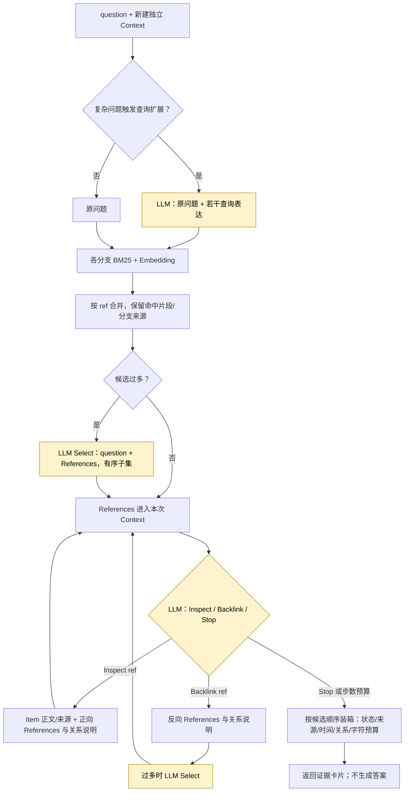
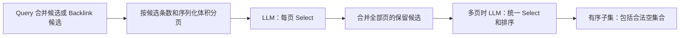

# AM-Link Add/Search 设计总览

更新：2026-10-11，当前实现 **0.2.1，核心工程修复已实施，方法质量继续验证**。只提供 Add/Search，主办方负责 Answer/Eval；未部署或参加官方 Smoke。

入口：[实现与配置](./amlink/README.md)、[协议](./amlink/PROTOCOL.md)、[执行计划](./docs/phase-2/method-improvement-plan.md)。[0.2.0 核心审计](./docs/doing/2026-10-11-amlink-core-audit.md)保存失败基线；[0.2.1 修复与方法议题](./docs/doing/2026-10-11-amlink-core-repairs.md)记录本轮改变及验证。旧实验不自动变成新版本成绩。

## 不变的边界

- RawEvent 原文可追溯，按 user_id 隔离；成功 Add 幂等且立即可检索。
- **Add 的停止不等于清空缓冲。** 未触发整理时，完成最低 episode 与索引即可停止；已经触发 Reflection，则本请求要求的处理水位必须终结后才返回200。
- 标准 Search 每次创建独立语境，只检索已提交 MemoryItem，不读取或排空 WorkingMemory，不与 Reflection 共享 loop，不代答。
- 依赖失败和真正无结果分开；无内部模型重试、后台补偿或静默降级。

## 对象及当前实现

| 对象 | 含义与实现 |
| --- | --- |
| RawEvent | 不可变消息，保留角色、原文、会话、接收顺序和可选来源时间；不作为独立 Query 候选 |
| MemoryWorking / WorkingMemory | accepted/settled 水位之间尚未整理的消息；可跨 Add 积累，触发后按完整消息有界分批 |
| MemoryItem | episode/person/entity/concept/event/fact；最低 episode 是原文投影，更高层归纳另建节点 |
| MemoryRelation | about/contains/supersedes/contradicts/same_event_as；有端点和来源校验，有被过滤关系及原因记录；语义正确性仍须案例复核 |
| References | 带语义和短区分后缀的稳定 ref + 类型、可读标签、片段、来源、关系说明；不是孤立编码 |
| MemoryContext | 当前活跃节点、引用、关系和来源；送模型前对完整序列化请求作预算检查，裁剪投影不改底层原文 |
| Reflection Workspace | 跨 Add、跨批次保留已加载结构；提交不再清空，下一批刷新节点/来源；模型可以 Evict 活跃内容 |

最低 episode 禁止被 Mutation 改写成摘要。所有新增/改变的节点（含派生 episode）先嵌入，再事务提交正文、词法/向量索引和关系。旧实验里已损坏的 episode/向量不会自动重建；新实验使用独立数据库。

## Add：有界整理完成后再返回

黄色节点是 LLM 决策。Query/Backlink 的候选过多时另调用 LLM Select；Embedding 单独记录为模型调用。

本地总期限默认 **1740秒（29分钟）**，包含 Add 排队；单次模型等待最多120秒且受剩余总期限约束。不为空耗时而等待。触发后默认每批最多32条完整消息、约18000字符，最多64批；对整包工具定义、提示词、语境和原文按80000字符检查。单条消息本身无法容纳时显式失败，不通过截短全部原文假装完成。

目前仍是**同用户锁内同步处理**，尚未实现计划中的“并发先追加、短窗口合并、单全局协调器”。延长期限不能代替吞吐验证。默认8条/6000字符以及现有更新关键词触发规则暂未调整；真实主实验曾过早触发，下一步需要改进触发的语义。

内部工具名 `reflection_search` 目前实际是 Query/Select；后续 Inspect/Backlink 由同一 Reflection loop 决策。这已补上探索能力，但还不是“一次调用完整复用标准 Search”的嵌套实现，需避免术语误导。

## Search：候选发现、按引用探索、证据输出

Inspect 不做 Select。同一 ref 可以先 Inspect 再 Backlink；去重单位是“ref + 操作”。工具结果立即影响下一次决策，可以走 `Inspect A → 新引用 B → Inspect B` 或 `Inspect A → Backlink A → Inspect C`。默认最多3跳、8步；跳数只是上限。当前模型可以在不同深度已知引用中选择，属于有深度约束的引用探索，并非严格逐层清空队列的经典 BFS。

Query 候选数量不再耗尽图扩展名额。节点扩展、深度、操作去重、模型语境投影分别记录，便于判断“有边没走”“没看到正文”和“候选被裁剪”。

### Select 的当前语义

输入是 **question + 候选 References**，不再复制整个调用方 Context。每条候选带类型、语义引用、标签、命中片段及其覆盖情况、来源和命中分支；最低 episode 预览优先展示问题相关的完整消息及日期。

默认每页最多24条。全局选择装不下时缩短候选预览并标明覆盖，仍保留全部已选候选；极端身份信息本身超预算则明确失败。分页能降低单次输入，却可能在页内阶段错删互补证据，需要后续同切片对照；不把分页本身当成召回改进的证明。

### 最终证据装箱

不再按旧检索分数覆盖 Select 顺序。最低 episode 展开来源原文一次，不同时重复展示整篇 episode 和相同原文；派生节点保留自身叙事，已完整出现的来源用前卡片引用复用。分配每张卡片的可用篇幅，优先保留完整消息；长消息片段和省略来源逐项记录。时间显示为明确的来源UTC时间，不能混同存储时间 `created_at`，也不擅自断言相对时间对应的事件日期。

当前停止后仍从“Query有序候选 + 图新增候选”装箱，图候选追加在后；还没有按模型最终证据闭包重新组织结果。集合题、多跳题的互补证据可能仍被前面候选挤占。这是下一步方法设计问题，不在本轮增加未经讨论的答案分析器。

## 验证与未完成事项

确定性回归覆盖失败 Add 重放、分批与水位、完整消息预算、最低 episode 保护、派生节点嵌入、Select 分页/空集/顺序、Inspect/Backlink 交替、Workspace 保留和日期去重装箱。旧真实积压1445条在副本中用替身模型分48批消费完，最终代码最大模型输入74596字符；**这不是实际 Reflection 质量验证**。真实模型小案例的节点/边、路径、证据完整性及限制见[修复报告](./docs/doing/2026-10-11-amlink-core-repairs.md)。

待讨论：会话边界与容量触发如何支持更完整视角；跨批维护后再 Mutation 的粒度；人物身份复用和有来源的稀疏导航图；复杂问题的互补证据需求；长节点 Inspect 的进一步披露。当前预算投影可能隐藏重要内容，完整 Workspace 也尚无自动容量回收策略。

0.2.0失败基线仍为：主实验148 episode/4 event/0关系，Add41/145、Search92/100。时间题缺来源日期，多跳题选中证据在装箱丢失，29个最低 episode 被摘要覆盖。新代码修复不追溯改写这些历史事实，也不能从小样本推算完整比赛得分。

埋点遵循[可观测标准](./benchmark/OBSERVABILITY.md)。新增批次/水位、整包预算、分页/合并 Select、关系过滤、图上下文增量和逐项装箱决策；HTTP默认不采集内部轨迹。网页是观测投影，未采集/被浏览器投影截断均应标为未知，不能推断模型没有执行。
