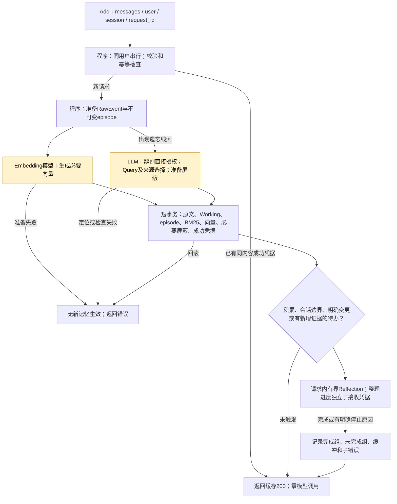
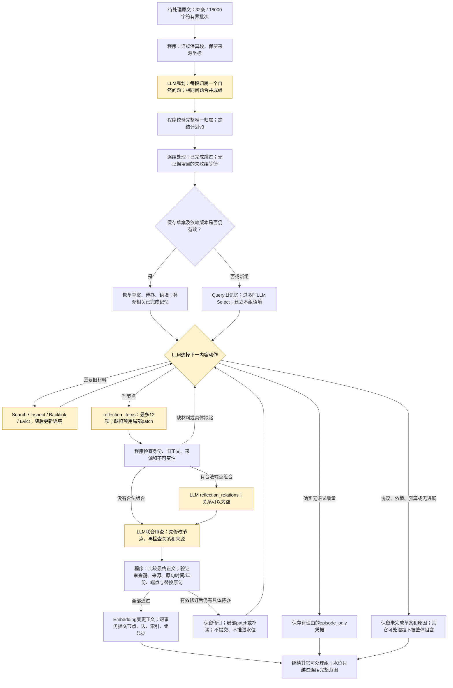
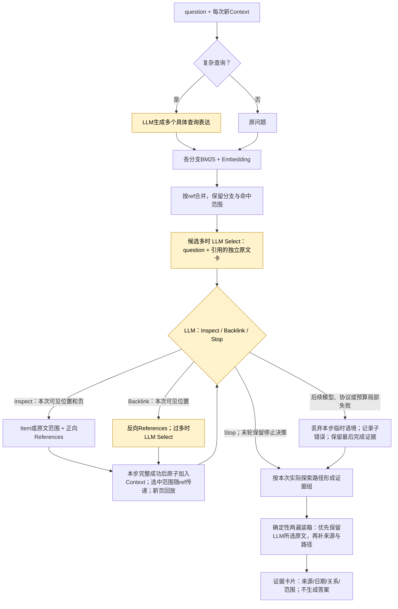

# AM-Link Add/Search 当前设计

下一轮[工具协议、局部整理修订与有界对话执行计划](docs/phase-2/2026-10-28-tool-contract-and-reflection-repair-plan.md)已完成设计核对，**尚未实施**。拟统一当次工具 schema 校验，明确审查依据与持久支持，让局部语义问题能够在保留合法草案的基础上修订；工具往返需先解决编号、预算和可见证据一致性再做实测取舍。下文仍描述 `b000d96` 当前实现，不能把计划流程当作已运行事实。

2026-10-28 补充审计：[整理与模型接口核查](docs/doing/2026-10-28-reflection-api-audit.md)。当前方法已提交为 `b000d96`。`strict=true` 已发送，但实际代理输出仍有 schema 违规；当前各轮重新渲染 context，没有原生工具往返续接。审查合法结果的 `remaining_work` 能续做，解码/来源校验异常尚可能直接结束该组。文中的协议统一、局部修订与有界工具回放是建议，未改变下述实现。

更新：2026-10-28。当前默认实现已接入[节点保真与简明来源审查计划](docs/phase-2/2026-10-28-memory-integrity-review-plan.md)：全部旧 episode 正文/时间不可覆盖，可变导航节点只使用当前支持来源，节点审查直接交付最终正文，检查语气、原句时间及年份依据。[实施核对](docs/doing/2026-10-28-memory-integrity-implementation.md)区分工程与真实语义结果。此前 [Add/Search 对外契约](docs/phase-2/2026-10-27-add-search-contract-and-convergence-plan.md)不变；未部署，完整历史整理、图语义和多跳质量尚未验收。

## 边界和对象

2026-10-28 已按开源榜要求迁移：默认智增增 `text-embedding-v4` / 1024 维、每批最多 10 条，LLM 相关组件继续 `gpt-4o-mini`。旧模型配置明确拒绝，旧向量库/缓存已备份清理。231 项回归和两个新库切片通过接入验证，但 Reflection 审查及图质量仍未验收。见[迁移报告](docs/doing/2026-10-28-embedding-v4-migration.md)。长文本仍是完整 Item 一次嵌入，8192 tokens 边界与多片段索引的[后续设计](docs/phase-2/2026-10-28-embedding-v4-migration-plan.md)尚未实施，不通过截断原文绕过限制。

只提供Add/Search，主办方负责Answer/Eval。公开接口不变；同用户锁内同步执行，没有内部模型重试、后台补偿、自动重建或静默降级。默认开启embedding及模型Select。

MemoryItem包含episode/person/entity/concept/event/fact，MemoryRelation保留about/contains/supersedes/contradicts/same_event_as。最低episode是不可变原文投影，RawEvent保存原始角色、会话、顺序及来源时间。Reflection 不再新建摘要 episode；历史派生 episode 的正文/时间也不可改。新信息写 fact/event，重复陈述保持原正文并补来源；只有 person/entity/concept 导航内容可修改。user_id是隔离空间，不等于真实speaker；角色也不能代替人物姓名。

References始终是语义ref加可读叙事。MemoryWorking保留尚未整理的原文，Workspace是跨Add保留的有界活跃语境。位置清单、原文片段和证据组都是内部调用/输出组织，不新增长期记忆类型。

## Add：原子接收，按积累整理

```mermaid
flowchart TD
 A[Add：messages / user / session / request_id] --> B[程序：同用户串行；校验和幂等检查]
 B -->|已有同内容成功凭据| Z[返回缓存200；零模型调用]
 B -->|新请求| C[程序：准备RawEvent与不可变episode]
 C --> D[Embedding模型：生成必要向量]
 C -->|出现遗忘线索| F[LLM：辨别直接授权；Query及来源选择；准备屏蔽]
 D --> T[短事务：原文、Working、episode、BM25、向量、必要屏蔽、成功凭据]
 F --> T
 D -->|准备失败| E[无新记忆生效；返回错误]
 F -->|定位或检查失败| E
 T -->|回滚| E
 T --> G{积累、会话边界、明确变更或有新增证据的待办？}
 G -->|未触发| Z
 G --> R[请求内有界Reflection；整理进度独立于接收凭据]
 R -->|完成或有明确停止原因| O[记录完成组、未完成组、缓冲和子错误]
 O --> Z
 classDef model fill:#fff3cd,stroke:#b8860b,color:#000
 class D,F model
```

原文、索引与成功凭据在同一个事务中生效，远程模型调用不持有数据库事务。准备或必要索引失败，本轮没有可检索材料；提交后响应丢失不代表撤销，同 ID 重放读取成功凭据。Reflection 的模型、预算或协议失败不撤销已可靠接收的原文，也不伪称整理完成。

每个成功 Add 都有可检索的最低 episode。因此保留 WorkingMemory 不妨碍标准 Search，Search 不需要处理尾部。显式授权遗忘属于必要可见性约束：模型区分当前用户指令与引述，定位来源，随接收事务屏蔽来源和派生索引；定位失败不接受该请求。当前屏蔽粒度是完整原消息及依赖节点，不支持一句话的选择性擦除；来源查找有预算，语义定位仍需核验。

普通积累为至少 2 个 Add 且达到 8 条或 6000 正文字符；单 Add 达到 64 条或约 36000 序列化字符可容量触发。会话边界优先处理此前连续前缀，明确变更可处理到当前末端。默认请求期限 1740 秒含排队，模型单次最多 120 秒；整理提前最多 5 秒收束，给进度保存和返回留余量。同用户仍串行，无后台补偿或内部网络重试。

```mermaid
flowchart TD
 A[待处理原文：32条 / 18000字符有界批次] --> P[程序：连续保真段，保留来源坐标]
 P --> G[LLM规划：每段归属一个自然问题；相同问题合并成组]
 G --> V[程序校验完整唯一归属；冻结计划v3]
 V --> N[逐组处理；已完成跳过；无证据增量的失败组等待]
 N --> R{保存草案及依赖版本是否仍有效？}
 R -->|是| S[恢复草案、待办、语境；补充相关已完成记忆]
 R -->|否或新组| O[Query旧记忆；过多时LLM Select；建立本组语境]
 S --> L
 O --> L{LLM选择下一内容动作}
 L -->|需要旧材料| Q[Search / Inspect / Backlink / Evict；随后更新语境]
 Q --> L
 L -->|写节点| I[reflection_items：最多12项；缺陷项用局部patch]
 L -->|确实无语义增量| NO[保存有理由的episode_only凭据]
 I --> C[程序检查身份、旧正文、来源和不可变性]
 C -->|缺材料或具体缺陷| L
 C -->|有合法端点组合| E[LLM reflection_relations；关系可以为空]
 C -->|没有合法组合| U
 E --> U[LLM联合审查：先修改节点，再检查关系和来源]
 U --> K[程序：比较最终正文；验证审查键、来源、原句时间/年份、端点与替换原句]
 K -->|有效修订后仍有具体待办| W[保留修订；局部patch或补读；不提交、不推进水位]
 W --> L
 K -->|全部通过| T[Embedding变更正文；短事务提交节点、边、索引、组凭据]
 T --> NEXT[继续其它可处理组；水位只越过连续完整范围]
 NO --> NEXT
 L -->|协议、依赖、预算或无进展| FAIL[保留未完成草案和原因；其它可处理组不被整体阻塞]
 FAIL --> NEXT
 classDef model fill:#fff3cd,stroke:#b8860b,color:#000
 class G,L,Q,I,E,U model
```

分组是工作进度，不是长期节点。原文按自然边界切成不超过 1800 字符的段；每段工具键直接填写自然问题，消除“groups 数组＋动态组号表”的交叉编号。提示强调同一人物属性属于同一整理组，组内仍可创建多个合适的节点。组数最多 12，组内最多 16 次主决策；审查分页另计但共享请求及实际模型预算。

`reflection_plans` 保存逐组完成凭据与未完成草案；后组可以先完成，低水位不会导致已分组材料被重新规划。只在相关旧记忆、已完成组产物或草案依赖有变化时重新考虑失败组；相同成功 Add 重放永不再次整理。恢复前核对原文版本及已加载旧节点版本，失效草案不覆盖新记忆。积压没有后台自动清理，必须如实计入未完成质量指标。

数据库 `user_version=3`，计划格式 v3，Workspace 阅读格式仍为 v2。旧数据库显式拒绝，不静默迁移或重新处理旧研究数据。新实验一律新库。

## Search：独立语境，沿引用读取证据

```mermaid
flowchart TD
 A[question + 每次新Context] --> B{复杂查询？}
 B -->|是| C[LLM生成多个具体查询表达]
 B -->|否| D[原问题]
 C --> Q[各分支BM25 + Embedding]
 D --> Q
 Q --> U[按ref合并，保留分支与命中范围]
 U --> S[候选多时 LLM Select：question + 引用的独立原文卡]
 S --> L{LLM：Inspect / Backlink / Stop}
 L -->|Inspect：本次可见位置和页| I[Item或原文范围 + 正向References]
 L -->|Backlink：本次可见位置| K[反向References；过多时LLM Select]
 I --> P[本步完整成功后原子加入Context；选中范围随ref传递；新页回放]
 K --> P
 P --> L
 L -->|Stop；末轮保留停止决策| G[按本次实际探索路径形成证据组]
 L -->|后续模型、协议或预算局部失败| T[丢弃本步临时语境；记录子错误；保留最后完成证据]
 T --> G
 G --> F[确定性两遍装箱：优先保留LLM所选原文，再补来源与路径]
 F --> O[证据卡片：来源/日期/关系/范围；不生成答案]
 classDef llm fill:#fff3cd,stroke:#b8860b,color:#000
 class C,S,L,K llm
```

Search近似于Query＋有深度上限的Inspect/Backlink多跳＋候选过多时Select。默认最多3跳、8次主决策；模型可从不同深度已知引用选择，并非逐层清空队列的经典BFS。续页不新增节点/跳数，但消耗决策步数。Inspect不做Select；Backlink返回带叙事引用，正文按需Inspect。

Query合并后候选超过5个就执行Select。每个引用的互补原文片段独立作为临时输入卡；不再固定24张分页，按包含工具定义的完整80000字符预算组织。不再固定每 ref 最多 4 段；按总模型输入预算、候选数量和分支贡献分配原文窗口，短原文尽量完整，同源重叠合并。分页保留后统一Select，再按ref合并，保留模型顺序及选中范围；全局保留集仍装不下时显式`select_merge_budget`，不再次暗中截短证据。

Select仍输出References子集，不新建节点、不生成答案。模型看到问题、任务用途、语义ref、原文、角色、日期与命中说明；Search寻找回答证据，Reflection寻找旧目标及支持来源。完整坐标/hash/覆盖信息进入观测。语义去重和互补性由模型判断，尚不能宣称更大的同屏候选已经带来稳定收益。

Select的coverage说明仅接受绑定实际选中位置的条目，传入后续语境作为待核验的导航说明，不能当成原文或答案。主选择中非法位置仍失败；无效辅助说明被剔除并记录。查询向量仅在同一语境内按问题原文和模型指纹精确复用，候选检索重新执行，不缓存过期结果。BFS分别记录新引用和新增读取范围；范围增长不等于语义增益。

BFS选择清单展示真实入边/出边数量与类型，帮助模型判断何时查Backlink；这只是导航元数据，不冒充读过正文。已有时间信息但缺地点等属性时，模型可沿相关主体的反链找补充事实。仍由模型选择具体引用与动作，无kind准入闸门。当前L1实测是一轮Backlink补入相关事件后由来源装箱闭合；尚不能称为连续2—3跳普遍增益。

首次 Query、查询 embedding 和必要 Select 是基础检索，失败仍报错，合法空结果才返回空集。后续 BFS/Backlink Select 的模型、协议或预算错误可终止扩展，从最后完成语境装箱；失败步骤的引用、路径、读取凭据和覆盖说明全部丢弃。数据库或来源完整性错误仍报错，有候选但无法合法装箱也不伪装为空集。无内部重试。

## 引用位置和模型实际可见范围

所有工具模型调用共用`narrative.py`渲染器，预算预检和实际HTTP使用同一正文。输入按任务、新材料、相关旧记忆、草案缺项及可读动作位置组织；工具输出仍保持结构化。原话、角色、来源日期、限定条件和引用不改写成自由摘要。内部观测保留完整结构，但不把哈希和范围账本反复塞入模型正文。

关系审查必须同时显示两端实际可见的正文，包括Inspect放在disclosures里的旧正文；修改旧节点时额外呈现修改前正文，身份比较所需的已读正文也进入审查。不会偷偷从数据库读取模型未见材料。小组联合审查先校正节点，再明确按修改后的端点判断边；未明确重新判断的依赖边撤销。缺端点显式失败；节点被撤销后，依赖边一起撤销。这个保证是材料和处理一致，不是模型判断必然正确。

每次先投影，再冻结显式编号清单；工具枚举、模型输入与解码共用这一清单。字典排序不能改变工具位置。Inspect/Backlink/Evict仅提供本次实际允许的位置，空清单不会生成空整数枚举。Select使用同样的页内位置规则，合法空集、去重并保持顺序；混入无效位置会显式失败。

内部片段记录origin_ref、正文digest、Python Unicode字符半开区间[start,end)及原文text。标签、来源时间和省略说明放在范围外。Reference能保留同源多个分支命中窗口；重叠合并，二次裁剪同步收缩范围。

10月26日窗口改为整段命中区分度排序，来源加入长度归一化，短消息尽量完整保留；同分时为命中后限定语留空间。Select对多来源episode保留互补窗口，不再按分支数限制来源个数。原文、字符预算及遗漏账本不变。查询扩展不得自行确定相对时间；包含输入未提供数值的分支会被记录并丢弃，无模型重试。这只检查数值，不保证所有扩展语义正确。

Inspect按已有Item及其合法sources分页。模型选择可读页编号，不直接提供任意偏移；每次最多展示8个续页选项，后续调用可继续披露。新页先占预算，再填自动预览；页的保护在下一次成功主决策实际包含该页后解除，Select/embedding不解除。实际输入范围进入receipt：它证明材料送达并返回，不证明模型理解。遗忘、删除或版本变化使缓存范围及阅读依据失效。

Select实际选中的原文卡不再机械裁成520字符；若被语境整体预算移除，仍记录实际遗漏。Reflection待办与提交共用missing_material检查；冲突两侧的来源缺口映射到真实来源页，读入后保护至验证。C2真实复验仍有protected_workspace_budget，不能称长文语境已稳定。

receipt统一收集disclosures、items正文、sources片段、References片段及完整working，按来源版本和范围记录。明确读取记录与当前可见范围分开：自动展示正文不冒充Inspect；历史取过但当前隐藏的页可以重新选择。页映射在模型调用前冻结，结果按同一映射解码。Reflection默认先读节点正文，再按需读长来源；必要语义正文保留至本批终结。来源片段中的query说明最多160字，避免重复携带完整维护问题。

## Reflection依据与Workspace

旧候选资格先于词法/向量候选上限检查；本批及未来最低episode不能冒充旧身份匹配。更新旧目标、改旧关系端点需要同版本Inspect，且所需正文在最终Mutation调用可见。冲突/替代两侧需要可见来源；新引用来源必须是已展示来源，继承来源不被冒充新增支持。

旧范围非空时，每个新person需要绑定new ref的定向旧身份Query：成功空结果允许no_prior_match；有候选需读相关候选。数据库确认本用户的有效旧资格范围完全为空时，使用明确scope_empty凭据，不执行无意义空Query，不伪造query_performed。全新端点之间的关系可由本批原文直接支持。程序校验的是材料与过程，人物语义是否正确仍需实测。

Workspace格式v2，有界至2×context_chars，节点和引用受现有预算限制。先折叠非保护来源页、未展示来源预览，再逐出可释放节点/引用；保护的是必需范围，不是节点的所有旧来源。v0/v1清除旧阅读凭据、恢复有效引用；未知格式显式拒绝。原文始终留在数据库。

非法方向/类型/端点会阻止整批Mutation，不自动翻转或静默过滤。反馈列出缺项、引用位置和合法方向；材料已齐时动态提示重新提交。错误未解决时不提供Stop，空Mutation不得掩盖失败。同样错误且无新增材料时显式无进展失败；无法留下补材料和提交槽时报告材料预算不足。

写入工具的Item身份限定为新`new:`标签或已加载的明确可修改节点。预检先拒绝虚构旧身份、全部旧episode正文/时间覆盖、重复摘要episode和非法类型，再进入材料门槛。唯一流程先暂存节点/遗忘草案，再通过`reflection_relations`提出关系。模型可明确撤回非法边，但合法性、材料和最终提交仍整包检查，未完成时不移动水位。新组不继承另一组草案；同一未完成组仅恢复版本仍有效的草案。

Reference/Inspect中实际展示过且本次有可见凭据的来源，即使重复的`workspace.sources`缓存已折叠，也可在校验时回载；仍检查同用户和冻结批次资格。隐藏来源和未来来源不会因存在数据库里就自动变成可引用依据。

当前支持与历史溯源分开：只有正文/时间完全不变的节点保留旧支持并增加新支持。person/entity/concept 内容变化时仅提交本次审查选中的来源，不再无条件并回旧来源；历史提交仍在观测轨迹中。预检与最终提交都执行 episode/fact/event 不可变规则。

审查先读原文，再读草案，草案旁重列直接引用的原句。以“写出忠于证据的最终陈述”代替仅判真伪，保留可能性、未决定、否定和明确承诺。time_expression 必须确实出现在所选可见原句中；标准化日期年份必须出现在所选原文，发言时间/引用名称不能替代。原文缺年或只有未锚定相对时间时保留原话、日期字段留空。程序仅验证必要引用/年份条件；人物、日期的完整语义及关系仍由模型审查，不能视为金标准。

### 唯一的分步草案与来源对应

首次只提出节点或有明确理由的no-op。有效草案不能任意重写；只有明确节点缺陷才开放`reflection_patch_items`。局部操作先移除草案项再upsert，未提及项保持原样，绝不借此删除数据库原文。纯关系缺陷只修关系。材料补齐由程序自动推进，不再提供`reflection_validate`或`reflection_commit`。可供下次调用不等于模型已读，提交依据仍来自实际返回的内容调用和审查输入。

程序调度小组联合审查：把实际已展示的直接来源、本组原文及冲突两侧原文组织为带位置的片段表，关系同时呈现两端正文。节点不再让模型分类 keep/drop/revise，而是直接返回最终完整正文、时间和支持来源，正文为 null 才撤销。程序比较前后记录保留或修订；关系仍可保留/撤销。理由字段不能替代正文。修改节点后保留的边需明确列出重审端点，否则撤销。整包过大按节点先、关系后分页，后页读取已修订端点，完整原文不暗中截断。分页源位置保留原编号，不当作新列表下标。

来源表含角色、原文范围、主要工作/共享背景及发言时间；发言时间不是事件日期。模型选择来源位置，程序展开原文范围和版本作为实际审查凭据。全撤销只有明确`episode_only`理由且没有真实更新/冲突/遗忘待办才可完成；仍有语义增量、缺材料或预算不足不能伪装no-op。审查不再输出 `resolution/needs_revision`，而是顶层每个明确 `uN` 键的最终内容及 `remaining_work` 具体待办；没有 reviews 容器及每项重复的 anyOf 动作分支。有效修改先留在草案，再进入补读或局部 patch；无新材料或实质修订不反复审查。重复 JSON 键、错键、缺键和数组代替映射均拒绝，不猜对应关系。

审查后再次执行材料、身份、来源、类型和闭合检查，通过后一次提交。语义审查是模型判断，不是事实金标准；仍需检查主体、时序和关系。person导航的姓名可以由speaker支持；对话role不代表职业。supersedes 要求同主体/同属性/同条件下明确替代，审查必须提供可在所选来源中逐字核对的 replacement_quote。泛化、特例、另一场事件或共同兴趣不构成替代。原句存在仍不自动证明语义成立。

别名去重后两个不同提案引用若归为同一真实节点，其自环作为重复关系消除并记录；直接提出同ref自环仍被拒绝。没有跨类型自动反转、内部网络重试或后台补偿；维护/后续探索失败可以停止并保留已完成交付，但子错误与未完成范围必须记录。

完整长记录仍会暴露身份/预算/结构化输出与关系语义问题。已通过的小窗口不能代表完整人物记录已验收；逐运行版本、失败与调用量见实施报告。

## 最终证据组合与研究对照

保持Query/Select根引用顺序，把实际探索且有用的图补充、连接节点、关系及其来源放入较早根引用的证据组。A→C的有效补充不再默认排在所有初始候选之后。supersedes/contradicts两侧不提前过滤。卡片id仍是已有根ref，score表达返回顺序；证据组不是存储节点。

两遍分配先给各组支持窗口，其中 Select 选中原句优先，再补剩余材料。没有新增关系且原文范围已由前卡完整交付的纯 episode 不再占名额；其它材料最终按来源版本/范围去重，共享标记只指向已经返回的卡片。路径未闭合时去掉未闭合关系陈述，仍可返回独立支持材料。逐项记录来源缺失或预算裁剪。声明来源完整、路径闭合、答案证据充分是三件事，最后一项默认unknown。

模型参与证据组合的入口是Select选中的具体原文卡；装箱确定性展开这些原文，并补关系路径及来源。没有追加一个能重写证据的生成器。历史`packing_experiment.compare`属于靶场离线对照工具，不能当成当前服务的备用执行分支，也不承诺未来切换。

## 观测及验证

[观测标准](benchmark/OBSERVABILITY.md)沿用span及artifact协议。当前记录引用清单、工具参数、原文范围回执、Reflection门槛缺项、缓冲目标及证据组决策；网页显示有界预览和原始artifact路径，旧记录缺项显示未知。HTTP 默认不开内部轨迹。native 网页分别展示接收结果、整理完成/待办/未分组数量、图扩展局部停止与子错误；旧记录缺字段显示未知，不能从父步骤 200 推断内部全成功。

[本轮实施报告](docs/doing/2026-10-27-delivery-contract-implementation.md)将工程验收、真实诊断和待验证质量分开。记录冻结范围、主归属/背景、程序推进、实际联合审查范围、完成决定、向量复用与探索增量；真实源码哈希与方法快照保留于运行目录。窗口/锚点是辅助诊断，完整材料样本单列；失败Add后的Search、模型局部异常终止、未评分任务分别报告，不合成总体准确率。

历史[10月23日闭环](docs/doing/2026-10-23-reflection-convergence-implementation.md)、[前轮实施](docs/doing/2026-10-23-evidence-loop-implementation.md)、[100题重跑](docs/doing/2026-10-14-amlink-100-rerun-review.md)不能当作当前代码成绩。继续扩大独立历史和数据类型覆盖，并通过冻结数据库/输入定位退化；当前没有Answer准确率或新一轮100题总体结论。
