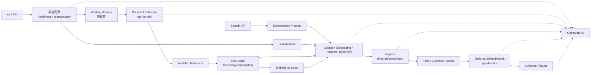

# AM-Link 二期方法设计草案

日期：2026-10-08。状态：设计初稿，待小样本实现和讨论修订。

## 1. 目标

AM-Link 二期要解决的不是“把更多文本塞进向量库”，而是把连续会话中的原始证据整理成可追溯、可更新、可检索的记忆，并在官方 Answer 需要时交付一组足够完整的证据。

它必须同时满足两组要求：

1. 比赛要求的 Add/Search 边界：Add 只写入，Search 只返回证据；主办方负责 Answer/Eval；原始请求、用户隔离、幂等、立即可检索和严格错误不能被内部设计破坏。
2. 数据集暴露的真实难点：时间和相对日期、明确更新与矛盾、重复事件去重、分子分母配对、人物归属、多跳关系、偏好迁移、隐私最小化、遗忘后不回流、隐式反馈和长历史噪声。

核心判断是：

> **记忆方法的最小交付物不是一条“看起来相关”的摘要，而是带来源、状态和关系的证据集合。**

## 2. 三个参考点如何合并

### 2.1 从一期 AM-Link 保留什么

一期已经证明了几项不可丢失的基础：

- 原始消息是事实真源；结构化事实、索引和 Markdown 都是可重建派生物；
- `user_id` 是唯一检索隔离边界，所有节点、向量、链接和路径都必须带用户作用域；
- `request_id` 幂等，重复 Add 不重新调用模型，payload 冲突明确失败；
- Add 先把 raw/working/FTS 事务提交，再谈可选增强；Search 失败或模型不可用时保留确定性证据；
- 结构化 mutation 必须声明 source event，版本、有效时间、状态和 evidence group 不能只存在于模型提示词里；
- lexical、embedding、时间和图关系是互补信号，任何一路失败都不能假装整个记忆成功；
- Search 内的模型只能规划 query、选择候选或排序，不能生成最终答案。

这些规则直接进入二期基础层，不作为可选特性。

### 2.2 从 TinySoul-Agent 提炼什么

TinySoul 的长期 Agent 记忆不能原样搬进只有一次 Add/一次 Search 的比赛服务，但其中的语义可以收敛成内部机制：

| TinySoul 机制 | AM-Link 二期取法 | 不直接照搬的部分 |
| --- | --- | --- |
| 连续会话活动 Memory | 每个 user 的 `WorkingMemory` 热缓存，先接收原文和待整理线索 | 不把缓存当唯一真源；不等待日切才让 raw 可检索 |
| daily 日志 | 按事件日期或 `undated` 的 evidence group，保存来源顺序和原文 | 比赛没有完整 Agent 日历，不把接收日期冒充事件日期 |
| entity/concept/fact/note/ref | 采用稳定 `MemoryRef` 和 typed links，供 Inspect 和 Search 内部使用 | 不要求官方响应暴露内部 Markdown 路径 |
| Reflection | Add 达到阈值或出现高风险信号时，执行一次有界结构整理 | 不运行无限后台队列、独立长时间 Agent Turn 或 Jev |
| Inspect | 已知 ref 的有界正文、direct refs、backlinks 和证据邻接 | 不做公开的交互式工具循环；由 Search 内部确定性展开 |
| Search | 从 query 发现 seed refs，再做 filter/select/rerank 和证据闭包 | 不让 Search 直接回答问题 |
| 渐进披露/continuation | 内部候选页和运行观测保存完整快照，避免一次展开过多 | 官方 top_k 响应仍是一次有限结果，不引入额外 API |

这里的关键转换是：**TinySoul 的“Agent 自主逐步检查”变成 AM-Link 的“确定性边界 + 少量受约束模型决策”**。这样保留方法思想，同时符合比赛的延迟、成本、可复现和只提供 Add/Search 的要求。

### 2.3 数据集告诉我们的设计检查

当前 26 个案例可以按“必须交付的证据形状”分成几组：

| 数据难点 | 代表案例 | Add 必须保存 | Search 必须共同返回 |
| --- | --- | --- | --- |
| 更新/当前态 | BEAM B01 | 同一属性的旧值、新值、顺序和来源 | 当前值；必要时附更新链 |
| 矛盾/待澄清 | BEAM B02、PerLTQA P02 | 两端陈述、时间和 `contradicts` | 双方证据和冲突状态 |
| 去重/聚合 | LM04、LM07 | 事件身份、金额/物品、重复提及和来源 | 全部独立项及重复关系 |
| 分子/分母 | LM05 | 数值、统计口径、主体和日期 | 分子与分母成对出现 |
| 多人物交集 | LoCoMo L04 | 人物归属、兴趣、会话来源 | 两个主体的证据覆盖 |
| 偏好迁移 | LM06 | 稳定偏好和一次性场景分离 | 偏好证据与当前任务分离 |
| 条件分支 | CL-bench C02 | 规则、数字、适用条件和未知条件 | 规则与当前实例同时出现 |
| 隐私/遗忘 | PersonaMem PV03/PV04 | 许可、敏感等级、撤回作用域和失效状态 | 过滤敏感内容，旧 ref 不回流 |
| 隐式反馈 | PersonaMem-v3 V303 | 行为原值、对象、时间和推断边界 | 只使用 query 时间之前的证据 |

“证据完整”不能用 top-k 命中率替代。每个案例都应在本地运行中列出 required evidence slots，观测实际返回了哪些槽位。

## 3. 总体架构



每个 user 的数据空间包含四层：

1. **原始层**：`RawEvent`，保留 role、content、source timestamp、session、request 和稳定事件 ID；
2. **活动层**：`WorkingMemory`，保存最近连续会话、未整理事实、待解决冲突和已发现 ref；
3. **知识层**：`MemoryRef` 及其 typed links，表达事实、实体、概念、daily 和证据组；
4. **检索层**：全文、embedding、时间和图邻接索引，全部可由原始层与知识层重建。

数据库或文件布局可以沿用一期 SQLite/WAL 思路，但二期实现必须把“真源、派生索引、可读投影”分成明确 owner。Markdown/JSON 视图用于诊断和恢复，不作为唯一事务真源。

## 4. 稳定 ref 和事实状态

### 4.1 Ref 类型

建议第一版只实现以下 ref 类型，避免过早引入 TinySoul 的全部文档种类：

| `kind` | 含义 | 典型内容 |
| --- | --- | --- |
| `event` | 原始 Add 消息 | role、原文、来源时间、session |
| `daily` | 日期或 undated 的证据容器 | 同一事件时间范围内的原文指针 |
| `entity` | 人、物、地点、组织 | 规范名、别名、类型、相关事实 |
| `concept` | 主题或长期兴趣 | 跨场景语义连接 |
| `fact` | 可独立引用的原子事实 | 陈述、主体、时间、版本、证据组 |
| `evidence_group` | 需要共同交付的证据集合 | 分子/分母、人物两侧、事件链 |

稳定 ID 必须由服务生成并在 user 命名空间内唯一。名称、摘要或模型输出不能直接成为主键。跨用户同名实体不能合并。

### 4.2 Fact 状态

每个 fact 至少包含：

```text
memory_id
user_id
canonical_key
statement
kind / status / version
event_time / time_expression
valid_from / valid_to
confidence
source_event_ids
evidence_group_id
created_at / updated_at
```

`status` 建议使用：

- `active`：当前可用事实；
- `superseded`：被明确更新替代，但历史问题仍可能需要；
- `conflict`：与另一事实互相矛盾，尚未决定哪一条有效；
- `tombstoned`：撤回、隐私或删除规则阻断，默认永不返回。

“最新”只能由明确的更新关系、有效时间或 query 的 current/history 意图决定，不能用数据库写入时间简单覆盖旧值。`contradicts` 不等于 `supersedes`；这正是 BEAM B02 失败的核心。

### 4.3 Typed links

第一版 links 控制在可解释集合：

`derived_from`、`supports`、`contradicts`、`supersedes`、`mentions`、`about`、`participant`、`occurred_on`、`same_event_as`、`related_to`。

每条 link 带 `from_ref`、`to_ref`、relation、source refs、created_at 和可选 confidence。反链由索引派生，不在两端重复维护。

## 5. Add：热缓存驱动的有界反思

### 5.1 Add 的两条路径

每次 Add 分为“硬路径”和“增强路径”：

**硬路径必须完成：**

1. 校验协议、user_id 和消息顺序；
2. 用稳定规则生成 RawEvent ID；
3. 在一次事务中写入幂等记录、原始事件、WorkingMemory 追加片段和原文 lexical 索引；
4. 提交后立即可以通过 Search 找到原始证据；
5. 记录 `add.raw_commit=ok`，然后返回官方成功响应。

**增强路径按阈值触发：**

1. 同一 user 的新事件达到消息数/字符数阈值；
2. session 发生切换；
3. 发现明显的更新、否定、冲突、敏感信息或 ask-to-forget 信号；
4. 上一次 reflection 留有尚未处理的热缓存。

增强路径只在当前请求的有界预算内运行。若没有下一次 Add，热缓存不需要依赖后台任务才能检索；原文 Search 已经是可用记忆。默认不恢复一期的隐藏补偿队列。

### 5.2 Reflection 输入

`gpt-4o-mini` 不接收完整用户历史，而接收：

- 本次 Add 的新 RawEvent；
- WorkingMemory 当前窗口；
- 通过 lexical/embedding/时间/图索引找到的相关 ref 和内容预览；
- 与这些 ref 相邻的一跳 direct refs/backlinks；
- 已知的 evidence group、版本、状态和待解决冲突。

模型看见的每条候选都带稳定 ID，便于输出引用。模型不能凭空创建没有 source_event_ids 的事实，也不能读取或写入其他 user 的 ref。

### 5.3 Mutation 输出

模型只输出结构化 mutation，不编辑 Markdown，不返回自然语言总结：

```json
{
  "upsert_entities": [],
  "upsert_concepts": [],
  "upsert_facts": [
    {
      "op": "create|revise|contradict|tombstone",
      "canonical_key": "user.preference.hotel.view",
      "statement": "用户偏好景观好的住宿",
      "source_event_ids": ["event:..."],
      "evidence_group_id": "group:...",
      "event_time": null,
      "valid_from": null,
      "valid_to": null
    }
  ],
  "links": [],
  "forget_rules": [],
  "unresolved_conflicts": []
}
```

确定性校验器必须检查：

- schema、用户作用域和 source refs 是否存在；
- 新事实是否有 source event；
- revise/supersede 是否指向同一 canonical key；
- tombstone 是否覆盖原始来源、派生 fact 和索引过滤；
- mutation 是否试图写入 query、答案、rubric 或未来事件；
- 同一批 mutation 的版本和 link 是否自洽。

校验失败时不应用该批结构化 mutation；原始事件仍保持可检索，观测明确标记 `reflection.error`。成功的 mutation 与索引更新必须原子提交，避免 Search 看到半套图。

### 5.4 缓存何时清空

只有在本批 mutation 和相关派生索引完成后，WorkingMemory 才把对应事件推进 watermark。失败或超时则保留未整理事件，下一次 Add 可以重试同一逻辑工作；重试不能重新追加 RawEvent，也不能复制已经提交的 fact。

这里的“重试”是下一次请求内的可恢复工作，不是隐藏后台补偿。是否允许在一次 Add 内对同一模型请求做一次 schema 修复，需要以真实延迟/费用实验决定；默认最多一次受控修复，不能叠加多层重试。

## 6. Search：从 query 到证据闭包

### 6.1 Inspect 和 Search 的分工

**Search** 是从无到有：给定 query，在用户空间中发现与问题相关的 seed refs。

**Inspect** 是从已知 ref 出发：读取该 ref 的有界正文、direct refs、证据组和反链，返回可继续探查的 refs 和内容预览。

比赛接口只公开 Search，但 Search 内部可以调用 Inspect。这样保留 TinySoul 的语义分工，又不引入第二个公开 endpoint。

### 6.2 Search 管道

Search 由以下有限操作组成，既可以由确定性代码执行，也可以由 SearchPlan 指定是否启用某个阶段：

1. `query_discovery`：从 query 提取关键词、实体、时间、否定、比较/聚合信号和候选 query variants；
2. `directory`：限制检索空间，例如某个 entity、session、日期范围、fact kind 或 evidence group；
3. `discover`：lexical、embedding、时间和直接状态索引并行产生候选；
4. `backlinks`：从 seed ref 查询真实反链，补充“谁支持/提到/替代了这个事实”；
5. `inspect`：读取候选 ref 正文、source event 和 direct links，形成 InspectView；
6. `filter`：应用 user、status、时间有效性、隐私和撤回过滤；
7. `select`：在候选内容预览上选出与 query 或证据槽位相关的 ref；
8. `rerank`：结合 query relevance、证据覆盖、时间、状态、图距离和重复度稳定排序；
9. `evidence_close`：补齐同一 evidence group 或多跳关系所需的支持/矛盾证据；
10. `emit`：将有界 EvidenceCard 转成官方 `data[]`，不生成答案。

### 6.3 Discovery 和 Inspect 的内容要求

候选不是只有 ref ID。每个候选预览至少包含：

- ref id、kind、status、version；
- 可读标题和正文片段；
- source event / daily 来源；
- 事件时间、source timestamp 和时间精度；
- direct refs、反链数量和 evidence group；
- lexical/semantic/temporal/graph 的内部分数（只进观测和模型输入，不直接暴露为答案）。

这解决 TinySoul 设计中“模型不能只看一串 links”的问题，也避免 Search 误把相关的摘要当成完整事实。

### 6.4 Query plan

对简单的实体/短语查询，可以只使用确定性 plan；对时间、更新、矛盾、多人物交集、聚合和条件分支问题，才启用一次 `gpt-4o-mini` query plan。plan 只能输出：

```json
{
  "intent": "fact|current_state|history|aggregation|relation|preference|constraint|abstention",
  "query_variants": ["..."],
  "filters": {"entities": [], "time": null, "status": ["active", "conflict"]},
  "required_evidence": [
    {"slot": "numerator", "kind": "fact"},
    {"slot": "denominator", "kind": "fact"}
  ],
  "expansion": {"max_hops": 1, "include_backlinks": true}
}
```

plan 不能写答案，也不能把一个相似句子宣布为已满足的 evidence slot。计划器失败、超时或 schema 不合法时，回退到确定性 query + lexical/temporal plan。

### 6.5 Select 和 Rerank 的区别

- `select` 回答“哪些候选值得继续看”，输入是带正文预览的候选，输出稳定 ref IDs；
- `rerank` 回答“这些候选的证据顺序如何”，输入已经是候选集合，输出 rank/score；
- `filter` 是确定性约束，不能被模型偷偷绕过；
- `evidence_close` 不是相似度排序，而是检查必要的支持、矛盾、分母、另一人物或上一版本是否缺失。

如果启用模型，Search 最多使用有限的 query plan 和 select/rerank 调用；调用次数、输入输出 token、超时和失败都必须进入观测。不能把 Inspect 设计成模型自由循环。

### 6.6 EvidenceCard

内部最终结果建议先组成 EvidenceCard，再映射成官方 result：

```text
EvidenceCard
  primary_ref: fact/entity/event
  statement: 已保存的原子事实
  source_refs: 直接支持它的 raw/daily refs
  related_refs: 版本、冲突、分母、另一人物或多跳节点
  status: active/superseded/conflict/tombstoned
  temporal: 原始表达 + 可解析范围
  completeness: required slots 中已覆盖的集合
```

如果 top_k 或 Answer 上下文允许，primary fact 和必要 source 可以拆成多条结果；如果必须压缩，则 `content` 中组合已保存证据，但不能丢掉来源、否定和冲突状态。两种策略都要在案例上比较完整证据覆盖。

## 7. 关键案例的理论链路

### LM04：支出去重

```text
Add: 25 链条、40 车灯、120 头盔、车灯重复提及
  ↓
Reflection: 识别 event identity，建立 same_event_as / evidence_group
  ↓
Search: 发现三项事件 + 重复关系，而不是只返回相似句
  ↓
Answer: 对独立事件求和 = 185
```

若 Add 只存摘要，链路在结构化处断；若 Search 只返回链条和车灯，链路在证据覆盖处断；若三项都返回但没有重复关系，链路在 Answer 的去重处断。

### LM05：分子和分母

```text
Add: 女性领导岗位 20；公司领导岗位总数 100
  ↓
Search plan: intent=aggregation，required slots=numerator+denominator
  ↓
Inspect/filter: 校验同一公司、同一统计口径和日期
  ↓
Answer: 20 / 100 = 20%
```

只检索到“女性领导岗位”而没有分母时，Search 应返回已知证据但不能声称证据闭合；这比返回一个看似完整的错误百分比更可诊断。

### BEAM B02：冲突而非更新

```text
Add: 2024-03-10 “已取得 Key”
Add: 后续 “从未真正取得 Key”
  ↓
Reflection: 两个 fact 都保留，建立 contradicts，不自动 supersede
  ↓
Search: 同时返回双方来源和 conflict 状态
  ↓
Answer: 说明前后矛盾，请求澄清
```

真实 Mem0 重跑中，Search 已返回双方，但 Answer 选择了后者。这说明“召回正确”仍不足以保证回答正确，AM-Link 至少要把冲突关系和来源一起交给官方 Answer。

### PV04：遗忘不回流

```text
Add: 用户曾喜欢手工艺品
Add: 用户明确要求忘记该偏好
  ↓
Reflection: 写入 tombstone/forget rule，关联原始来源、fact、摘要和索引
  ↓
Search: 先执行隐私/撤回过滤，再做候选排序
  ↓
Answer: 可以给一般礼物建议，不引用已撤回偏好
```

如果只删除一条摘要而保留旧 raw/vector，旧偏好仍可能被 Search 找到；这是一条必须单独观测的链路。

## 8. 时间、隐私和错误边界

### 时间

保存四类时间：事件发生时间、消息 source timestamp、接收时间、结构化节点生命周期时间。`yesterday`、`last month` 等原始表达必须保留；解析失败时使用 `unknown`，不能用 ingested_at 冒充事件时间。

### 隐私和撤回

敏感信息默认不进入长期画像。当前任务需要使用的敏感原文可以留在受控 raw scope，但不能无条件进入 fact、embedding 或 Answer context。撤回必须使 raw、派生 fact、摘要、反链和向量在 Search 最终过滤前都失效；删除失败必须显式观测。

### 错误分类

| 失败位置 | 可保留的能力 | 不能声称 |
| --- | --- | --- |
| Add schema/DB 失败 | 无 | Add 成功 |
| Reflection 模型失败 | raw、working、lexical Search | 结构化整理完成 |
| Embedding 失败 | lexical、时间和已提交 ref | 语义召回完整 |
| Query plan 失败 | 确定性 discovery/Inspect | 复杂意图已识别 |
| Select/Rerank 失败 | 稳定确定性排序 | 模型筛选成功 |
| Graph/ref 不一致 | 可验证 raw evidence | 多跳证据闭合 |
| Search 空结果 | 明确无结果 | 系统故障或用户没有相关事实 |
| 撤回过滤失败 | 可记录错误 | 记忆已删除 |

所有错误都要区分 `error`、`empty`、`skipped`、`degraded` 和 `replay=cached`。观测未采集时是 `unknown`，不能填成成功。

## 9. 与比赛和观测接口的对应

AM-Link 内部事件沿用 `benchmark/OBSERVABILITY.md`：

```text
add
  ├─ raw_commit
  ├─ reflection.extract
  ├─ mutation.validate
  ├─ store/index
  └─ model (每一次真实 gpt/embedding 调用)
search
  ├─ query_plan
  ├─ discover.lexical / discover.semantic / discover.temporal
  ├─ inspect
  ├─ filter
  ├─ select / rerank
  ├─ evidence_close
  └─ emit
```

每个阶段引用 source/memory/query/result/context artifact。`candidates` 记录 rank、score、selected；最终 context（如果本地实验有 Answer 侧）单独保存，不把 Answer 反向写入记忆。运行观测要能回答：

1. 事实有没有被 Add 保存；
2. 结构化事实来自哪些原文；
3. Search 找到了哪些候选、排除了哪些候选；
4. 哪个 evidence slot 缺失；
5. Answer 实际看到了什么；
6. 失败是方法问题、数据切片问题还是 provider 依赖问题。

## 10. 评价方法

二期早期不追求一个混合总分，至少分别记录：

- raw immediate recall：Add 后原文是否可找回；
- evidence any/complete：至少一个必要证据、全部必要证据的比例；
- source fidelity：结果能否追到正确 source event；
- state correctness：更新、冲突、superseded、tombstone 是否正确；
- chain coverage：多跳路径是否闭合；
- answer-side correctness：只在独立 Answer/Eval 运行后报告；
- latency、model calls、input/output tokens、embedding calls、费用和降级比例。

LM04、LM05、BEAM B02、PV04 应作为第一批回归案例；LoCoMo L04、LM06 和 CL-bench C02 用来检查证据闭包、偏好迁移和条件分支。完整数据集扩展必须在固定切片和 holdout 上进行，不能边看答案边调排序。

## 11. 当前结论和待修订处

当前最稳妥的二期方向是：

1. 先实现 raw + hot buffer + lexical immediate Search；
2. 再加入可追溯 ref/mutation 和确定性 Inspect；
3. 以证据槽位和状态过滤约束 hybrid Search；
4. 最后按复杂度选择性调用 `gpt-4o-mini` 做 plan/select/rerank；
5. 每一步都用同一套观测和案例回放比较收益。

仍需在讨论后定稿的内容记录在 [PLAN.md](./PLAN.md)，主要是 reflection 触发时机、Search 模型调用条件、EvidenceCard 组合形式、embedding 默认配置和冲突结果策略。未完成这些讨论前，不开始二期公网部署，也不把本设计称为已经实现的方法。
