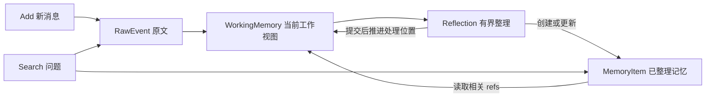

# AM-Link 二期最小可行设计

日期：2026-10-08。状态：讨论方案，尚未实现。当前修订为“统一记忆节点 + 轻量类型 + 引用图 + 有界多跳”。

上一轮限制为无类型条目、三种关系和一跳展开，是为了降低复杂度。本轮保留同一套存储和少量字段，同时允许人物、事件、概念等节点，以研究跨会话关联。修订依据见 [DISCUSSION.md](./DISCUSSION.md) 的 3C 节。

## 1. WorkingMemory 与 MemoryItem 的关系

WorkingMemory 表示“这一段对话还有什么正在处理”，MemoryItem 表示“已经整理出的哪份记忆可以长期引用”。二者不是相互包含的两种事实库。

| 对象 | 作用 | 内容与生命周期 |
| --- | --- | --- |
| `RawEvent` | 原始消息真源 | 原文、角色、会话、来源时间和顺序；整理完成后仍保留，撤回按独立规则阻断 |
| `WorkingMemory` | 本段会话的工作视图 | 待整理 raw refs、少量相关历史 refs、可选短叙事；随消息推进和成功整理更新 |
| `MemoryItem` | 持久的可引用内容 | 事实、人物、事件、概念、情景日志；正文和来源可以跨会话关联 |
| `MemoryRef` | 内容的稳定地址 | 指向 RawEvent 或 MemoryItem；不是又一份摘要，也不自带访问权限 |



一次 Reflection 可以把多条消息整理成一个 event，也可以从一条消息产生多个 fact；同一 MemoryItem 又可以在以后被读回。因此它们是多对多的整理关系，不是每个缓存条目升级成一个 MemoryItem。

WorkingMemory 先按 `(user_id, session_id)` 保留处理位置 `processed_through`：表示该会话截至哪条消息已完成整理提交。待整理 refs 从位置之后的原文派生，不再同时维护容易不一致的 pending IDs 和 watermark。相关历史 refs、短摘要先作为可重建视图；不要求每次 Add 都调用模型更新摘要。

成功提交派生记忆、必要索引和处理位置后，才移出这一批待整理内容；原文不会跟着清空。未整理消息始终进入 Search 的原文候选，避免最后一批消息因没有后续 Add 而消失。原文与派生记忆按来源去重，不把两份表达计成两份独立证据。

## 2. 一个节点模型，支持不同记忆类型

### RawEvent 仍表示原始消息

沿用一期命名的 `RawEvent` 是消息记录；下表中的 `event` 是购买、搬家、拜访等语义事件。多条 RawEvent 可以描述同一 event，一条 RawEvent 也可能描述多个 event，二者不能等同。

RawEvent 保留 `event_id/user_id/session_id/role/content/source_time/ordinal/request_id`。没有来源时间则留空；适配器生成的作用域 ID 不能冒充真实人物或发生日期。

### MemoryItem 的共同字段

```json
{
  "memory_id": "m17",
  "user_id": "u42",
  "kind": "fact",
  "text": "陈老师说，他目前在青桥中学任教。",
  "source_event_ids": ["e31"],
  "status": "active"
}
```

这是构造示例，不来自数据集。ID 由服务管理；模型主要写 kind、正文和来源，状态变更必须有依据。所有类型共用同一张表、同一套索引和引用规则。

| `kind` | 可读含义 | 何时值得建立 |
| --- | --- | --- |
| `episode` | 情景日志，已知日期时呈现为 daily，否则按会话片段呈现 | 保存对话的前后语境、顺序和来源入口 |
| `person` | 人物，people 是这些节点的集合视图 | 需要区分人物归属或跨会话连接时 |
| `entity` | 组织、地点、物品等实体 | 需要连接多条事实或事件时 |
| `concept` | 兴趣、主题、规则概念 | 需要跨措辞连接内容时，正文解释概念边界 |
| `event` | 一次实际发生或被陈述发生的事情 | 事件去重、时间顺序或跨消息叙述时 |
| `fact` | 有来源的陈述 | 需要单独引用、更新或辨别冲突时 |

person 在语义上属于 entity，采用单独 kind 便于人物过滤；不同时为同一人建立两份节点。daily 是情景日志的日期视图，不额外建表，也不根据机器接收日期虚构“那一天”。同一天可以有多个会话片段，不要求汇成一篇超长日志。

节点按用途创建，不把每句对话机械展开成六种节点。person/entity/concept 的正文主要提供辨认说明和导航；需要判定真假的关键陈述放在 fact/event 并保留原文。人物档案不应成为另一套需要同步维护的事实全集。

`time_expression/time_start/time_end` 暂为可选字段。time range 只指所描述事件的时间，不同时承担消息日期、入库日期和事实有效期；无法确定锚点、年份或精度时留空，保留原话。入库时间属于内部元数据，不作为事件时间。

暂不要求 canonical_key、confidence、version、evidence_group_id 或每类型专有的大量字段。内部并发控制和运行快照仍需存储版本或哈希，它们不进入模型的事实字段。

## 3. 引用、正向链接和 backlinks

### ref 是地址，节点是内容

建议形式为 `memory:m17` 和 `raw:e31`，在服务器确定的 user 作用域中解析。类型、名称和显示路径是元数据，不嵌入稳定 ID；名字改写或 kind 修正不应使旧 ref 失效。任何读取、入边查询和展开都重新校验 user 作用域。

模型输入可渲染成自然语言链接：

```text
memory:m17 · fact · active
陈老师说，他目前在青桥中学任教。
涉及：[陈老师](memory:p2)、[青桥中学](memory:o3)
来源：[原始消息 e31](raw:e31)
```

链接由系统根据已保存关系渲染；正文链接若被识别为引用，也必须先通过同一校验器。不同时维护一套正文链接和另一套含义不同的数据库关系。

### 五种关系加来源引用

| 关系 | 方向和作用 | 不能据此推断 |
| --- | --- | --- |
| `about` | fact/event → person/entity/concept/event，表示叙事涉及谁或什么 | 只凭连接不能断言喜欢、拥有、因果等正文没有说明的关系 |
| `contains` | episode → fact/event，表示日志包含哪些内容 | 同一日志中的内容不一定属于同一事件或可以相加 |
| `supersedes` | 新陈述 → 被明确替代的旧陈述 | 较晚提到不自动等于更新 |
| `contradicts` | 尚未解决的矛盾，两端可双向导航 | 不自动选择较新的一端为真 |
| `same_event_as` | 两个 event 被证据确认是同一次事件 | 不因措辞相似而合并不同购买或不同人物 |

`source_event_ids` 已保存到原文的引用，读取时显示 derived_from，不再持久化重复来源边。其他关系存一份 `from_ref/to_ref/relation/source_event_ids`；最后一项记录关系依据。对称关系用规范端点顺序保存一行，查询时视为双向。

Backlinks（反向链接）从同一份边查询“谁指向了我”，只需入边索引，不让模型再生成一遍反链。例如 `fact:m17 → about → person:p2` 已存在，就能从 p2 找到 m17。反向查询不改变 about 的含义，也不创造相反事实。

人物、事件和概念的合并必须有原文依据。同名、同主题、相近向量都只能作为候选；不确定时保留独立身份。肯定和否定可能都链接同一概念，仍须读取正文。

## 4. Inspect/Search 与有界多跳

TinySoul 当前设计中 Inspect 读取已知 ref 的正文和 direct refs，反链通过 Search 的 backlinks source 获取。本方案沿用这个原语分工，Search 内部统一编排：

```text
discover(query)             找候选 refs，附实际正文预览
inspect(refs)               精确读取正文、来源和正向 links
backlinks(refs, relation)   找真实入边和来源节点的预览
select(query, previews)     选择值得继续读取的已知 refs
```

Inspect 可以返回正向链接预览，不递归内联整张图。Search 再决定是否读取其中的 ref 或查反链。每一跳复用相同原语，支持多跳无需为每种类型写专门推理引擎。

第一轮比较“不展开 / 一跳 / 最多三跳”。三跳是候选试验上限，不是每个请求必须走三轮；初始候选之外最多打开 32 个新节点，单个入口最多取 8 个邻居，正文总量另设 token 预算。数值需由切片校准，不是官方规则。来源原文作为终端证据另计预算，不从 raw 反复展开所有引用它的节点。

遇到重复节点、无新证据、预算用尽时结束；按 ref 去重，防止环和高连接度 concept 节点拉入全图。预算截断记为未充分展开，不能据此宣称历史中没有相关事实。

可先采用确定性候选融合、正文相关性排序和图遍历。模型如参与规划或选 ref，设置请求总调用上限，初始建议不超过两次；每次使用已获得的正文预览。不同深度读取是成功路径的计划步骤，不是失败重试。依赖或校验失败显式返回，由外部调用方重试。

### 两跳构造示例

问题：“我上周末拜访的老师在哪所学校任教？”假设历史分别明确说了“上周末拜访陈老师”和“陈老师目前在青桥中学任教”。

```text
Search 发现：event「上周末拜访陈老师」
  → Inspect 正向 about：person「陈老师」            第 1 跳
  → backlinks(陈老师)：fact「目前在青桥中学任教」   第 2 跳
  → Inspect fact 及两条原文，检查身份、时间和冲突
  → 交付“拜访对象”与“任教学校”两条证据
```

学校 fact 不一定包含拜访或上周末，query 相似度可能较低；人物 ref 提供明确检索入口。如果同名未辨认、任教 fact 缺失或任职已更新，图路径不能补出答案。Search 交付证据，Answer 才据此作答。

图可达也不等于逻辑成立。例如 `甲 → 摄影 ← 乙` 只说明两段内容涉及摄影，正文可能分别是喜欢和不喜欢，不能据此算共同爱好。

## 5. Add 的完整闭环和状态边界

```text
校验和幂等
  → 事务写 RawEvent、原文索引和本段工作视图
  → 按阈值整理：新原文 + 相关 MemoryItem + 有界邻接预览
  → 一次 Reflection 提出节点/关系/状态变更
  → 校验并原子提交派生记忆、必要索引及处理位置
  → 返回 Add 成功
```

未触发 Reflection 时，raw 可检索后即可成功；本次触发且配置为必需的整理失败，则显式报错，保留已完成阶段供外部重放。整理时必须先看到相关已有记忆，才能复用人物身份、修改记录或关联冲突，不能只抽新消息再盲目追加节点。

统一 mutation 覆盖节点创建/可读投影更新、关系写入和状态变更。新节点以批内临时 ID 引用，由服务映射稳定 ID；引用只能是已加载旧节点或同批合法新节点。作用域、来源和变更一次校验，不让模型直接写数据库。校验只能证明引用有效和边界合法，事实准确性仍需对照来源评估。

事实发生明确更新时新建新 fact，并保存 supersedes；人物说明和日志等导航正文可在原 ref 下更新，观测保留内容快照。时间和否定保留在叙事中，导航摘要不能覆盖事实历史。

旧事实可作为找到新版本的候选入口；最终当前态输出排除未标注的旧值。历史查询可返回标注后的旧值。未解决矛盾按适用时间共同呈现，不因入库较新就覆盖。

撤回/隐私过滤在每次读取、邻接展开和最终出箱都生效，覆盖原文、派生节点、工作摘要和索引；不能只改 MemoryItem.status 而让 raw 通道泄漏。撤回的细粒度作用域须在实现前明确，不是任意 kind 都可由模型一句话整节点删除。

## 6. 真实案例与观测验证

先用原文基线验证隔离、幂等、立即检索，再比较同一批节点在无展开、一跳、三跳下的结果；另与无类型条目基线比较，区分整理收益与图遍历收益。

| 案例 | 必要观察 |
| --- | --- |
| LM04 | 事件身份与重复提及是否正确，金额及全部独立支出是否保留 |
| LM05 | 分子/分母是否同主体、同口径、同日期，概念相关不能替代数值依据 |
| BEAM B02 | 两端矛盾是否共同返回，不擅自变成 supersedes |
| PersonaMem PV04 | 原文、摘要和反链展开均不能带回撤回内容 |
| LoCoMo L04 | 分别由 Joanna/Nate 查兴趣 fact，再核对概念和肯否语义；两侧必须各有来源 |

L04 已有 7 个跨会话来源锚点，见[案例记录](../casestudies/locomo-shared-interest.md)。节点和边仍由 Add 正常整理得到，不能把 gold evidence 或答案交给 Reflection；标注只用于离线测覆盖。

观测沿用 `benchmark/OBSERVABILITY.md`：用 retrieve span 记录 memory.inspect、memory.backlinks 和各轮展开，用 artifact 保存方向、候选、过滤、深度和截断原因。about/contains 等业务图关系进入 artifact，不直接添加到 observation v1 限定的 links 枚举。记录的是实际读取路径和证据，不是模型隐藏思维链。

分别报告来源覆盖、完整链路、错误关联、节点/正文成本、实际模型调用与延迟。本地 Answer 只作代理诊断，不能称为官方成绩；目前上述图与多跳方案均未实测。

## 7. 待实现前收敛的细节

1. Reflection 窗口、触发阈值和已有节点候选预算；
2. 人物同名、别名和重复事件的保守复用规则；
3. 当前事实、历史事实与撤回作用域的精确定义；
4. 多跳预算、预览/正文长度和模型选择位置；
5. 并发写入时处理位置推进、索引一致性与外部失败重放。

这些是有限的实施参数和不变量，不要求继续扩充本体、专用数据库或复杂的每类型字段后才能开始验证。
