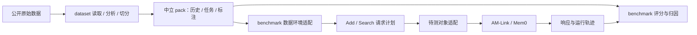

# 本地 Add/Search 靶场

靶场让我们在消耗正式比赛评测机会之前，使用可选择、可追踪的数据反复检查 AM-Link、Mem0 等实现。它承担两个方向的适配：将中立数据包构建为评测环境，再通过 Add/Search 协议访问待测对象。

**案例研究入口**：[案例实验与研究工作区](./STUDIES.md)。`python -m benchmark study --case lm4 --scope full --target lexical` 可固定案例输入、运行本地方法、收集真实步骤并自动更新本地网页。支持片段/窗口/时间切片、native 方法接入、持久运行登记与评注。此基线无需模型；AM-Link 二期实现仍待设计。



数据层不生成 Add、Search、用户 ID 或评分规则。当前环境 profile `evidence-retrieval` 读取历史与文本任务；`targets.py` 的对象适配器接收同一 Add/Search 结构，与具体数据集无关。新增数据源改 dataset 读取器；新增环境策略改 benchmark；新增对象只改 target adapter。

## 当前环境与限制

| 环境处理 | 实际行为 |
| --- | --- |
| 历史写入 | 按 session/turn 顺序；每次不超过 `--chunk-size`（最大 20）条消息或 2,000 个空白分隔词。超长 turn 拆片，保留源字符区间。该词计数是本地近似，不保证等于官方 Adapter。 |
| 角色 | 保留数据源原始 user/assistant；LoCoMo 首个 participant 映射 user，另一人映射 assistant。此选择记录在环境配置中。 |
| 任务 | 将已分离的 `input.text` 作为 Search query。源 instructions/options 保留在 pack，当前检索 profile 不把它们解释为写入指令。 |
| 标注 | answer、rubric、preference 不进入 Add/Search；evidence_turn_ids 在靶场映射到原文片段和 Add ID。 |
| 可评分性 | 有明确 evidence 才算召回；缺少证据标签的题标为 `ungraded`。只有显式 `retrieval_expect_empty` 才评价空检索，问答不可回答不推出 Search 必须为空。 |
| 缺失/歧义 | ScriptMem 缺真实历史、PersonaMem 历史未取得时拒绝回放；CL-bench 未分离的单轮 context/task 记入 exclusions。 |
| 隔离与重试 | 每个 run 使用独立 user/request/session namespace；顺序回放；当前 profile 不自动重试。 |

有证据标注的 LoCoMo/Refined 可做字面证据召回诊断；CL-bench/Life、BEAM 可先观察写入与检索结果。字面匹配会漏掉正确摘要/改写，不能直接作为 Mem0 等抽取式系统的最终质量排名。通用 Answer/rubric judge 尚未实现（已有短片段诊断 Answer）；当前结果既不是各源原始 QA 分数，也不是比赛官方成绩。[接口依据](https://agentmemories.ai/api-guide)仅用于待测对象边界。

## 构建与查看环境

先按 [`dataset/README.md`](../dataset/README.md) 生成 pack，再在不连接对象的情况下检查请求数、排除项和完整计划：

```powershell
.\.venv\Scripts\python.exe -m benchmark plan --dataset-pack dataset/data/prepared/locomo-smoke.json --chunk-size 20 --top-k 10 --output benchmark/data/plans/locomo-smoke.json
```

计划包含来源 SHA、pack SHA、选择条件、profile 配置、Add/Search 列表、exclusions，以及每个 turn 的字符区间 → Add ID 映射。标注答案不写入请求计划。原始任务通过 record/task ID 回到 pack 查看。

```powershell
.\.venv\Scripts\python.exe -m benchmark run `
  --dataset-pack dataset/data/prepared/locomo-smoke.json `
  --profile evidence-retrieval --chunk-size 20 --top-k 10 `
  --target aml-api --base-url http://127.0.0.1:8080 `
  --system-name AM-Link --system-version local-dev `
  --case-limit 1 --query-limit 3
```

`aml-api` 调用 `POST /v1/memory/add` 和 `POST /v1/memory/search`，核对 ID、success、data 等契约。HTTP 鉴权支持 `none/token/bearer/x-api-key`，用 `--api-key-env <变量名>` 读取密钥；不将密钥写入报告。AM-Link 二期服务尚未实现，此处为接入入口。

## Mem0 对照

已有两种接法，均不获取框架源码构建：`mem0-library` 调用已发布的 `mem0ai` 包，`mem0-oss` 连接已运行的 OSS REST 服务。包适配按 [Mem0 Python quickstart](https://github.com/mem0ai/mem0/blob/main/docs/open-source/python-quickstart.mdx)；REST 按 [服务文档](https://github.com/mem0ai/mem0/blob/main/docs/open-source/features/rest-api.mdx)。

```powershell
.\.venv\Scripts\python.exe -m pip install --only-binary=:all: mem0ai
.\.venv\Scripts\python.exe -m benchmark run --dataset-pack dataset/data/prepared/locomo-smoke.json --target mem0-library --system-name Mem0 --system-version "<installed-version>"
```

2026-10-07 已在忽略的 `benchmark/data/research-env` 安装 Mem0 2.2.1；固定依赖见 `requirements-research.txt`，未改根虚拟环境。经用户明确授权，`microstudy.py` 六条件实测完成：41 次模型请求、371,647 输入字符，0 请求失败，费用未知。上限为 100 次/50 万字符；模型输入输出、用量、Add 后快照和本地诊断 Answer 已保存。通用来源专用 rubric judge 仍未实现。短片段由证据辅助选择，不能冒充完整历史难度；日期有/无是显式条件。参见[逐例分析](../casestudies/mem0-microstudy.md)与[研究记录](../docs/doing/2026-10-07-dataset-research.md)。

Mem0 的默认实例可能访问外部模型，由执行者的包配置决定。通用 package/REST adapter 不传逐消息 timestamp，也没有服务端 request_id 幂等语义，报告会标明差异。不能把适配后的 success 当作内部完整记忆证明。

本地无需模型的参照可重跑：

```powershell
.\.venv\Scripts\python.exe -m benchmark.lexical_study
.\.venv\Scripts\python.exe -m visualization.research
```

它在 LongMemEval-S 500 题上先排名、后读取 gold；470 道可回答题计入证据覆盖，30 道拒答题单列。原文和逐题结果写入忽略目录；可发布聚合进入统一视图。它不是问答准确率，也不是 AM-Link 或 Mem0 的成绩。

对比时固定同一 pack、profile、限量选项与模型配置，给每个对象独立 run；检索召回、延迟、错误、实际 usage 分开比较。接口未提供模型调用/费用时为 `null`。

## 追踪单个样本

每次运行保存于被忽略的 `benchmark/data/runs/<run-id>/`：

- `plan.json`：实际选择的环境计划与来源映射。
- `dataset-pack.json`：运行时的数据包快照，避免后续重新准备数据影响复核；含本地标注，不能交给待测对象。
- `trace.jsonl`：每次 Add/Search 的请求、响应、状态、耗时、原文来源区间、证据匹配与诊断。
- `report.json`：逐题结果、按类别聚合、evidence recall/hit/chain coverage、MRR、错误与延迟。未命中题计入 MRR 分母，ungraded 不混入质量分母。

```powershell
.\.venv\Scripts\python.exe -m benchmark inspect --report benchmark/data/runs/<run-id>/report.json --trace benchmark/data/runs/<run-id>/trace.jsonl --case-id conv-26
```

也可用 `--search-id`。有 gold evidence 时显示对应 Add；无证据标签时显示该样本全部 Add。可以追查 source Add 失败、Search 失败、字面证据未命中或排名低；目标内部未开放的抽取/索引原因不能由接口输出推断。trace 含数据原文，仅保存在本地忽略目录。

## 扩展方向

AM-Link 自身的内部埋点使用 [可观测性标准接口 v1](./OBSERVABILITY.md)：统一来源引用、父子步骤、候选排序、上下文、模型用量与失败信息。接口定义、recorder 和导入校验已实现，二期实际埋点尚未接入。[研究可视化](../visualization/README.md) 可将这些记录连接到样本和理论案例。

保持环境策略独立，可以继续加入增量历史检查点、干扰历史、更新时间过滤、特定能力选题，以及“统一 Answer → 来源专用 Eval”阶段。后者必须固定 answer/judge 版本和预算，单独记录调用与费用，才能公平比较抽取、压缩和原文检索系统。当前不把 rubric 当 evidence，也不凭关键词猜 gold spans。

```powershell
.\.venv\Scripts\python.exe -m unittest discover -s benchmark/tests -v
```

设计、已完成核验与后续边界见[本轮计划](../docs/doing/2026-10-05-dataset-decoupling.md)。
