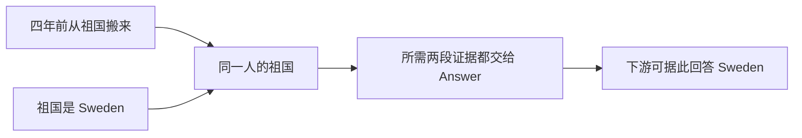

# AM-Link 0.2.0 核心设计与真实链路复核

日期：2026-10-11。范围：当前源码、既有真实模型档案、只读数据库分析和无网络复现。本轮不修改方法代码、不重跑付费模型、不部署。结论替代此前“重构全部完成、输入预算已解决”的表述。

**结论：协议外壳和 episode 检索已经运行，但完整的缓冲整理、持续语境和引用图探索尚未按计划落地。不能把本次实验当作已完整实现的 AM-Link 方法效果。`model_input_budget` 仍可在当前代码复现。**

## 1. Add 到底等待什么

最终确认的两项要求并不冲突：每个成功 Add 有最小可检索 episode；当前已经启动的 Reflection 必须终结后，相关 Add 才返回 200。**停止不等于 WorkingMemory 为空**。没有达到整理条件时，可以停止并保留工作缓冲，等待后续 Add 提供更完整的语境；否则就退回了每条 Add 都整理的设计。

当前 `Engine._add` 的实际分支是：

1. 同 user 锁内追加 RawEvent，生成 episode，完成词法和向量索引。
2. 未触发 Reflection：标记本请求成功，直接返回。
3. 已触发 Reflection：同步等待 `_run_reflection` Mutation/no-op 提交；任何异常向外返回错误，没有提前返回 200 后继续后台整理。

因此，“已触发 Reflection 要等完成”已经实现；此前只描述最低 episode 的句子不完整。但完整协调器并未实现：

| 计划要求 | 当前代码 | 判断 |
| --- | --- | --- |
| 并发 Add 先追加，Reflection 顺序消费稳定快照 | 锁在追加前取得；同用户请求整段串行，不能并发加入缓冲 | 部分实现，生产/消费尚未解耦 |
| 首版一个顺序协调器、极短合并窗口 | 128 个按 user 哈希的锁，无合并窗口和有界队列 | 与已确认计划不一致 |
| 停止／MemoryContext 维护／Mutation 状态可追踪 | 保存 maintenance/stopped；没有 Mutation 状态，失败可留下 maintenance | 不完整 |
| 工作缓冲跨 Add，旧记忆语境也跨 Add 保留 | 原文缓冲保留；新 pending 会重建 context，提交直接清空 context | 后者未实现 |
| 允许充分完成本轮工作，再返回 200 | 同步等待已触发整理；默认本地 240 秒，实验 180 秒 | 未校准到官方允许的长请求预算 |
| 总期限包含排队 | 取得锁后才开始计时，取锁没有超时 | 未实现 |

[官方 API Guide](https://agentmemories.ai/api-guide) 本次核验仍要求同步完成且可立即检索后返回 200，单次 Add/Search 最长 30 分钟。30 分钟是上限，不是必须空等的时长；应给真正的语境维护和 Mutation 足够时间，并把排队算入总期限。增加期限无法解决本地输入预算拒绝。

另有一个成功边界缺陷，已用当前代码和假 provider 复现：Add A 的 episode embedding 失败 → Add B 的 no-op Reflection 推进水位 → `Store.commit_mutation` 把 A 一并标为 done → 重放 A 直接返回成功，但 `episode_ref` 仍为空，也不再补索引。它不是本次 100 题的已观测成因（该运行的 145 个最低 episode 均已建立），却违反成功重放和即时可检索约定，属于优先修复项。

定位：`amlink/engine.py:79–118`、`amlink/store.py:283–326`。本报告行号基于审计时版本。

## 2. 输入预算：修了一部分，没有修完整

真实主档案为 `amlink-refactor-locomo-100-real-20261011b`：四个 LoCoMo 完整历史、2080 条消息、145 次 Add、100 次 Search，最终报告如下。

| 项目 | 结果 |
| --- | --- |
| Add 成功 | 41/145 |
| Add 的 model_input_budget | 96 次：83 次 Select，9 次 Reflection 决策，另外 4 次在进入已记录模型 span 前失败 |
| 其它 Add 错误 | 来源丢失 4、重复 ref 1、schema 3 |
| Search 成功 | 92/100 |
| Search 错误 | 4 次 Select 返回重复 ref；4 次含未知/拼错 ref |
| 真实模型调用 | embedding 554，LLM 416；共 970 次 |
| 已记录 LLM 用途 | Reflection 36、Query expansion 60、Select 100、BFS 决策 220 |

此前报告中“修复后没有新的 Select 输入预算错误”不正确；“57 个查询来源 Add 失败”也应更正为 **57 个标注证据目标**。这不是 57 道独立题，也不能自动理解为原文没有保存。

100 题之后确实进一步缩短了 lineage、候选叙事和 context，并处理重复 Select ref。但是最终 L01 两 Add、一 Search 的回归没有运行 Select，且历史很短；它不能验证长历史预算或 Select 修复。其 `engine.py/config.py` 哈希也与本轮审计源码不同。

本轮把真实末尾待处理原文按**当前** `_model_row`、`_model_context`、Reflection tool 定义和 `Providers.tool` 序列化，再调用真实本地预算守卫，未发出网络请求：

| 记录 | 待处理消息 | 当前序列化 Reflection 请求字符数 | 本地上限 |
| --- | ---: | ---: | ---: |
| conv-26 | 264 | 210,030 | 80,000 |
| conv-30 | 193 | 161,256 | 80,000 |
| conv-41 | 521 | 346,878 | 80,000 |
| conv-42 | 467 | 255,050 | 80,000 |

这里保留已存 workspace；conv-42 使用空 context，因此还是下界。复现只衡量拟进入 Reflection 的请求，不声称重放了完整 Add（orientation 可能更早失败）。四个请求均被当前守卫报 `model_input_budget`。conv-41 光 orientation 拼接原文就有 85,209 字符。

根因是每条原文虽然截短，`working` 的条数仍无界；question、new_refs、来源列表等也没有统一的整包预算。失败后处理水位不推进，下次携带更多积压，越失败输入越大。`batch_messages/max_batches` 没有接入 Reflection 消费编排。局部截短还可能把关键来源裁掉，却仍让模型为整个水位作终结决策。

需要修的是稳定快照的有界消费、完整请求预算和跨批语境维护；不能只抬高 80,000，也不能通过内部重试解决。

## 3. 实际建立了怎样的记忆

数据库核对结果：

| 检查项 | 主实验事实 | 含义 |
| --- | --- | --- |
| 节点 | episode 148，event 4；person/entity/concept/fact 均为 0 | 几乎仍是对话块检索，没有形成预期的语义导航图 |
| 关系 | 0 条 | 无法验证沿关系多跳的贡献 |
| 最低 episode | 145 个；其中 29 个正文后来被改写 | 保真原文卡被摘要覆盖，最低投影没有受保护 |
| 向量一致性 | 上述 episode 改写没有重嵌入；另有 3 个新 episode 没有向量 | lexical、embedding、模型阅读内容不一致 |
| 时间 | 2080 条原文都有 source_time；152 个节点均无时间字段 | 原始时间有保存，但没有形成可用的时间记忆 |
| Reflection | 36 次成功模型决策全部直接提出 mutation，28 次提交 | 没有观察到继续 search、evict 或 stop 决策 |
| 关系提议 | 共提出 19 条，提交 0 条 | 当前 episode 间连边过滤等处理使提议没有形成图；不能当作图构建成功 |
| 整理触发 | 132/145 次 Add 触发 | 91% 接近逐 Add 整理，缓冲的设计收益尚未体现 |
| 待处理积压 | 1445/2080 条 | 失败阻断了消费，并非模型有意保留待补充信息 |

仅 13 次 Add 未触发。实验阈值为 20 条或 6000 字符，默认更低（8 条）；官方文本单次就可能提供 20 条。另外硬信号正则包含 `now/never/actually` 等普通叙事词，扫描整个 pending 和双方角色。**有缓冲表不等于形成了好的整理批次**：正常时触发过勤，失败后又把所有积压一起塞给模型。

最低 episode 初建保留角色、session、ordinal、speaker 和原文，这是已实现的优点；但后续摘要覆盖使“我昨天去了活动”可能只剩“她参加了活动”。RawEvent 仍存在，所以不是原始数据库丢失；问题发生在检索表示、模型可见内容与最终装箱。

References 也只是部分达到设计：带 kind、ref、片段和来源，但大多数 episode 名称是 `memory:episode-arena-amlink-refactor-locomo-…`，运行名挤占语义标签，同名区分主要靠序号和摘要后缀。TinySoul 的 Inspect 同时返回正文、带 title/evidence 的 direct_refs 和显示信息；当前 AM-Link 虽记录原始边，却没有把 Inspect/Backlink 产生的关系含义完整回放到 Search 的 context.edges。不能只把“字符串合法、有后缀”视为引用语义已经实现。

## 4. 各个核心环节是否有效

| 环节 | 已观测／代码事实 | 判断 |
| --- | --- | --- |
| BM25 + embedding | 真实调用、分支候选及合并均存在 | 跑通；但没有消融证明各自净收益，向量与正文不一致干扰判断 |
| 多问题 Query | 60/100 题运行扩展；成功合并中 52 题有原问题+3分支、40题只有原问题 | 已运行；很多是同义改写，未稳定分解为多个缺失证据槽位；Reflection 不扩展 |
| Select | 真实 LLM 选择；92 个成功 Search 中 47 个最终顺序与保留结果的 Select 相对顺序不同 | 精炼存在；最终 `_assemble` 按旧 score 重排，排序语义未贯穿；合法空子集仍报错 |
| Search 多跳 | 220 次模型 action 全为 Inspect；执行 155 次，65 次重复/非活动引用收束；Backlink 0 次 | 本次未观测到真实边上的多跳，不是验证了 BFS 有效或无效 |
| BFS 实现 | visited 按 ref 而非 ref+操作；同 ref Inspect 后不能再 Backlink；候选已达 max_nodes 会跳过读取 | 限制了已确认的灵活探索；声明 3 跳不等于实际发生 3 跳 |
| Reflection 寻找旧记忆 | 自动 orientation 与 `reflection_search` 都只调用 `_search_refs`，没有 Inspect/Backlink 工具 | 未实现计划中的多跳背景补充；函数名 search 不代表完整 Search |
| WorkingMemory | 原文跨 Add 保留；触发后同步处理 | 基础有效；触发过勤、失败积压、无批量消费和持续语境破坏了设计目的 |
| Reflection Workspace | pending 变化会重建；提交清空；模型 Evict 未清 sources/edges | 不是真正跨 Add 的可维护语境；逐出后的来源和关系可能还可见 |
| Mutation | tool calling、来源校验、事务提交存在 | 没有稳定图构建；episode 保真/索引一致性、更新来源全集约束需修复 |
| 装箱 | 每条最多 7000 字符，总计24000；正文+原文+来源状态重复展开 | 常仅容纳3–4条，可能丢掉已选证据；source_time 没进入返回文本 |

上述问题仍可从当前代码定位。主实验代码与当前源码主要差异在 engine/config；不能用旧实验量化新版本提升。补充检查的跨数据集早期运行 `...broad-real...net3` 为 14 个 episode、0 边；LongMemEval `...20261011b` 有 4 episode、1 fact、4 边，但未调用 Backlink，也不足以证明完整多跳有效。最后 L01 小回归只有2个 episode、0边、0次 Select。

新出现的节点通过 Reflection search 加入 items/references 后，没有同步加入 Mutation 校验使用的 memories 集；模型可能看见一个 ref，却不被校验器认可。这也是“能找到旧记忆”到“能正确更新图”的实现断点。

## 5. 三个具体断点

### 时间：找到 yesterday，却没有日期

`conv-26:qa-0` 问 Caroline 何时参加 LGBTQ support group。原文 D1:3 是“昨天去了”；原消息 timestamp 对应 2023-05-08，按会话日期口径应落到 5 月 7 日。

真实过程：相关 episode 进入 Select，并被排第一 → 最终装箱按旧分数排到第二 → 返回原文包含 yesterday，因此字面 evidence recall 命中 → 但 episode 和最终 source 展开都没有携带消息 source_time，只有写入时 created_at。下游看得到“昨天”，看不到“相对哪一天”。

这说明**原文命中不等于时间证据闭合**。应携带来源日期、原始相对表达及其所属说话人；归一日期可作为有依据的派生字段，不能拿系统写入日期替代。

### 多跳：Sweden 已被选中，最后没有交出去

`conv-26:qa-11` 问 Caroline 四年前从哪里搬来。所需两段是 D3:13“4年前从我的祖国搬来”和 D4:3“我祖国 Sweden 的奶奶送给我项链”。

真实轨迹中，两段所属 episode 都已进入候选、也都被 Select 保留，分别在有序子集第8和第7位。模型候选片段没有包含这两句完整关键原话；没有人物/地点关系图补强。最终装箱只装下前三条约7000字符的大块，所需两段均被丢弃。第二段对应的 Add 虽报错，最低 episode 实际已存在并被选中。

所以这里不能简单归因为“没存”“没召回”或“Add 失败导致没有证据”。断点在**候选叙事不足、优先级不佳和装箱容量**；图也未形成可供进一步探查的线索。

### 集合题：绘画和游泳找到了，陶艺与露营没有交齐

`conv-26:qa-15` 问 Melanie 有哪些活动。标注涉及陶艺、露营，以及同一早期对话里的绘画和游泳。

该题没有触发 Query expansion（现有规则没有覆盖这句问法）。陶艺 episode 被 Select 保留但排名第8，装箱没有进入；露营 episode 进入 Select 候选，其关键句可见，却未被保留；绘画与游泳进入最终第一条。两个遗漏发生在不同阶段。需要按“人物的多项活动”形成独立证据覆盖，而不是反复找一条最像问题的大对话块。

## 6. 如何解释 multi-hop/temporal 的数字

| 类别 | 题数 | 标注证据数 | evidence recall@5 | 完整链覆盖 |
| --- | ---: | ---: | ---: | ---: |
| single-hop | 2 | 4 | 100% | 2/2 |
| multi-hop | 35 | 90 | 36.7% | 2/35 |
| temporal | 53 | 56 | 46.4% | 25/53 |
| open-domain | 10 | 14 | 57.1% | 4/10 |

这只是四段历史各前25题的方便切片，不是平衡抽样；single-hop 的两题不具备稳定比较意义。所有100题的 `add_setup_ok` 均为 false，且8次 Search 失败。靶场采用字面来源匹配，不测当前 Answer 准确率，也不要求时间锚点一起出现。

多跳需要多段同时留下，任何一步丢一段就断链；时间题除找原句还要求参考日期。当前图为空、正文变摘要、片段截短、Select顺序和装箱不一致、日期不输出，均给出具体的失败解释。它们支持优先修复方向，尚不构成消融实验中的因果增益证明。

## 7. 修复与验收顺序

1. **成功边界与消费预算**：每个 request 独立检查最低 episode/索引完成；不能按水位替其它失败请求确认成功。明确已触发快照的终结状态，截止时间包含排队。按稳定水位有界消费，整包计量模型输入；原文保持完整、跨批语境保留，不能靠丢原文推进水位。已有内部不重试原则不变。
2. **记忆质量**：保护最低 episode，派生摘要另建节点；任何可检索正文变更同步索引。修复日期从输入到 episode、Inspect、装箱的完整通路。模型能看到的来源与本地校验认可的来源一致。
3. **真正的语境与图路径**：接入 Reflection 的 Inspect/Backlink，工具结果立即影响下一轮，提交后保留可用 Workspace；按来源和身份建立稀疏、有用的关系，不为了边数强造图。完整作用域内复用旧节点。
4. **检索闭环**：让 References 的标签/命中片段携带事件与人物语义；问题扩展围绕需要补齐的关系/时间/集合槽位。保留 Select 顺序、允许合法空子集，允许同一 ref 的不同探索操作；装箱以证据完整性减少重复原文，逐项记录舍弃原因。
5. **重新验证方法**：先重跑上述日期、祖国、活动集合和故障重放短例，再做成功完成 Add 的同切片对照。分开报告 Query、Query+Select、加入图探索、加入 Reflection 的效果；至少展示一条真实正向多跳、一条反向再 Inspect。随后扩大到3–5倍案例量；图为空时不得宣布多跳验证完成。

这不是新增设计语义，而是恢复此前已经确认但尚未完整落实的要求。官方 Streaming 允许多个增量节点 Search；当前“先全部 Add 再 Search”仅作为本次普通文本靶场流程，不能推广成所有赛道前提。最小 episode 与独立 Search 的边界仍保持不变。

## 复现与限制

本轮现有测试复跑 **39项通过，其中 amlink 4项、benchmark 35项**。它们未覆盖上述大部分核心语义，不能替代审计。原91项二期测试在0.1.0归档，不是当前0.2.0验收覆盖。

只读汇总与无网络复现存于忽略的 `benchmark/data/research/audit-20261011/`：`audit.py`、`audit-summary.json`、`reproduce.py`、`reproduction.json`。输入为既有运行的 SQLite、report、trace、observability 及 artifact；数据库以只读连接打开，故障复现使用内存数据库与假 provider。没有读取或复制凭据，没有改变原实验。

观测本身也需完善：预算拒绝发生在 model span 前；query.merge 已是 Select 后的视图；部分裁剪没有逐候选原因；artifact 有体积截断上限，网页又有展示投影。不能把未采集当作没有发生，也不能声称每一层完整输入都无损保留。
