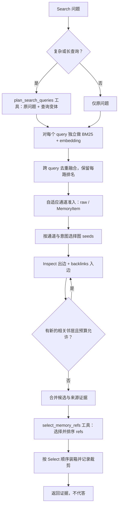
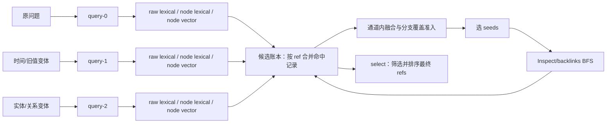

# AM-Link 二期记忆方法改进计划

状态：讨论稿；向量/select 默认启用和 select 兼具筛选、排序已确认，尚未实施。
更新日期：2026-10-09。
目的：把当前实现、TinySoul 的可复用设计原则、案例研究中暴露的断点，收敛成一套可验证的 Add/Search 改进方案。最终接口和默认值仍以代码及 amlink 文档为准。

## 设计目标

让每个 Search 都尽可能同时利用词法、向量和模型语义筛选；让 Reflection 在写入前主动寻找可能相关的旧记忆；让每次 Add 都能把新原文、旧结构化记忆和已召回证据放进一个有界的 Reflection 工作区；让类型、关系和原文证据分工清楚；让运行轨迹能说明一条证据在哪个阶段进入或离开链路。AM-Link 继续只实现 Add/Search，最终答案仍由比赛方生成。

“火力全开”在这里意味着默认启用已选定的检索能力，并对真实调用和成本留痕；它不意味着无界候选、无限模型调用或吞掉依赖错误。Embedding 和 select 出错时显式失败，不静默退回较弱链路；比赛调用方负责约定内的重试，AM-Link 内部不重试。

## 现状与建议

| 主题 | 当前已验证 | 建议目标 |
| --- | --- | --- |
| 向量召回 | 已被真实切片调用，但配置默认关闭；只覆盖已整理的 MemoryItem，不覆盖 raw | 默认开启；BM25 与向量独立召回后融合，向量故障明确暴露 |
| 模型候选精炼 | 代码步骤名为 select，但只在复杂/长查询启用；观测类别和网页标签写成 rerank /“重新排序” | 每个有候选的 Search 默认执行一次 select；由同一次 LLM select 完成筛选和排序，不新增 rerank 操作 |
| Search 语义 | BM25/向量候选后做 Inspect、backlinks、图扩展，再由模型选择 | 固定理解为“发现候选 → 展开正反向证据 → select → 返回证据” |
| Reflection 旧记忆 | 已用新批次文本检索最多 24 个旧候选，并补一跳邻接；精确重复检查有限；每批上下文不跨 Add 保留 | 每次 Add 载入持久化 Reflection 工作区；工作区保留旧 refs、来源、查询分支和图路径；模型工具循环可多 query、多轮 Search 和多跳 Inspect/backlinks，再提交或暂缓结构化 mutation |
| 类型/关系平衡 | MemoryItem 可优先成为图遍历 seed，但无节点类型或关系配额 | 根据问题意图分配证据通道，不对每题硬塞所有类型；单独度量各类型、关系召回 |
| 可观测 | native 轨迹能看到多数步骤，但两路融合贡献、部分截断原因和 select 语义存在缺口 | 记录每个方法步骤的输入、候选、输出、预算及排除原因，并接入专属可视化 |
| 模型协议 | OpenAI 兼容 Chat Completions 使用 response_format=json_object，没有发送 API tools/function tools | Reflection 和 select 使用 API tools 传递结构化调用；工具只由 AM-Link 执行，provider 能力需先做真实 smoke |

## 目标链路

### Add / Reflection

```mermaid
flowchart TD
  A[Add 原文提交 RawEvent + FTS] --> B[载入 Reflection Workspace]
  B --> C[合并新消息、WorkingMemory、旧 refs、来源和已知图路径]
  C --> D[有界 orientation：当前叙事派生 query，混合召回并合并候选账本]
  D --> E[按需 Inspect/backlinks，更新工作区 frontier 和证据路径]
  E --> F{硬信号或工作区压力？}
  F -->|否| G[保留原文和工作区；必要时 compact/defer]
  F -->|是| H[Reflection 模型读取完整工作区和工具说明]
  H --> I{模型发起哪种工具调用？}
  I -->|memory.search(query)| J[一次混合 Search：BM25 + embedding]
  J --> K[候选 refs + 可读内容、标签、来源、关系线索]
  K --> H
  I -->|memory.inspect(ref)| L[精确读取节点正文、来源和出边]
  L --> H
  I -->|memory.backlinks(ref)| M[精确读取真实入边及来源]
  M --> H
  I -->|reflection.defer/compact| N[保留 refs、未决线索和有来源摘要]
  N --> G
  I -->|reflection.finish(mutation)| O[本地校验来源、类型、身份和关系]
  O --> P[提交节点、边、索引和处理位置]
  P --> Q[工作区改为新 refs、关系和未决线索的紧凑视图]
```

这张图把“每次 Add 的工作区”和“触发后的模型决策循环”放在一条链上。`WorkingMemory` 仍然只是尚未推进处理位置的 RawEvent 视图；`Reflection Workspace` 是可持久化、可压缩的派生工作状态，保存旧 MemoryItem refs、来源 raw refs、query 分支、Inspect/backlinks 路径、已知冲突和未决线索。它不是第三份事实库，也不能替代 RawEvent 或已提交 MemoryItem。

每条 query 分支不会把文字简单拼在一起。各分支独立经过 raw-lexical、node-lexical、node-embedding 等通道，结果按 `ref` 写入同一个候选账本；账本保留命中它的 query、通道、原始 rank/score、路径和来源。工作区下一次 Add 继续使用这个账本，但新消息、节点状态变化和撤回会使旧条目标记为待刷新，而不是无条件相信缓存。

一次 `memory.search` 是一个 query 的一次检索；收到结果后，模型可以换 query 再搜、对结果中的 ref 做 Inspect、继续查反链，再调用 `reflection.finish`。并行且彼此独立的 query 可在同一轮工具响应中提出；需要读到前一轮结果才能决定的查询属于下一轮。`reflection.defer/compact` 不提交新的事实，只保存可追溯 refs、未决线索和受字符预算限制的摘要。压缩优先去除重复正文预览，不删除原文、节点或关系。

**当前实现**不是这个循环：_reflection_context 将一批新消息拼成一个 query，调用一次 _discover，截取最多 24 个候选；之后从命中的旧 MemoryItem 取一跳出边和入边邻居。它没有多 query，也没有跨轮模型追加 Search。模型收到一次构造好的 JSON 上下文后产出 JSON mutation。这个基础方向能提供相关旧记忆，但检索粒度和图深度目前有限。

当前是否触发 Reflection 由确定性条件判断：对用户的未处理原文，待处理条数达到 8 条或字符数达到 6000，或出现遗忘/更新线索，或待处理内容跨会话时触发；随后按每批 32 条/18000 字符切分，最多 8 批。未触发时原文已经进入 FTS，可被 Search 找到。这个硬门槛应保留，用来保证明确的更新和遗忘不会被模型一句“暂缓”吞掉。

**建议目标**不额外增加一个只负责说“要不要 Reflection”的模型门卫。每次 Add 先加载工作区并做一次有界 orientation；硬信号或工作区达到上下文压力时进入 Reflection tool loop，模型可以在循环中继续搜索、`defer/compact` 或 `finish`。没有硬信号时，可以只保存更新后的工作区；如果将来需要模型参与软触发判断，也应让它返回结构化的 `defer`，而不是让它阻止原文提交或改变硬触发条件。这样保留每次 Add 的上下文连续性，又不为每条短消息额外支付一次独立分类调用。

触发后，模型看到的不只是本批 NEW，还包括工作区里之前 Add 和 Reflection 留下的旧 refs、来源、关系和检索路径。Add 协议本身没有外部 Search 问题，因此 orientation 的 query 来自当前新增叙事、工作区未决线索和已知实体/时间锚点；真正的用户问题仍由后续官方 Search 单独提供。模型可以再次 Search，因为 orientation 的候选只是背景，不是最终完整证据；也可以直接 Inspect 已知 ref。完成 mutation 提交后，工作区不清空，而是把新旧 canonical refs、边和尚未解决的身份/冲突线索压缩成下一次 Add 可继续读取的状态。

工具调用协议提供有结构的函数名、调用 ID 和参数；AM-Link 执行 allowlist 中的只读检索工具，并把真实结果作为 tool-result message 回放给模型。`finish` 只产生提案，来源、用户隔离、关系矩阵和数据库提交仍由 AM-Link 本地校验与提交。

不能把 tool calling 理解成“无需任何结构声明或校验”：API 工具本身需要参数定义，模型返回的 arguments 仍需按本地 Pydantic 合约验证，ref 仍需在当前 user scope 解析。借鉴 TinySoul 的 provider-neutral ToolSpec / ToolScope / ToolCallRecord / tool-result message 边界即可；不搬入它的 provider/model 重试、切换和复杂 runtime。AM-Link 的请求继续单次尝试、显式失败。

### Search



### Query expansion 是什么

Query expansion（查询扩展/查询改写）是先把一个复杂问题变成若干条更容易检索的搜索表达，再对每条表达做独立召回并合并结果。它只改变“拿什么文字去找候选”，不决定哪些候选最终保留，也不生成答案。

例如“之前和现在的每日配额分别是多少、发生了什么变化？”可扩成“每日配额”“之前的每日配额”“更新后的每日配额”“配额变更”。原问题仍保留；每条 query 分别走 BM25 和 embedding；跨 query 合并时保留来源 query 和各路 rank，避免把候选为何出现抹掉。然后 Inspect/backlinks 扩展节点关系，最后 select 才决定最终 refs 及顺序。

当前 Search 已有一段有限的 query expansion：仅当 COMPLEX 规则命中或问题超过 100 字符，且 graph 模式启用 search_model 时，先用 JSON mode 调用 query plan。它最多返回 3 条变体和一个 history 标记，原问题也始终检索，因此最多是“原问题 + 3 条变体”；每条分别执行一次 BM25 和（启用时）embedding。简单查询不做扩展。这里的“保留复杂查询触发规则”是指先不为了所有短问题额外调用一次模型规划查询；它不影响已确认的默认 embedding 和 select。当前 search_model 同时门控 query plan 与 select，实施时必须拆开语义：select 默认开启；query expansion 仍按复杂/长查询触发。工具化后，扩展阶段仅暴露 plan_search_queries function tool，不能调用任意检索或返回答案。未来可通过固定切片验证规则是否漏掉了短但需要拆解的问题，再调整触发方式。

三种粒度要分开：

| 粒度 | 做什么 | 当前 Search | Reflection 建议 |
| --- | --- | --- | --- |
| 多 query / query expansion | 同一轮对原问题及若干变体独立召回，再融合 | 复杂/长问题最多 4 条 query | 模型可以在一轮提出多个独立 memory.search 调用 |
| 多轮 Search | 读上一轮结果后，形成新的 query 再搜索 | 当前没有模型驱动的 Search 轮次；只有前置 query plan | 需要：模型读结果后可补搜，直到证据够用或预算/停止条件触发 |
| 多跳邻接 | 从 ref 读取相邻节点，沿新节点继续 Inspect/backlinks | 已有 BFS 式多跳，默认 max_hops=3；它沿图走，不会每一跳重跑词法/向量 Search | 需要：模型可按结果选择下一批 refs 继续 Inspect/backlinks，和多轮 Search 分开记账 |

当前 Mermaid 的线性图只是步骤类别，不能表示真正的控制流。Search 的 _expand 已按 frontier 逐层重复 Inspect 和 backlinks，递归加入新邻居直到没有新 frontier、达到 hop/neighbor/node 限制或请求 deadline；因此 Search 的多跳邻接已经实现。Reflection 则不同：只对新消息做一次合并 query，之后取一跳邻居，不是迭代多跳；而且它直接访问 store.edges，当前并未复用 Search 的 memory.inspect/backlinks 方法及对应 span。上面的 Search 图改用条件回边表示 BFS；Reflection 图改用模型工具循环表示自适应检索，也让两条链路将来复用同一套有观测的内部原语。

### 分支 query 在哪里合并

合并点应位于“每条 query 的通道召回”之后、“图扩展 seeds 选择”之前，并且在工作区中保留为可追溯的候选账本，而不是只留下一个总分：



当前 Search 的 `by_ref` 已经在这个位置做了最小合并：同一 `ref` 只保留一行，并把各 query 的 `score` 相加；但它没有保存该 ref 被哪些 query、哪条通道和哪次图路径命中，之后的候选截断也无法解释来源。下面的候选账本是对这段逻辑的可观测和可分析扩展，不是把同一证据复制多份。

具体处理分四步：

1. 每个 `query_id` 在每个通道内独立取候选，并保存原始 BM25 rank/value、embedding cosine/rank、命中片段和 query 来源。不同通道的数值不直接横比。
2. 以稳定 `ref` 去重，但不删除命中记录。例如同一原话同时被原问题和“旧配额”变体命中，只生成一个候选项，候选项内部保留两条 query 命中和各自 rank。重复 query 先按规范化文本去重；近似但不同的 query 仍保留分支 lineage。
3. 对每个通道先做通道内 rank fusion，再在共享预算下做分支覆盖准入。多条变体命中同一 ref 的支持可以增加优先级，但应设置饱和，避免某个 ref 因变体数量多而挤掉只被一条关系查询命中的互补证据。这里的聚合分数只是候选排序信号，不是事实置信度。
4. 合并后的账本负责选图 seeds；Inspect/backlinks 发现的新节点以 `source=graph`、`hop`、`path` 和关系来源回写同一账本。图邻居不重新走 lexical/embedding，除非模型在下一轮明确发起新的 query。最终 `select` 看到完整 lineage，再决定保留及顺序。

因此“分支查询后在哪里合并”的答案是：**在候选账本合并，图扩展前统一准入，图扩展后回写同一账本，最后由 select 收敛**。Reflection 的下一轮 query 不会清空上一轮账本，只追加新的命中记录并对过期 refs 做状态标记。观测需要分别记录 `branch_hits`、`merged_refs`、`admitted_refs` 和 `select_refs`，否则无法判断证据是在分支召回、合并预算还是 select 阶段消失。

Reflection 的粒度建议是“模型控制器 + 共用有界检索原语”，而不是在 Add 开始时硬编码很多 query：

1. 初始模型上下文给出本批 NEW 叙事、已知 role/session/ordinal/time 和可用工具。模型可在同一轮提出多条互不依赖的 memory.search(query)；调用方并行执行，然后按 query/channel/rank 去重融合并逐条回传。
2. 模型读完本轮结果后，可以跨轮补充更窄的 query，例如由找到的项目名、人物别名、旧金额、否定词或时间锚点引出下一次 Search。这才是多轮 Search。
3. 模型也可从搜索结果中的 typed refs 选择一个或多个做 memory.inspect(ref)，查看该节点正文、来源和出边；若需要找反向提及，再调用 memory.backlinks(ref)。新读到的 refs 可继续 Inspect/backlinks，形成逐跳、多方向的邻接探索。
4. 充分或达到停止/预算边界后，模型调用 reflection.finish(mutation)。同一次模型回合如果并行提交 Search 和 finish，编排器应拒绝提前 finish 或先执行工具再复核终止状态，不能越过尚未回放的检索结果。

这里的“多次 query”和“多轮 Search”不应混为一项配置。前者是同一轮多条独立候选发现；后者依赖上一轮返回内容，适合由模型工具调用自适应决定。Inspect/backlinks 的多跳又是沿 refs 扩图，不会自动再跑 query。三种步骤有不同输入、输出、调用数和观测父子关系。

工具循环属于正常的检索方法步骤，不能用“重试”来解释。需要为一次 Add 设有限的模型回合数、search 调用数、inspect/backlinks 节点数、邻接深度、返回字符数、embedding 调用量和总 deadline；达到预算却没有 finish 时显式失败，不静默生成一个看似完整的 mutation。具体上限先从固定切片测量覆盖、延迟、token/费用，再配置，不在方案中先猜数值。

Reflection 使用的 `memory.search` 仍复用同一 Search 原语：单条 query 经过混合发现、候选账本、图扩展，然后对本次非空候选执行一次 `select`，工具结果同时返回 selected refs、有限的未选 refs 及其排除/截断原因。这样每个 query 的语义精炼都默认开启，但不会把同一批候选再额外调用第二个“最终 select”；Reflection 模型可以根据返回内容发起更窄的下一条 query。外部官方 Search 则在所有 query 分支和图扩展合并后执行最终一次 select。两者都不引入名为 rerank 的操作。

select 可以在单次模型调用内同时完成筛选和排序：返回有序 refs 子集。API 工具 `select_memory_refs` 将这组 refs 作为有结构的 tool call 返回；query expansion 与 select 仍是独立阶段，前者扩大“找什么”的覆盖，后者收敛“留下什么”。

## 术语、引用与模型可见内容

### 统一术语

- query：BM25/embedding 发现候选。
- inspect：从已知 ref 读取内容与正向链接。
- backlinks：查找指向已知 ref 的真实入边。
- select：模型基于问题和候选内容同时完成筛选与排序，输出有序 refs 子集；这是本期唯一的模型候选精炼原语。

本期不引入 rerank 名称或第二种排序操作。现有 observation v1 的 operation enum 仍把该 span 归为 rerank，因此需设计 observation v2：operation、span 名、可视化阶段和文档统一写 select；旧 v1 轨迹可兼容读取，但界面需标注为历史记录中的旧分类，不可改写历史事件。

### Refs 形态

AM-Link 当前以 raw:&lt;id&gt; 和 memory:&lt;id&gt; 表示原文与节点；Reflection 暂用 new:&lt;label&gt; 提交新节点，由服务生成持久 opaque ref。来源关系通过 source_refs，图关系通过带类型和来源的边表达。模型看到 JSON 结构中的 ref、叙事文本、来源和边，不是 Markdown 超链接。

TinySoul 的 canonical ref 把记忆类型和可读 cite 放在地址中，例如 memory:daily/2026-10-09、memory:entity/mei-lin、memory:fact/f-digest。Markdown 关系正文也直接用这些链接表达“这是谁”“依据哪条 daily/fact”；Inspect 展示正文和 direct refs，backlinks 返回真实引用者。这让链接本身携带了类型/身份线索，而不是只有存储地址。

建议 AM-Link v2 先采用“语义 canonical cite，冲突时才差分”的方案，而不是强制每个 ref 都带随机 opaque ID：`memory:person/mei-lin`、`memory:person/mei-lin~2`、`memory:fact/daily-quota~2026-09`、`raw:message/r-701c`。类型和短 slug 让模型容易读懂；只有同一 slug 出现多个无法证明为同一身份的对象时，才追加稳定差分后缀。后缀可以是顺序号、短摘要或稳定 hash，具体形式由单用户串行写入和迁移规则决定。

直接把人名作为唯一标识是可行的，但必须提前接受三条规则：同名者不能复用同一 ref；ref 一旦发出不能因为后来发现重名而改名；显示名、别名或语言规范化变化放在节点正文和 alias 字段里，不修改 canonical cite。这样“有重复时再差分”不会迁移已有边和来源，只是在新对象创建时分配第二个 ref。它的风险是语义地址可能很长，且一个人改名后旧地址不再直观；因此可以提供 `memory:person/mei-lin` 的别名解析，但持久边仍使用当时分配的 canonical ref。若后续需要跨别名合并，保留旧 ref 并建立显式身份映射，不偷偷重写历史链接。

所以稳定 ID 不是为了让模型看到一串不可读字符，而是为了在重名、改名和身份纠错时保持地址不变；它是可选的冲突解决器，不应遮住语义标签。人物/实体的 slug 是地址 cite，不是身份判定；是否复用一个 person ref 仍需模型看到跨会话来源并有证据。原始用户/会话标识不直接拼入 ref，避免把外部身份编码进链接；ref 解析仍严格受 `user_id` 隔离。考虑到 AM-Link 数据含中文和多语言，slug 的规范化或转义策略需要讨论；实施时还需对现有 raw/memory refs、source_refs、边、向量和屏蔽状态做完整迁移。

给模型的正文也不应只是一组 ref 字段。应构造叙事化的链接上下文，例如：

> Mei Lin 的每日调用配额从 1,000 调整为 1,200。旧记录 [memory:fact/daily-quota~f-39d2] 的来源是 [raw:message/r-701c]（user，session s2，turn 14：“每天最多 1,000 次”）；新记录 [memory:fact/daily-quota~f-b430] 的来源是 [raw:message/r-82e1]（user，session s5，turn 6：“改为每天 1,200 次”）。新记录 --supersedes--> 旧记录，关系证据为 [raw:message/r-82e1]。

模型调用上下文应保留自然叙述，并在链接旁给出 kind、可读标签、实际正文、source_refs 与有向关系；结构字段帮助定位和校验，不把叙述压成标签拼盘。角色、session、ordinal、时间按真实可用信息呈现；缺失就留空/省略，不为数据集虚构 user_id 或 role。把 MemoryItem 与 source raw 分开展示，使“整理后的意思”和“原话证据”可以来回核查。

## 候选与图关系的平衡

TinySoul 的现有设计支持独立词法/向量发现、显式候选操作和多来源组合；它没有固定的 kind/relation 最低配额。AM-Link 也不应机械规定“每种节点至少一个”，因为简单事实题可能只需要一个 fact 和其来源。

当前 AM-Link 的实际竞争方式值得注意：FTS lexical 在 raw 和 memory 节点上共用一个 top-k；向量只搜 MemoryItem；两路按倒数排名融合后共用 candidate_limit；图 seeds 优先挑 MemoryItem；扩展节点随后又与 raw/MemoryItem 共用一个候选池；select 预览超字符预算时从末尾直接移除候选。它有 MemoryItem seed 优先，但没有 raw、节点词法、节点向量、关系邻居之间的预算保护，也没有节点类型/关系类型配额。这可能使原话细节、某一类节点或边上的互补证据在进入 select 前消失。

这里要分清“召回来源”和“候选在推理中的作用”：

| 召回来源 | 目前能找到什么 | 进入候选后的用途 |
| --- | --- | --- |
| raw-lexical | 原话、专名、数字、时间、否定；也包含尚未整理的尾部消息 | 直接作为精确证据，检查原始说法和 speaker/session 顺序 |
| node-lexical | 所有 MemoryItem 的词法命中 | 作为可读记忆摘要或导航入口 |
| node-embedding | 已有向量的 MemoryItem 语义近邻 | 找措辞不同、词面不重叠的记忆摘要 |
| graph-neighbor | seeds 的真实 incoming/outgoing refs | 沿 person/entity/concept/event/fact/episode 及 about/contains/supersedes/contradicts/same_event_as 关系补足上下文 |

MemoryItem 内部还应按候选作用区分 claim/event（fact、event、episode）与 navigation（person、entity、concept）。前一组常承载直接回答事实、日期和多条记录；后一组用于身份、主题和跨会话连接。它们是预算分组和分析视角，不等于强制每条数据同时创建两类节点。

### query 通道由谁选择

可以先让 LLM 做一次结构化 query routing，但它应选择“检索意图和表达”，不应拥有关闭某个基础证据通道的权力。否则一次模型误判就可能让 raw 精确值、MemoryItem 语义近邻或关系邻居完全没有进入候选。

推荐的分工是：

- 短而明确的问题先用确定性线索标出 `exact-value`、`time`、`person/relationship`、`history/update/conflict`、`multi-item`；不额外调用分类模型。
- 复杂/长问题由 `plan_search_queries` tool 返回若干 query、每条 query 的 purpose/anchors 和可选 `channel_hints`。Reflection 中则由 `memory.search` 的参数携带同样的意图提示，避免再增加一个独立分类调用。
- 引擎对每条有效 query 默认执行 raw-lexical、node-lexical 和已启用的 node-embedding；有 MemoryItem seed 时再按预算进行 graph Inspect/backlinks。`channel_hints` 只影响候选优先级、seed 选择和字符预算，不是硬过滤器。
- 若某通道没有结果、索引未建立或被预算跳过，必须记录真实原因；不能把模型没有选择该通道误写成“无证据”。

例如，问题“之前和现在的每日配额分别是多少？”可以让模型标出 `history/update`，生成“每日配额”“旧配额”“更新后配额”三个 query，并提高 raw、时间相关节点及 `supersedes` 两端的预算；它仍然保留向量召回和其它可解释的候选，让 select 最后判断哪些内容真的需要交付。这样利用 LLM 的语义路由能力，又不让路由本身成为证据丢失的单点故障。

建议按四层组织，不预设固定比例：

1. **分源召回**：分别观测 raw-lexical、node-lexical、node-embedding；每条候选保留原始 BM25 值/排名、cosine/排名、命中 query。为避免当前 raw/node 共用 lexical top-k 导致的候选饥饿，召回层需能分别取得 raw 与 typed node 候选。不同分数只在自身通道内解释，不直接横向比较。
2. **构造导航与邻接**：MemoryItem 用作有类型的导航入口；来源 raw 随节点按需展开；关系通道只从被发现的 seeds 沿真实出边/入边加入邻居，并带上 relation、方向、路径及其来源。不要把整张图预先打散加入候选。
3. **按意图动态准入**：用 query 的显式线索决定候选优先级，而不是输出一个固定比例。精确数字/日期/否定/原话优先保留 raw 证据；人物关系、跨会话和主题问题提高 person/entity/concept 导航节点与关联边优先级；更新/冲突/历史问题把新旧事实及 supersedes/contradicts 两端当作证据组；多项汇总问题保留多个 event/fact 候选及各自 raw 来源。若暂时无法识别意图，使用各通道的融合排名并允许未用预算借给其它通道。
4. **统一 Select**：在有限总字符/候选预算内给 LLM 一份包含通道来源、正文、refs、关系路径和 raw 来源的候选集，由单次 select 一并做筛选和排序。被 select 排除与在之前预算阶段被截断必须是两种独立观测事实。

具体执行可以分为“各通道独立取候选 → 意图排序 → 共享预算装箱”：先为 raw-lexical、node-lexical、node-embedding 保留各自的短名单和来源分数；按上表把 node refs 映射到 claim/event、navigation 两类；图扩展另记邻接来源与 hop。根据 query 意图形成活动通道优先级；可先从每个有相关候选的活动通道纳入少量代表项，再按通道内 rank、意图优先级和内容成本逐项填充共享字符预算。关系证据组整体计入预算。某通道没有相关候选或没有剩余证据时，未用容量立即借给其它通道，不保留死配额。

短查询先用可解释词面提示标识 exact-value、time、person/relationship、history/update/conflict、multi-item 等意图；复杂/长查询复用 plan_search_queries 工具返回的意图标签和变体，不再增加一个单独分类调用。意图只是候选准入提示，不能排除其它通道；最终 select 仍看到各通道来路并作语义筛选。

关系候选也应避免度数高的通用节点垄断邻居窗口。每个 seed 的 outgoing/incoming、关系类型分开记录；按问题优先级扩展，留出剩余预算给另一方向/关系；冲突和 supersedes 两端作为一个证据组。没有 query-relevant neighbor 就停止该分支，不为“图看起来完整”而扩展所有边。Search 当前 _expand 使用每入口 max_neighbors 和全局 max_nodes，按单个 relation score 排序，没有关系类型保护；该限制需在切片上验证，避免一开始再堆复杂打分规则。

评估时对每个案例同时记录候选在各通道的排名与最终路径，逐层改变共享预算、借用策略和关系组保护。切片至少覆盖：LM04 精确金额/重复购买、LoCoMo 人物共同兴趣、BEAM 新旧冲突、LM02 时间口径、遗忘与拒答。比较候选通道覆盖、各阶段流失、select 输入/输出、误截断、延迟和模型/embedding 次数；若案例提供来源标注，再计算来源召回作为额外效果指标。根据这些实测再定默认预算，不先拍一个 20/30/50 的比例。

## Reflection 稳定性与图质量

当前 AM-Link 的 API 请求没有使用 tools 或 tool_choice，也没有 Function Calling。Reflection 和 Search select 都使用 response_format=json_object，再由本地 Pydantic 模型解析；合法 JSON 只能保证外形，不保证身份、来源或关系语义正确。

建议采用 API function tools 作为模型输出/检索控制协议，而不再要求模型自由撰写 JSON 对象：

- Search 的 select 任务只暴露 select_memory_refs 工具，返回候选 refs 的有序子集；调用方校验 refs 都来自本轮候选。该工具负责筛选和排序两件事。
- Reflection 暴露 memory_search、memory_inspect、memory_backlinks 等只读工具，以及 reflection_defer_compact、reflection_finish 两个状态工具。模型可以多轮找旧记忆；证据不足时保留有来源的 refs/未决线索并压缩工作区，完成时以 finish 工具参数提交 items/links/forget 提案。
- Tool call 参数仍要有工具定义，TinySoul 也是由 provider-neutral ToolSpec 携带参数定义，再由 provider adapter 映射成 API tools。这个参数定义不是另造一套模型输出 JSON Schema；本地仍必须用 Pydantic 和业务规则校验模型参数，不能把供应商结构化输出当成信任边界。
- AM-Link 只执行明确 allowlist 的内部工具，不接受模型给出的任意函数名、SQL、user_id 或跨用户 ref。finish 不直接绕过 Reflection 校验器和事务提交。
- API 连接层要归一化 tool call id/name/arguments 和 tool-result message；工具输出作为下一条模型上下文回放。模型 API 调用失败、参数无效或循环预算耗尽都显式返回，不执行内部错误重试。计划中的多轮 tool call 是正常方法步骤，不是失败重试。

TinySoul 的可复用重点是分层：LLM 层定义 provider-neutral ToolSpec/ToolScope/ToolCallRecord/ToolResultMessage 并映射供应商协议；LLM 层不执行业务工具；Kernel/Action/Plugin 解释和执行调用、将结果回放并决定下一轮。AM-Link 可实现这个最小边界，不需要照搬 TinySoul 的多 provider/model chain、retry policy 或完整 runtime。真实 GPT-4o-mini 接入端是否支持所需 tools/tool_choice 语义，必须先用最小 smoke 验证；失败时显式阻断实现选择，不静默退回 JSON mode。

Reflection 的语义稳定性仍需独立验证：固定案例检查工具调用是否搜到旧证据、是否引用已有身份、是否对关系给出 raw 依据。向量相似度只提出候选，不自动合并人物或事实；同名人物需要身份依据，近义事实需要比较时间、实体、谓词和原文来源。

跨会话人物采取“别名候选 + 明确身份依据”策略，同名不等于同一人；近义事实采取“候选匹配 + 语义比较”，结果可为复用节点、补来源、建立同事件关系、建立冲突/更新关系，或保留为不同节点。relation 必须有原文依据，且按类型约束方向。单独统计重复、误合并、漏边和错误边，不能只看节点数。

## 延后议题：证据到答案的闭环

本期先不增加证据槽位模型输出、closure 检查或 AM-Link Answer 辅助。LM04 的多笔金额、LoCoMo L04 的多个共同兴趣、BEAM B02 的冲突表达和 LM02 的时间口径，仍作为后续研究切片：先通过 Search refs、来源与真实靶场 Answer/Eval 观察断点，再决定是否需要在 Search 结果里加入证据覆盖提示。比赛方仍负责最终 Answer/Eval。

## 专属观测与可视化

新 observation 语义应能逐段重建 mermaid 方法链路的输入、输出和损失位置。每个 artifact 包含 stage、request、输入 refs、输出 refs、内容预览、耗时、模型/向量调用和预算；候选排序信息不能把 BM25、cosine 与融合分数混成一个可横向比较的数。

| 阶段 | 必须可见的输入/输出 |
| --- | --- |
| raw commit / index | 原始消息 refs、实际持久化数量、FTS 建立/更新结果、待整理位置；明确区分未尝试、成功、失败和跳过；不根据成功状态推断 Reflection 已完成 |
| reflection workspace | 本次 Add 载入的旧 refs、上次保留的 query 分支/路径、追加和失效的 refs、compact 前后字符量、未决线索和状态版本 |
| query plan / tool query | 原问题、query 变体、来源于哪一轮、模型提出的搜索理由（简短结构字段，不保存隐藏思维链） |
| discover.lexical | 每条 query 的 raw/node refs、原始 BM25 排名/值、命中文本 |
| discover.embedding | 每条 query 的模型标识、MemoryItem refs、cosine 与排名；不得记录密钥 |
| query merge / channel admission | 每个 ref 的 query 分支命中、通道来源、各路排名、融合名次、准入/截断原因和预算余量；保留 branch lineage |
| inspect / backlinks | 种子 ref、出边/入边、关系来源、实际读取节点、当前 hop、visited 状态和不扩展原因 |
| select | 模型所见候选投影、select_memory_refs 调用参数/顺序、未选 refs、参数校验结果 |
| pack | 最终内容与来源；top-k/字符预算/状态过滤的剔除 refs 和理由 |
| reflection tool loop | 每轮模型调用、tool call、tool result、下一轮父子关系、停止/继续原因 |
| reflection.finish / commit | finish 工具参数、校验字段错误、创建/复用/边变更、提交或显式失败 |
| benchmark answer/eval（可选） | 实际 Search 返回内容、诊断 Answer、独立后验评注；用于分析下游是否使用证据，不要求 gold 预先绑定 |

可观测的首要目标是解释“这一条运行实际做了什么”，不要求每个案例先具备 gold evidence 标注。对已知 ref，可沿生命周期标出：未存储、已存但未索引/索引失败、未被 query 召回、候选预算截断、关系未扩展（并给出深度/方向/预算/相关性等停止原因）、被 select 排除、被装箱或输出预算丢弃、已送入 Answer 上下文。最后一种“Answer 收到但没有使用”需要 Answer/Eval 或人工评注提供可观察证据；不能仅凭 Search 返回推断。若没有已知的目标证据 ref，只能报告各阶段实际输入、输出和停止原因，不能断言“漏掉了正确证据”。gold 或人工标注只作为可选叠加层，把已知 ref 沿轨迹追踪；它不是采集、渲染或过程分析的前置条件。

可视化应突出每个实际阶段的输入/输出内容和状态，而不制造“正确性”标签。原文和完整运行载荷继续存于忽略的本地 artifact；过程事件通过稳定 refs/哈希链接它们，视图提供受限预览。只记录公开模型输入/输出和 tool calls，不记录隐藏思维链。

## 分步实施与验收

1. **Observation 与引用协议**：为 workspace、query branch merge、select、候选通道、图 hop 和 tool loop 增加明确的 AM-Link 事件/产物字段；设计有语义的 typed refs 和可读叙事投影。验收：一条运行能从原文输入一路点到工作区、refs、边、模型工具调用、校验与返回内容。
2. **默认完整 Search**：embedding 默认开启；每个非空候选集都执行一次 select_memory_refs 工具调用，select 一次完成筛选和排序；query expansion 暂保留复杂/长查询触发。验收：成功轨迹确实包含两路召回与 select；provider 错误显式可见；没有静默降级。
3. **Reflection Workspace 与工具循环**：为每次 Add 载入并更新持久化工作区；接入 provider-neutral tool call/result 消息最小子集；开放有界 search/inspect/backlinks、defer/compact 和 finish 提案工具。验收：模型可复用上次 Add/Reflection 的旧 refs，跨 query、Search 轮次和图 hop 找旧记忆，工具结果可回放；user scope 和每步证据来源不能丢。
4. **查询分支合并与动态通道预算**：拆出 raw/node lexical、node vector、graph neighbor 的候选记录和独立准入原因；以 ref 候选账本合并 query 分支，按 query intent 排优先级并允许空通道借出预算，不定固定比例。验收：固定切片可比较分支覆盖、通道召回、阶段流失、内容覆盖、关系组完整性和成本。
5. **身份与关系质量**：迁移 ref 到有语义类别的可读路径，并从创建时保留 canonical 稳定地址；加强 alias 候选、同名保护、近重复对比和关系证据校验。验收：固定人物/更新/冲突/同事件案例分别统计错误合并、重复、漏边、错误边。
6. **小样本验证与真实 provider smoke**：先做真实 tool-call 最小 smoke，再运行 Reflection/Search 切片；不把语法合法等同于方法正确。分别报告 Add 成功率、工作区复用率、过程轨迹完整性、证据召回、图质量、诊断 Answer、延迟和真实模型/embedding 次数及费用。遇到接口失败不叠加内部重试。

## 讨论确认点

已明确的设计要求：embedding 与 select 默认启用；select 同时筛选和排序，不另设 rerank；Reflection 需要多 query、多轮 Search 和多跳邻接；优先使用 API tools 传递 query plan、select 和 Reflection 结构；query expansion 暂保留复杂/长查询触发规则；Answer 辅助暂缓；运行观测以真实过程为主，不以 gold 标注为前提。

建议下一步围绕两个仍需共同定形的实现问题讨论：一是采用“类型/语义 slug 作为默认 canonical ref，只有冲突时追加不可变差分”的引用方案，以及 alias/身份映射的最小字段；二是 Reflection Workspace 的持久字段，以及 tool loop 的调用、Search 轮数、Inspect 深度、候选和字符上限如何用案例切片校准。具体上限应该由真实片段的覆盖/延迟/费用曲线决定，不能先拍数值。当前建议不采用“先用人名作为主键，冲突后把旧主键迁移”的方案；可以先用语义地址，关键是禁止事后改写已引用的 canonical ref。

上述均为设计目标，不代表当前代码已采用工具调用、默认向量、typed ref 或 Reflection 多轮搜索。

## 依据

- [当前 Add/Search 设计总览](../../DESIGN.md)
- [AM-Link 二期协议](../../amlink/PROTOCOL.md) 与 [实现入口](../../amlink/README.md)
- [可观测性事件标准](../../benchmark/OBSERVABILITY.md)
- [TinySoul 记忆设计](../../reference/TinySoul-Agent/docs/design/memory.md)
- [TinySoul LLM 与工具调用设计](../../reference/TinySoul-Agent/docs/design/llm.md)、[工具协议](../../reference/TinySoul-Agent/tinysoul/llm/protocol/tools.py)与[供应商工具映射](../../reference/TinySoul-Agent/tinysoul/llm/provider/openai_sdk/payloads.py)
- [TinySoul canonical refs](../../reference/TinySoul-Agent/tinysoul/plugins/memory/refs.py)
- [TinySoul Inspect/Search 原语讨论](../../reference/TinySoul-Agent/docs/chat/04%20context-inspect-and-search-design.md)
- [2026-10-08 AM-Link 真实运行与案例分析](../doing/2026-10-08-amlink-answer-research.md)
