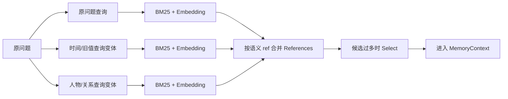
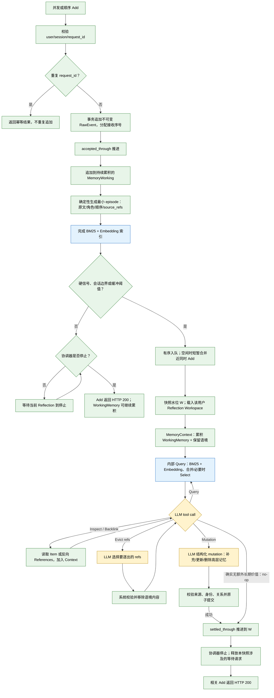
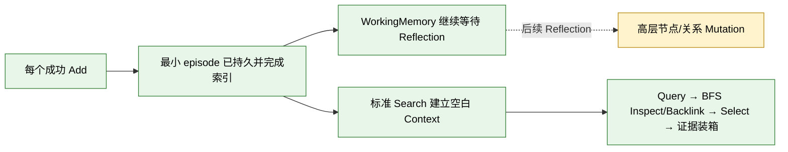

# AM-Link 二期重构设计与执行计划

状态：准备实施；已确认每个成功 Add 先生成可检索的最小 `episode`，Reflection 仍按积累条件触发，代码尚未改动。
更新日期：2026-10-11。

本文描述当前二期代码归档后的重构目标，不代表已实现。`MemoryItem`、`MemoryRelation`、`References`、`MemoryContext`、`MemoryWorking`、`Search`、`Inspect`、`Backlink`、`BFS`、`Select` 和三种 Reflection 状态沿用已对齐的含义。

已对齐：比赛按阶段先完成全部标准 Add，再执行标准 Search；Reflection 不在每次 Add 后运行，MemoryWorking 要积累到一定规模或遇到硬触发/会话边界后，才为模型提供更完整的全局视角。每个成功 Add 先生成一个最小 `episode` MemoryItem，并完成词法与向量索引；这一步是协议可见性保证，不等于启动 Reflection，也不由模型决定是否省略。触发后的模型决定是否补充、更新或删除更高层结构化记忆，确实没有额外长期价值时才 no-op。标准 Search 每次新建临时 Context，其 Query/BFS loop 只处理已提交的结构化 MemoryItem（包括最小 episode），不直接读取 WorkingMemory，也不和 Reflection 共用语境。最后一个 Add 未触发 Reflection 时，WorkingMemory 可以继续保留，但其最小 episode 已经可检索；首个 Search 不需要阶段性排空或处理尾部。

## 设计边界

AM-Link 仍只提供官方要求的 Add/Search，主办方负责 Answer/Eval。Search 返回证据，不能生成最终答案或把答案伪装成记忆记录。当前二期代码、真实运行和失败档案仍然保留为研究基线；这份计划描述归档后重构目标，不回写成“已实现”。

官方 Add 请求要求持久化后立即可检索，未获批的异步状态地址不能返回 202；单个 Add 或 Search 请求最长可运行 30 分钟。公开 contract 快照中的 Add 调度上限为 16–64，Search 为 16–256；它们是评测调度上限，不是保证吞吐。`user_id` 是唯一检索隔离字段，连续 Add 使用同一个 `user_id` 属于同一记忆空间；`session_id` 用于来源会话组织，不是 Search 过滤条件。[官方 API Guide](https://agentmemories.ai/api-guide)

## 已确认的对象语义

### MemoryItem 与 MemoryRelation

`MemoryItem` 是六类结构化记忆节点：

`episode / person / entity / concept / event / fact`

`MemoryRelation` 是节点之间的关联。节点正文应保留自然、可读的叙事；类型、时间、来源和关系用于组织、校验和检索。`episode` 是由原始消息切分和重组出的高保真情景日志，保留 speaker、局部顺序、条件和原话片段，不是简单摘要。原始消息仍是不可替代的来源真源。

### References

一个 `Reference` 必须同时包含两部分：

1. 带类型和语义身份的引用格式，而不是随机编码或孤立数据库主键；
2. 面向模型的叙事，解释它为何被召回，包括可读标签、类型、正文预览、来源、关系、Query 命中片段或 Backlink 命中语义。

因此，Query、Backlink、Inspect、Select 和 Reflection 的 tool-result 都不能只返回 `ref`。模型看到的始终是“引用 + 这条引用在当前语境中意味着什么”。同名对象在引用中仍需有可区分的稳定身份；语义可读不等于允许把两个同名对象合并。

### MemoryWorking 与 MemoryContext

`MemoryWorking` 是 Add 进入的待处理原文缓冲区，带有原始角色、顺序、`user_id`、`session_id` 和请求幂等身份。它不是第二份事实库，处理水位推进后只清空待处理视图，原始消息仍保留。

`MemoryContext` 是 Reflection 和内部 LLM 调用的活跃语境，包含：

- 当前已加载的 MemoryItem 正文、MemoryRelation 和 References；
- 本轮或跨 Add 保留的 MemoryWorking 内容；
- Query/Inspect/Backlink 的命中叙事、来源片段和路径；
- 尚未解决的身份、更新、冲突和时间线索。

`Evict` 只逐出或压缩活跃语境，不删除 RawEvent、MemoryItem、MemoryRelation 或来源。上下文空间和长期事实库是两个不同的边界。

**本轮建议：**把显式 `Evict(refs)` 设计为 Reflection/Search 工具调用。LLM 根据当前目标选择已加载、可逐出的 References；系统验证它们确实处于当前 `MemoryContext`、不属于受保护内容，然后只从活跃语境移除相应正文/叙事。底层节点、关系、来源和可重新 Inspect 的能力不变。上下文超限时的自动预算回收是另一条确定性路径；二者都记录为 Evict 事件，但区分 `model_requested` 与 `budget_reclaim` 原因。待处理的 MemoryWorking 原文和当前 mutation 必需证据应受保护，不能被显式或自动 Evict 丢失。

Reflection 的 `MemoryContext` 可以跨 Add 保留并由同一顺序协调器继续维护。标准 Search 与之隔离：每次调用都从空白的本次请求语境开始，只装入 question、已提交 MemoryItem、关系和本次探索产生的 References；它不直接读取 `MemoryWorking` 或 Reflection Workspace，也不把 Add 内 Reflection loop 当作 Search loop。每个 Add 已经有最小 episode 作为 Search 可见的结构化投影，因此首个 Search 不需要额外阶段边界处理，也不承担 Reflection 或排空 WorkingMemory。Search 返回仍只使用本次临时语境，不把探索路径当作新的长期事实，也不新增外部 Inspect/Backlink API。Search 可以在选中 Item 后展开其 `source_refs` 作为证据来源，但 RawEvent 不是独立 Query 候选。

## Search 的统一语义

Search 是一个完整的复合行为，可以近似表示为：

```text
Query(question)
  → References（过多时默认 Select）
  → LLM 驱动的 BFS：Inspect / Backlink / 停止
  → Backlink References（过多时默认 Select）
  → Inspect 选中的 References，得到 Item content
  → 最终 References 与 Item content
```

Query 的主要发现方式是 BM25 + Embedding，候选仅来自六类已提交 MemoryItem；不把 raw lexical、node lexical、node embedding 设计成三套互相争抢的默认候选池。选中 Item 后可以通过 `source_refs` 展开 RawEvent 作为来源证据，但 RawEvent 不参加 Search Query，也没有“无结构化节点时回退搜索 raw”的路径。若需让对话情景可检索，应由 Add Reflection 形成 `episode`。

复杂问题可以先由模型产生若干查询表达。它们只是 Query 的不同输入，不是不同的最终记忆，也不决定答案：



分支在候选账本合并；同一 ref 只保留一个候选，但保留它由哪条 Query、哪种发现方式和哪段片段命中。这样 Select 能理解候选为何出现，观测也能说明证据是在分支发现、合并或 Select 阶段消失。

### LLM 驱动的 BFS

BFS 不再被描述成“从固定 seeds 自动展开到固定深度”。Query 的 References 进入 MemoryContext 后，LLM 根据当前问题、已有 Item content、关系叙事和未决线索，通过工具调用选择下一步：

- `Inspect(ref)`：读取该 Item 的正文、来源和正向 References；读取结果立即加入 MemoryContext；
- `Backlink(ref)`：读取真实指向该 ref 的 References；候选过多时先 Select，再把选中的 References 及其叙事加入 MemoryContext，并继续 Inspect 需要的引用；
- 停止：当前语境已经足够，或继续扩展不再有明确价值。

工具循环是有界的轻量决策循环，不是开放式 Agent runtime。每次工具结果回放后，模型都重新看到更新后的 MemoryContext，因此下一步可以沿刚刚出现的引用继续走。

这里的 BFS 仍由编排器保证图搜索边界：维护 `frontier`、`visited`、当前 hop 和全局预算；模型只决定从当前 frontier 选择哪些 ref、走 `Inspect` 还是 `Backlink`，以及是否停止。工具结果产生的新 refs 进入下一层 frontier，同一层可以有多个待探索引用；因此这是“模型选方向、系统守住分层和预算”的 BFS，而不是让模型自由遍历整张图，也不是把一次单路径调用误称为无限 Agent。

```mermaid
flowchart TD
  A[输入：question + base MemoryContext] --> B{需要查询扩展？}
  B -->|否| C[原问题作为 Query]
  B -->|是| D[LLM Query Expansion：question + context -> q1...qn]
  D --> E[查询分支集合]
  C --> E
  E --> F[BM25 lexical Query]
  E --> G[Embedding Query]
  F --> H[References：语义 ref + 类型 + 叙事 + 词法片段]
  G --> I[References：语义 ref + 类型 + 叙事 + 向量命中]
  H --> J[按语义 ref 合并分支候选，保留 lineage]
  I --> J
  J --> K{Query 候选超预算？}
  K -->|是| L[LLM Select：context + question + candidates -> 有序 refs 子集]
  K -->|否| M[Query References]
  L --> M
  M --> N[进入 MemoryContext，形成 frontier]
  N --> O{LLM tool call：下一步？}
  O -->|Inspect(ref)| P[确定性 Inspect：Item content + 正向 References]
  P --> Q[Item content 与新 refs 进入 MemoryContext]
  Q --> O
  O -->|Backlink(ref)| R[确定性 Backlink：真实反向 References + 关系叙事]
  R --> S[按当前 BFS 层合并 backlink refs]
  S --> T{Backlink 候选超预算？}
  T -->|是| U[LLM Select：context + question + backlink candidates -> 有序 refs 子集]
  T -->|否| V[Backlink References]
  U --> V
  V --> W[References 叙事进入 MemoryContext，成为下一层 frontier]
  W --> O
  O -->|Stop| X[停止扩展：保留当前活跃 Context]
  X --> Y[确定性最终装箱：状态/来源/冲突/top_k/字符预算]
  Y --> Z[展开 References 指向的 Item content]
  Z --> AA[Search 返回 References + Item content，不代答]

  classDef llm fill:#fff3cd,stroke:#b8860b,color:#000
  classDef deterministic fill:#e8f5e9,stroke:#2e7d32,color:#000
  class D,L,U,O llm
  class A,B,C,E,F,G,H,I,J,K,M,N,P,Q,R,S,T,V,W,X,Y,Z,AA deterministic
```

黄色节点表示 LLM 参与，绿色节点表示系统、索引或图存储确定性执行。`Query Expansion` 是可选的查询表达扩展，不改变 References 的身份；多个分支先合并再 Select。`Select` 只在 Query 或某一层 Backlink 候选过多时执行，负责筛选和排序；最终装箱不再调用 Select。

各算子的输入输出边界如下；`embedding` 是模型调用但不属于 LLM 决策算子，需单独记录 provider、模型和费用：

| 算子 | LLM 参与 | 输入 | 输出 | 作用 |
| --- | --- | --- | --- | --- |
| Query Expansion（可选） | 是，结构化 tool call | question + 当前 Context | `q1...qn` 及简短意图标签 | 只扩展发现表达，不产生记忆节点 |
| BM25 Query | 否 | 每个 query + user scope | 带词法片段的 References | 从结构化节点中发现候选 |
| Embedding Query | 否（embedding 模型） | 每个 query + user scope | 带向量命中说明的 References | 补充近义和语义候选 |
| Branch Merge | 否 | 多路 References | 按语义 ref 去重后的 References，保留 lineage | 合并分支，不丢失命中来源 |
| Select | 是，结构化 tool call | question + Context + 候选 References | 原候选中的有序子集 | 过量候选的语义筛选和排序 |
| Inspect | 否 | 一个已知 ref | Item content + source refs + 正向 refs | 读取节点及其可继续探索的引用 |
| Backlink | 否 | 一个已知 ref | 真实反向 References + 关系叙事 | 找到指向该节点的来源和关联 |
| BFS action | 是，工具选择 | Context + frontier + 预算摘要 | 一个 `Inspect(ref)`、`Backlink(ref)` 或 `Stop` 调用 | 选择下一条探索动作，不越过系统边界 |
| Evict | 是，结构化 tool call；系统执行 | 当前已加载、可逐出的 References + Context 目标 | 已校验并从活跃 Context 移除的 refs | 语义性清理上下文，不删除长期记忆 |
| Budget reclaim | 否 | Context 大小、硬预算、受保护 refs | 自动移除的 Context refs | 保证运行预算；与模型请求的 Evict 分开记录 |
| Mutation proposal | 是，结构化 tool call | MemoryWorking + MemoryContext + 证据 | 节点/关系新增、更新、删除提案 | 生成结构化记忆变更 |
| Final pack | 否 | 停止时活跃 Context | 有序 References + Item content | 确定性应用状态、来源、冲突、`top_k` 和字符预算 |

这张图表达两种典型多跳：

```text
正向：Inspect(ref1 of item1)
      → item1 content + ref2
      → Inspect(ref2 of item2)
      → item2 content 进入语境

反向：Backlink(ref1 of item1)
      → References（必要时 Select）
      → 选中的 ref2 及其叙事进入语境
      → Inspect(ref2)
      → item2 content 进入语境
```

`Inspect` 本身不做 Select，它读取已知 ref。`Backlink` 返回的是 References，才需要在候选过多时 Select。最终 Search 不再追加一次 Select：停止时保留的活跃 Context 作为结果候选，由系统按状态、来源、冲突、`top_k` 和字符预算确定性装箱，再展开对应 Item content；它不调用一个“回答问题”的模型。

因此，Backlink 的 References 叙事可以先让模型判断“哪些反向引用值得继续看”，但它不会把孤立 ref 当成完整证据；需要正文时，下一轮单 ref `Inspect` 才把该 Reference 指向的 Item content 和正向引用加入 Context。这正是 `Backlink(ref1) → Select → ref2 → Inspect(ref2)` 的可观测路径。

最终装箱中的 Item content 展开是输出物化动作：已在 Context 中的内容直接复用，尚未展开但已进入最终候选的 ref 由系统确定性读取其正文和来源；这一步不产生新的 frontier、不调用 LLM，也不重新选择候选。

### Select 的位置和含义

Select 是唯一的模型候选精炼原语，同时负责筛选和排序，不引入名为 rerank 的第二个步骤。

- Query 分支合并后，候选过多时 Select；
- Backlink 输出合并后，候选过多时 Select；
- 最终返回前仍按 `top_k`、字符预算和证据完整性确定装箱顺序；
- Inspect 不因为读取了正文而再次自动 Select。

每次 Select 的输入都包括当前问题、MemoryContext、候选 References 及其叙事；输出是原候选中的有序 References 子集。系统必须记录未被 Select 采用的候选，而不能把它们和“未召回”混为一谈。

## Add 与 Reflection 状态机

Add 是生产者，Reflection 是消费者。Add 可以并发把消息追加到 MemoryWorking；Reflection 对同一记忆空间维持稳定顺序和处理水位。第一版重构不把按 `user_id` 并行作为必需架构，也不为了不同用户提前引入复杂调度：先使用一个有界的顺序协调器，测量证明有必要后再扩展跨用户并行。连续 Add 使用同一个 `user_id`，更换 `user_id` 才开启新的隔离记忆空间。

**批次与顺序：**短暂的并发合并窗口只把几乎同时到达的 Add 纳入同一轮，不推断官方批次结束。每条 Add 以不可变差分追加并保留来源；同一 `request_id` 重放按幂等处理，不增加次数。完全相同的重复内容可在 Reflection 投影中累计出现次数和来源，但不删除原始事件；近义内容不在接收阶段自动合并。`MemoryWorking` 可跨 Add 延续，承载待整理原文和需要后续消息补足的短期语境。

Add 首先把不可变 RawEvent 和其接收序号持久追加到 `MemoryWorking`，随后确定性地为本次 Add 生成一个最小 `episode` MemoryItem。这个 episode 保留角色、消息顺序、会话、局部原文和 `source_refs`，并立即进入 BM25 与向量索引；它是每个成功 Add 的最低 Search 可见投影，不需要先调用 LLM。稳定序号保证并发接收后仍能顺序整理；协调器启动前的极短窗口只合并几乎同时到达的请求，不表示批次结束。Reflection 由待整理规模、明确更正/遗忘等硬信号、会话切换等条件触发，不要求每条 Add 都调用模型。没有触发时，Add 在最小 episode 已持久且可检索、协调器处于停止状态后返回 200，让工作区继续累积；触发时，相关 Add 等待稳定快照完成 Reflection。模型结合累积工作区和旧记忆语境选择是否补充、更新或删除更高层结构化记忆；真正没有额外长期价值时可以 no-op，但不能撤销最低 episode 投影。

明确更正、遗忘等硬信号、待整理规模和 `session_id` 切换用于决定何时启动 Reflection；切换提示前一段来源可能结束，不自动等同于额外创建一个高层 daily/episode。模型只在已启动的 Reflection 中判断哪些内容应形成或更新结构化记忆。基于“先全量 Add、后全量 Search”的比赛顺序，Add 阶段完成时可能有尚未越过阈值的尾部；最低 episode 已让这部分内容可检索，后续 Reflection 仍可利用更大的工作区把多个 episode 归并为更高层节点或关系。

状态记录首版保持精简：`accepted_through` 表示 RawEvent 已持久；`settled_through` 表示该序号已由 Reflection 作出终结决策。两者之间的差值就是待整理尾部，不需要额外水位。无触发的 Add 可以先成功而 `settled_through` 暂不推进；触发后相关序号必须等 Mutation/no-op 终结。结构化 Mutation 的具体来源通过事件及 `source_refs` 记录。若触发的 Reflection 失败，原始输入保留，失败 Add 显式失败并由官方按原 `request_id` 重投；不做内部重试。



图中黄色节点由 LLM 参与，蓝色节点调用 embedding，绿色节点由系统确定性执行。最小 episode 与索引在触发判断前完成，因此任何成功 Add 都已满足 Search 可见性；图中的 `W` 是本轮稳定快照水位，`settled_through` 只表示 Reflection 是否已经对该水位作出 Mutation/no-op 终结。之后到达的内容进入下一轮，不能与当前轮并发修改同一 Reflection Workspace 或 MemoryItem 图。没有触发条件时 Add 不启动 Reflection；跨 Add 的工作语境来自持续累积的 MemoryWorking 和独立 Reflection Workspace。模型 no-op 只表示不再产生额外语义 Mutation，不表示没有 episode。

**Search 阶段边界：**每个成功 Add 都已把本次消息投影成最小 `episode`，并完成 BM25 与向量索引。因此，最后一个 Add 即使没有触发 Reflection，首个 Search 也能从结构化 MemoryItem 中发现它；不需要读取、排空或临时提交 WorkingMemory。WorkingMemory 仍可留在 Reflection Workspace，等待后续 Add 或明确触发条件。每个标准 Search 继续从空白 Context 开始，不读取 WorkingMemory，也不与其它 Search 共享探索状态。



这个边界不是 Search 内的 Reflection loop。Search 不消费 WorkingMemory，也不因尾部存在而额外执行模型整理；它只查询已经满足 Add 可见性保证的 episode 和其它已提交 MemoryItem，输出证据而不代答。

### 状态一：停止

协调器当前没有执行 Reflection 时，状态为停止。新 Add 持久追加 RawEvent、最小 episode 并完成索引后，如果没有触发条件，可在协调器停止时成功返回而继续留在 MemoryWorking；如果触发了 Reflection，则相关 Add 等待稳定快照终结。模型不需要重复创建每条 Add 的最低 episode，而是可选择创建/更新更高层的 episode、person、entity、concept、event、fact 或关系；只有确实没有额外长期记忆价值时才 no-op。模型 no-op 不会撤销最低 episode。

### 状态二：MemoryContext 维护

触发条件满足时，快照中的待处理原文进入本状态。模型先看到累积的原文、该用户持续保留的活跃语境和相关旧 References，然后通过工具调用：

1. 以本轮累积消息为 orientation query，在结构化 MemoryItem 上执行 BM25 + Embedding；当前 WorkingMemory 和保留 Context 同时作为 LLM 语境；
2. 根据 Query References 和已经出现的 References，选择 Inspect、Backlink 或停止；
3. 让每次 Inspect/Backlink 的结果立即进入 MemoryContext，继续影响下一步；
4. LLM 可调用 `Evict(refs)` 移除当前语境中已加载且可逐出的 References；系统验证后执行，底层事实不变。另由预算回收器确定性处理硬预算；
5. 语境足够时，LLM 结束探索并提出 Mutation；若确认本轮没有应长期保存的信息，可显式 no-op。模型可以跳过纯噪声或无长期价值内容，但不能用 no-op 把有价值内容无限推迟到 Search 阶段。

这里旧称的自动 `compact/Evict` 仅指预算回收。显式 `Evict(refs)` 是模型发起、系统校验执行的语义性上下文操作；两类事件必须在轨迹中分开。

模型不需要决定“是否暂缓”或“是否把失败当作完成”。compact/Evict 的实际预算动作由编排器自动执行；工具循环达到上限而没有合法结束时，Add 明确失败并保留未处理 WorkingMemory。

### 状态三：MemoryItem Mutation

在语境维护完成、已有足够证据后，模型通过结构化 LLM tool call 提出节点和关系 mutation。工具调用优先借鉴 TinySoul 的 provider-neutral ToolSpec、ToolCallRecord 和 tool-result 边界；AM-Link 不解析模型自由文本来猜 JSON，也不接受任意函数名、SQL、跨用户 ref 或未经校验的关系。

本地校验器负责：

- 节点类型、正文和语义 ref 合法性；
- 新节点、更新节点与同名对象的身份区分；
- source References 是否真实存在且属于当前 user；
- 关系两端是否存在，关系是否有来源支持；
- 更新、冲突、遗忘和重复节点是否满足当前策略。

事务提交成功后推进处理水位，并清空已经处理的 MemoryWorking 缓存视图；RawEvent、MemoryItem、MemoryRelation 和 Reflection Workspace 中仍保留的 refs 不被删除。若新到达内容已经排队，状态回到 MemoryContext 维护；否则回到停止。

## Add 失败和并发边界

Add 的同步成功边界现在明确为“两层写入”：先持久化不可变 RawEvent 和最低 episode，再决定是否启动 Reflection。最小 episode 保留角色、顺序、会话、局部原文和 `source_refs`，并在 HTTP 200 前完成 BM25 与向量索引；它保证每个成功 Add 立即可被标准 Search 发现。Reflection 仍按阈值、硬信号或会话边界触发，不要求每条 Add 调用模型。未触发时，WorkingMemory 可以继续积累；触发时，相关 Add 等待稳定快照终结。这样，缓冲的全局整理目标与官方逐请求可检索要求同时成立：`settled_through` 只表示 Reflection 完成水位，不再表示 Search 可见性水位。

- 每个成功 Add 都必须完成最小 episode 和两路索引；触发 Reflection 的请求还必须等其快照终结；
- 模型、Embedding、tool schema 或 Mutation 校验失败不能伪装成成功；
- 失败请求保留已提交的 WorkingMemory 和阶段记录，官方使用相同 `request_id` 重投时只完成尚未完成的工作；
- AM-Link 不在内部做模型重试、后台补偿式重试或自动整用户重建；
- 同一 `user_id` 的 Reflection 不并发修改同一 Context/MemoryItem 图；Add 接收可以并发，内部消费必须按接收序号推进。

这是同步 Add 外壳与顺序 Reflection 消费者：并发请求先落到有序缓冲并生成最低 episode；阈值触发后协调器按序消费，只有被该快照覆盖的 Add 等待 Reflection。其余 Add 可在停止态下先成功，等待后续消息把工作区补足。靶场 [benchmark/core.py](../../benchmark/core.py) 对每个案例先遍历完整 `adds`，再遍历 `searches`；第一条 Search 不再承担阶段收束，也不需要额外 finalize API。

单一全局协调器是首版的复杂度选择，但它会把不同 `user_id` 的 Reflection 也串行化。公开 contract 快照允许 Add 并发 16–64、单次请求最长 30 分钟；这不自动证明单协调器能满足时限。实施验收必须在目标 Add 并发和真实模型延迟下压测队列等待、批次大小、总费用和 p95/p99 Add 时延，并设置有界队列与小于官方上限的本地 deadline。若压测不通过，设计就还不能部署；应先用数据评估按用户分区的并行，而不是悄悄增加线程或后台补偿。

标准 Search 另启独立执行循环。每个请求从空白临时语境开始，以 question 对已提交 MemoryItem 做 Query，再按需 BFS 扩展；该 loop 不直接读取 Reflection Workspace/WorkingMemory，也不与 Add 内 Reflection 共享上下文。最小 episode 已在 Add 成功前提交并索引，因此最后一个 Add 即使没有触发 Reflection，首个 Search 也直接走同一条 Search loop；不存在一次性尾部协调或搜索期 overlay。Search 返回前仅将选中的 Item 及其来源展开为证据包，最终不代答。

## References、身份和图质量

引用格式使用类型和可读身份，例如 `memory:episode/配额更新-2026-10-09`、`memory:person/joanna`、`memory:fact/daily-quota-before`。具体语法仍需限制字符、重名差分和不可变身份规则；不能因为两个名称相同就复用同一个节点。

Reflection 建立新节点前必须先通过 Search、Inspect 或 Backlink 读取当前语境中的相关旧节点。向量相似度只能提出候选，不能自动合并人物、实体或事实。模型需要同时看到已有节点正文、类型、来源和关系；校验器再阻止无来源的重复节点、跨人物错误合并、悬空边和把更新写成覆盖历史。

## 可观测性要求

每一次 Add、Reflection 和 Search 都要记录公开过程输入/输出，不记录隐藏思维链：

| 阶段 | 必须可见 |
| --- | --- |
| Add / WorkingMemory | 请求身份、消息顺序、接收序号、持久化状态、处理水位 |
| Query | 原问题、查询变体、BM25/Embedding 命中 ref、命中片段和分支来源 |
| References 合并 | 去重前后数量、同一 ref 的多分支命中、保留的叙事 |
| Select | 输入候选、输出有序 refs、排除原因、模型调用和用量 |
| Inspect | 输入 ref、Item content、正向 refs、来源 |
| Backlink | 输入 ref、真实入边、关系语义、Select 前后 refs |
| BFS loop | 当前 Context 摘要、LLM 工具调用、参数、结果加入 Context 的内容、停止原因和预算 |
| Evict | 请求来源（LLM/预算回收）、被逐出的 refs、校验结果、原因、Context 前后大小；底层 MemoryItem 不变 |
| Mutation | tool call 提案、校验结果、提交节点/关系、冲突和水位推进 |
| Search 返回 | 最终 refs、Item content、排序、装箱和任何输出预算裁剪 |

因此可以区分：证据未存储、已存但未索引、Query 未召回、候选预算截断、Select 排除、Backlink 未扩展、BFS 停止、Evict 逐出、最终装箱丢弃，或者已经交给下游 Answer。没有 gold evidence 也可以记录这些过程；gold 只是可选的事后追踪层。

## 重构执行计划

### 0. 归档与契约冻结

归档当前 `amlink/` 为二期初版，保留源码、测试、运行记录和失败案例；不删除 `dataset/`、`benchmark/`、`casestudies/`、`visualization/`。为新实现单独建立目录和版本号，先冻结 Add/Search 外部协议、user/session 隔离、幂等和错误边界。

验收：旧实现可以按历史版本复现；新实现尚未声称兼容旧内部数据库；官方同步 Add/Search contract 有来源和日期记录。

### 1. 最小事实层

实现 RawEvent、MemoryWorking、MemoryItem、MemoryRelation、References 和接收/Reflection 完成游标。先完成事务、同 user 隔离、稳定接收序号、幂等重放；RawEvent 持久保存并作为来源依据；每个 Add 同步生成带 source_refs 的最小 episode，并完成 BM25/Embedding 索引后才返回 200。Search 请求只读已提交 MemoryItem，WorkingMemory 可以继续留给 Reflection。

验收：并发 Add 不丢消息、不重排接收序号；成功重放不重复写入；每个成功 Add 的最小 episode 可被标准 Search 发现；标准 Search 请求看不到 WorkingMemory 或其他 user 的数据；来源可由合法 Item 回溯到 RawEvent，并核对 Add 200 与官方“立即可检索”要求。

### 2. 共享检索算子与 BFS

实现 Query 的 BM25 + Embedding、查询分支合并、References 叙事、Select、Inspect、Backlink 和有界 BFS action。把算子做成可被 Add 内 Reflection 和标准 Search 分别编排的内部能力；此阶段不把两者并成同一个 loop。Query 和 Backlink 的候选过多时调用 Select；Inspect 只做确定性读取。

验收：用金额、更新、时间、人物关系、冲突和拒答切片逐步检查每个 ref 在 Query、Select、Inspect、Backlink 和 BFS frontier 中的去向；真实 Embedding 和 Select 默认开启，失败显式暴露；算子输入不隐含共享 Context。

### 3. Add 内部 Reflection loop

接入 provider-neutral API tool calling。仅当缓冲阈值、硬信号或会话边界触发时，才对稳定快照启动 Reflection；不为每条 Add 单独调用模型。触发时以累积 WorkingMemory 和旧记忆作为 orientation，在该用户跨 Add 保留的 Reflection Context 中运行；模型可继续内部 Query、Inspect、Backlink、Evict，并通过 tool call 判断 Mutation 或真正 no-op。公开 Search 不共享该 loop 或 context。编排器按预算自动回收上下文，并为轮数、字符、候选、图 hop、模型调用和总 deadline 设置边界。

验收：存在正向 `Inspect → forward ref → Inspect` 和反向 `Backlink → Select → ref → Inspect` 两类真实轨迹；未触发的 Add 不调用 Reflection 模型；模型不能调用任意工具或跨 user ref；一个被触发的快照有明确 mutation/no-op 终结，不以“输出合法 JSON 但过程未执行”伪装成功。

### 4. MemoryItem Mutation 与 Add 完成边界

使用结构化工具调用提出新增、更新、删除节点和关系；本地校验 source refs、身份、关系和状态，事务提交后推进 Reflection 完成水位。每个 Add 已先完成最小 episode 与索引；触发 Reflection 的 Add 还要等待所覆盖快照终结，未触发的 Add 可在最低投影完成后返回 200；失败保留 RawEvent/WorkingMemory 和阶段记录，不做内部重试。

验收：跨 Add 的更新、冲突、人物身份和同义重复案例能显示“先读取旧记忆，再 mutation”；重复 Add 不产生近似节点；关系两端和来源可回溯；低于阈值的 Add 尾部仍可通过已提交 episode 被 Search 发现，并在后续 Reflection 中归并或补充。

### 5. 标准 Search 独立 loop

完成 Add 写入后，接入标准 Search 的请求级新语境：每个请求独立 Query 已提交 MemoryItem，并运行独立的 Query expansion/合并/Select/BFS/Inspect/Backlink/装箱；请求 loop 不直接读取 WorkingMemory、不共享 Reflection Workspace、不包含答案生成。最后一个 Add 是否触发 Reflection 不改变 Search 编排，首个 Search 直接查询已提交的最小 episode 与其它 MemoryItem。

验收：连续 Search 间不共享探索状态；同一 user 的并发 Search 看到一致的已提交结构化快照；未触发 Reflection 的最后一个 Add 仍能通过 episode 返回相关证据；空 Item 图且没有成功 Add 时返回空证据，不回退到 RawEvent。

### 6. 联合靶场与可视化

把每个状态和 Search 子步骤接入现有 `benchmark/OBSERVABILITY.md`、native recorder 和统一网页。可视化按“输入语境 → 工具调用 → References 叙事 → Context 增量 → Mutation/返回”展示，保留旧案例轨迹并新增正向/反向 BFS 案例。

验收：一条运行可以点出证据在哪一步消失；能分别比较仅 Query、Query+Select、完整 LLM BFS 和 Mutation 后 Search；报告实际模型调用、延迟、字符/token 和费用，不把诊断 Answer 当官方成绩。

## 已对齐的边界与实施约束

1. Search 和 Add 内 Reflection 是两个执行循环：标准 Search 每次从空白语境开始，只处理结构化 MemoryItem；Add 内 Reflection 使用跨 Add 延续的独立语境。
2. 目标 Search 的最后装箱不再追加 Select；停止时活跃 Context 由系统按状态、来源、冲突、`top_k` 和字符预算确定性装箱。
3. 首版每次 `Inspect`/`Backlink` 工具调用只接收一个已知 ref；同层其它 frontier 留给后续调用，便于完整记录路径。
4. 比赛按阶段完成 Add 后再 Search；每个成功 Add 已有最小 episode 和索引，因此最后一批即使未触发 Reflection，首个 Search 也直接查询该 episode。标准 Search 请求不得直接读取 WorkingMemory，也不能把 Reflection loop 混成共享语境。
5. Reflection 由缓冲阈值、硬信号、会话边界等触发，不在每条 Add 后运行；触发后模型决定补充、更新或删除哪些高层 MemoryItem。真正无额外长期价值可 no-op，但每个成功 Add 都必须有最低 episode 投影。
6. 官方 Add 200 要求消息持久化且立即可检索。实现采用最低 episode 作为逐 Add 的可检索投影，并在返回前完成 BM25/Embedding 索引；`MemoryWorking` 和 `settled_through` 仅表达后续 Reflection 是否完成，不影响已满足的 Search 可见性。
7. 并发 Add 可在协调器启动前使用极短窗口合并；窗口只降低近同时请求的重复工作，不表示批次结束。Reflection 本身串行，不因 `user_id` 更换而创建并行调度机制。
8. 显式 `Evict(refs)` 由 LLM 选择当前语境中可逐出的 refs，系统校验后只移除活跃语境内容；预算回收仍由系统确定性执行。底层 Item/关系/来源不删除，mutation 必需证据受保护，必要时可重新 Inspect。

## 已确认：Add 可见性与 Reflection 缓冲

WorkingMemory 跨多次 Add 积累，以更大的语境支持全局 Reflection；不是每条 Add 都触发模型整理。每个成功 Add 同步生成一个最小 `episode` MemoryItem，保留角色、顺序、会话、局部原文和 `source_refs`，完成 BM25/Embedding 索引后返回 200。它是协议层最低可检索投影，不等于模型已经判断出长期价值，也不替代后续高层 episode 或其它类型节点。

因此，最后一个 Add 没有触发 Reflection 时，WorkingMemory 可以继续等待，`settled_through` 可以落后于 `accepted_through`，但标准 Search 已能检索其 episode。Search 不读取或消费 WorkingMemory，不新增一次性阶段处理；后续 Reflection 再利用累积的多个 episode 和旧 MemoryContext 做归并、冲突处理、关系维护或明确 no-op。模型 no-op 的范围是“不再产生额外语义 Mutation”，不能删除最低 episode。

设计已冻结到可实施状态。下一步可以在保留当前 `amlink/`、测试和运行档案的前提下归档旧实现，并按本计划建立新实现目录；归档前仍须把每个已验证事实、目标行为和待验证项与代码版本分开记录，不把计划写成已实现。

## 依据

- [AM-Link 当前设计总览](../../DESIGN.md)
- [AM-Link 二期实现入口](../../amlink/README.md)
- [TinySoul Memory 设计](../../reference/TinySoul-Agent/docs/design/memory.md)
- [TinySoul canonical refs](../../reference/TinySoul-Agent/tinysoul/plugins/memory/refs.py)
- [TinySoul Reflection Task](../../reference/TinySoul-Agent/tinysoul/plugins/reflection/memory/task.py)
- [TinySoul LLM 工具协议](../../reference/TinySoul-Agent/tinysoul/llm/protocol/tools.py)
- [可观测性标准](../../benchmark/OBSERVABILITY.md)
- [官方 API Guide](https://agentmemories.ai/api-guide)
