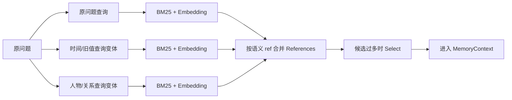
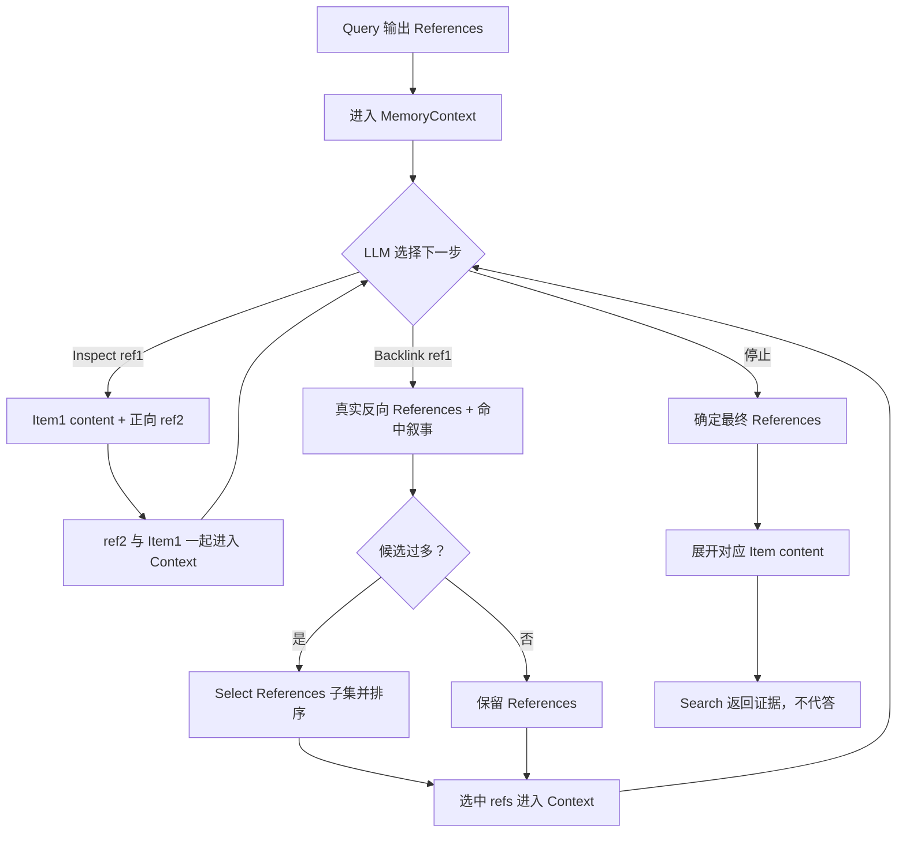
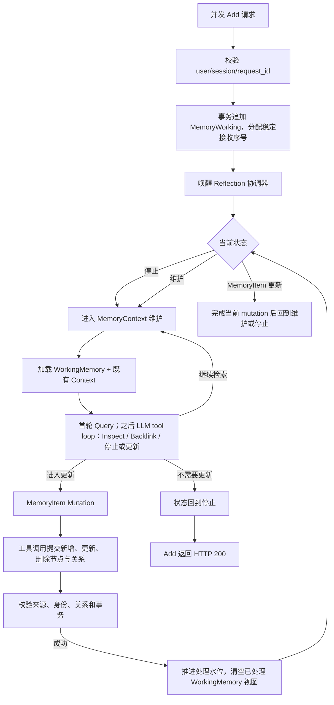

# AM-Link 二期重构设计与执行计划

状态：讨论稿；本轮已确认核心语义，尚未改动 `amlink/` 实现。
更新日期：2026-10-10。

本文把当前二期实现归档后的重构方向收敛成一套可讨论、可验证的架构。`MemoryItem`、`MemoryRelation`、`References`、`MemoryContext`、`MemoryWorking`、`Search`、`Inspect`、`Backlink`、`BFS`、`Select` 和三种 Reflection 状态沿用本轮已经明确的含义；上下文逐出/压缩是编排器的内部维护动作，不是模型的暂停工具。实现开始前，仍需确认文末列出的少数运行契约；未确认的内容不会当作当前代码事实。

## 设计边界

AM-Link 仍只提供官方要求的 Add/Search，主办方负责 Answer/Eval。Search 返回证据，不能生成最终答案或把答案伪装成记忆记录。当前二期代码、真实运行和失败档案仍然保留为研究基线；这份计划描述归档后重构目标，不回写成“已实现”。

官方 Add 请求要求持久化后立即可检索，未获批的异步状态地址不能返回 202；单个 Add 或 Search 请求最长可运行 30 分钟。公开 contract 快照中的 Add 调度上限为 16–64，Search 为 16–256；它们是评测调度上限，不是保证吞吐。`user_id` 是唯一检索隔离字段，连续 Add 使用同一个 `user_id` 属于同一记忆空间；`session_id` 用于来源会话组织，不是 Search 过滤条件。[官方 API Guide](https://agentmemories.ai/api-guide)

## 已确认的对象语义

### MemoryItem 与 MemoryRelation

`MemoryItem` 是六类结构化记忆节点：

`episode / person / entity / concept / event / fact`

`MemoryRelation` 是节点之间的关联。节点正文应保留自然、可读的叙事；类型、时间、来源和关系用于组织、校验和检索。`episode` 是由原始消息切分和重组出的高保真情景日志，保留 speaker、局部顺序、条件和原话片段，不是简单摘要。原始消息仍是不可替代的来源真源。

### References

一个 `Reference` 必须同时包含两部分：

1. 带类型和语义身份的引用格式，而不是随机编码或孤立数据库主键；
2. 面向模型的叙事，解释它为何被召回，包括可读标签、类型、正文预览、来源、关系、Query 命中片段或 Backlink 命中语义。

因此，Query、Backlink、Inspect、Select 和 Reflection 的 tool-result 都不能只返回 `ref`。模型看到的始终是“引用 + 这条引用在当前语境中意味着什么”。同名对象在引用中仍需有可区分的稳定身份；语义可读不等于允许把两个同名对象合并。

### MemoryWorking 与 MemoryContext

`MemoryWorking` 是 Add 进入的待处理原文缓冲区，带有原始角色、顺序、`user_id`、`session_id` 和请求幂等身份。它不是第二份事实库，处理水位推进后只清空待处理视图，原始消息仍保留。

`MemoryContext` 是 Reflection 和内部 LLM 调用的活跃语境，包含：

- 当前已加载的 MemoryItem 正文、MemoryRelation 和 References；
- 本轮或跨 Add 保留的 MemoryWorking 内容；
- Query/Inspect/Backlink 的命中叙事、来源片段和路径；
- 尚未解决的身份、更新、冲突和时间线索。

`Evit` 只逐出或压缩活跃语境，不删除 RawEvent、MemoryItem、MemoryRelation 或来源。上下文空间和长期事实库是两个不同的边界。

## Search 的统一语义

Search 是一个完整的复合行为，可以近似表示为：

```text
Query(question)
  → References（过多时默认 Select）
  → LLM 驱动的 BFS：Inspect / Backlink / 停止
  → Backlink References（过多时默认 Select）
  → Inspect 选中的 References，得到 Item content
  → 最终 References 与 Item content
```

Query 的主要发现方式是 BM25 + Embedding。两者在六类 MemoryItem 上工作；不把 raw lexical、node lexical、node embedding 设计成三套互相争抢的默认候选池。`raw` 通过 `source_refs` 展开，或在结构化节点尚未形成时作为明确的来源 fallback。

复杂问题可以先由模型产生若干查询表达。它们只是 Query 的不同输入，不是不同的最终记忆，也不决定答案：



分支在候选账本合并；同一 ref 只保留一个候选，但保留它由哪条 Query、哪种发现方式和哪段片段命中。这样 Select 能理解候选为何出现，观测也能说明证据是在分支发现、合并或 Select 阶段消失。

### LLM 驱动的 BFS

BFS 不再被描述成“从固定 seeds 自动展开到固定深度”。Query 的 References 进入 MemoryContext 后，LLM 根据当前问题、已有 Item content、关系叙事和未决线索，通过工具调用选择下一步：

- `Inspect(ref)`：读取该 Item 的正文、来源和正向 References；读取结果立即加入 MemoryContext；
- `Backlink(ref)`：读取真实指向该 ref 的 References；候选过多时先 Select，再把选中的 References 及其叙事加入 MemoryContext，并继续 Inspect 需要的引用；
- 停止：当前语境已经足够，或继续扩展不再有明确价值。

工具循环是有界的轻量决策循环，不是开放式 Agent runtime。每次工具结果回放后，模型都重新看到更新后的 MemoryContext，因此下一步可以沿刚刚出现的引用继续走。

这里的 BFS 仍由编排器保证图搜索边界：维护 `frontier`、`visited`、当前 hop 和全局预算；模型只决定从当前 frontier 选择哪些 ref、走 `Inspect` 还是 `Backlink`，以及是否停止。工具结果产生的新 refs 进入下一层 frontier，同一层可以有多个待探索引用；因此这是“模型选方向、系统守住分层和预算”的 BFS，而不是让模型自由遍历整张图，也不是把一次单路径调用误称为无限 Agent。



这张图表达两种典型多跳：

```text
正向：Inspect(ref1 of item1)
      → item1 content + ref2
      → Inspect(ref2 of item2)
      → item2 content 进入语境

反向：Backlink(ref1 of item1)
      → References（必要时 Select）
      → 选中的 ref2 及其叙事进入语境
      → Inspect(ref2)
      → item2 content 进入语境
```

`Inspect` 本身不做 Select，它读取已知 ref。`Backlink` 返回的是 References，才需要在候选过多时 Select。最终 Search 可以由模型选定 References，再由系统确定性展开对应 Item content；它不调用一个“回答问题”的模型。

### Select 的位置和含义

Select 是唯一的模型候选精炼原语，同时负责筛选和排序，不引入名为 rerank 的第二个步骤。

- Query 分支合并后，候选过多时 Select；
- Backlink 输出合并后，候选过多时 Select；
- 最终返回前仍按 `top_k`、字符预算和证据完整性确定装箱顺序；
- Inspect 不因为读取了正文而再次自动 Select。

每次 Select 的输入都包括当前问题、MemoryContext、候选 References 及其叙事；输出是原候选中的有序 References 子集。系统必须记录未被 Select 采用的候选，而不能把它们和“未召回”混为一谈。

## Add 与 Reflection 状态机

Add 是生产者，Reflection 是消费者。Add 可以并发把消息追加到 MemoryWorking；Reflection 对同一记忆空间维持稳定顺序和处理水位。第一版重构不把按 `user_id` 并行作为必需架构，也不为了不同用户提前引入复杂调度：先使用一个有界的顺序协调器，测量证明有必要后再扩展跨用户并行。连续 Add 使用同一个 `user_id`，更换 `user_id` 才开启新的隔离记忆空间。



### 状态一：停止

没有待处理 WorkingMemory，或本轮已经完成语境维护和必要 Mutation 时，状态为停止。Add 的同步处理不在 Reflection 尚未完成时返回成功；在本轮 Add 相关工作最终回到停止后，才返回 HTTP 200。若没有硬信号，仍可完成首轮 Query 和必要语境维护后停止，不强行创建 MemoryItem。

### 状态二：MemoryContext 维护

WorkingMemory 更新后进入此状态。模型先看到新原文、既有活跃语境和上轮保留的 References，然后通过工具调用：

1. 用当前新增叙事进行首轮 Query；这就是正常 Search 的 Query 阶段，不再另设 `orientation` 算子；
2. 根据 Query References 和已经出现的 References，选择 Inspect、Backlink 或停止；
3. 让每次 Inspect/Backlink 的结果立即进入 MemoryContext，继续影响下一步；
4. 编排器根据字符、候选和时间预算自动逐出/压缩重复、过时或当前无关的活跃内容；底层事实不受影响，模型不需要把这件事当成暂停决策；
5. 在上下文足够、预算耗尽或发现必须修改结构化记忆时，转入停止或 MemoryItem Mutation。

模型不需要决定“是否暂缓”或“是否把失败当作完成”。compact/Evit 的实际预算动作由编排器自动执行；工具循环达到上限而没有合法结束时，Add 明确失败并保留未处理 WorkingMemory。

### 状态三：MemoryItem Mutation

在语境维护完成、已有足够证据后，模型通过结构化 LLM tool call 提出节点和关系 mutation。工具调用优先借鉴 TinySoul 的 provider-neutral ToolSpec、ToolCallRecord 和 tool-result 边界；AM-Link 不解析模型自由文本来猜 JSON，也不接受任意函数名、SQL、跨用户 ref 或未经校验的关系。

本地校验器负责：

- 节点类型、正文和语义 ref 合法性；
- 新节点、更新节点与同名对象的身份区分；
- source References 是否真实存在且属于当前 user；
- 关系两端是否存在，关系是否有来源支持；
- 更新、冲突、遗忘和重复节点是否满足当前策略。

事务提交成功后推进处理水位，并清空已经处理的 MemoryWorking 缓存视图；RawEvent、MemoryItem、MemoryRelation 和 Reflection Workspace 中仍保留的 refs 不被删除。若新到达内容已经排队，状态回到 MemoryContext 维护；否则回到停止。

## Add 失败和并发边界

“Add 持久化到缓冲区”与“Add 成功返回”不是同一个瞬间。只有在官方要求的可检索条件满足，并且本轮必要 Reflection 已回到停止时，才返回 `200 success=true`。因此：

- Reflection 尚未完成时不能返回成功；
- 模型、Embedding、tool schema 或 Mutation 校验失败不能伪装成成功；
- 失败请求保留已提交的 WorkingMemory 和阶段记录，官方使用相同 `request_id` 重投时只完成尚未完成的工作；
- AM-Link 不在内部做模型重试、后台补偿式重试或自动整用户重建；
- 同一 `user_id` 的 Reflection 不并发修改同一 Context/MemoryItem 图；Add 接收可以并发，内部消费必须按接收序号推进。

这是一种同步外壳、内部生产消费分离的设计：Add 线程负责等待属于本次请求的消费结果，Reflection 逻辑仍可作为独立协调器和状态机实现。若后续事实证明一条 Add 等待整个 Reflection 会使评测吞吐不可接受，再单独讨论获批的状态查询地址，不把 202 偷换成现有接口的行为。

官方通常会先批量 Add、再统一 Search，但 Add/Search 协议没有“这一批 Add 已经结束”的边界信号。因此，AM-Link 不能把“等到未来所有 Add 都到齐后再整理”作为完成条件；可实现的同步语义是：每个 Add 都等待自己的接收序号被消费，协调器回到停止，且该请求内容已经可以被 Search。并发到达的后续 Add 可以在等待期间排队，按接收序号继续消费。这样，批量结束后再发 Search 时，前一批 Add 已分别完成必要处理，同时不会偷偷返回未完成的 200。

## References、身份和图质量

引用格式使用类型和可读身份，例如 `memory:episode/配额更新-2026-10-09`、`memory:person/joanna`、`memory:fact/daily-quota-before`。具体语法仍需限制字符、重名差分和不可变身份规则；不能因为两个名称相同就复用同一个节点。

Reflection 建立新节点前必须先通过 Search、Inspect 或 Backlink 读取当前语境中的相关旧节点。向量相似度只能提出候选，不能自动合并人物、实体或事实。模型需要同时看到已有节点正文、类型、来源和关系；校验器再阻止无来源的重复节点、跨人物错误合并、悬空边和把更新写成覆盖历史。

## 可观测性要求

每一次 Add、Reflection 和 Search 都要记录公开过程输入/输出，不记录隐藏思维链：

| 阶段 | 必须可见 |
| --- | --- |
| Add / WorkingMemory | 请求身份、消息顺序、接收序号、持久化状态、处理水位 |
| Query | 原问题、查询变体、BM25/Embedding 命中 ref、命中片段和分支来源 |
| References 合并 | 去重前后数量、同一 ref 的多分支命中、保留的叙事 |
| Select | 输入候选、输出有序 refs、排除原因、模型调用和用量 |
| Inspect | 输入 ref、Item content、正向 refs、来源 |
| Backlink | 输入 ref、真实入边、关系语义、Select 前后 refs |
| BFS loop | 当前 Context 摘要、LLM 工具调用、参数、结果加入 Context 的内容、停止原因和预算 |
| Evit（编排器内部） | 被逐出/压缩的 refs、原因、Context 前后大小；底层 MemoryItem 不变 |
| Mutation | tool call 提案、校验结果、提交节点/关系、冲突和水位推进 |
| Search 返回 | 最终 refs、Item content、排序、装箱和任何输出预算裁剪 |

因此可以区分：证据未存储、已存但未索引、Query 未召回、候选预算截断、Select 排除、Backlink 未扩展、BFS 停止、Evit 逐出、最终装箱丢弃，或者已经交给下游 Answer。没有 gold evidence 也可以记录这些过程；gold 只是可选的事后追踪层。

## 重构执行计划

### 0. 归档与契约冻结

归档当前 `amlink/` 为二期初版，保留源码、测试、运行记录和失败案例；不删除 `dataset/`、`benchmark/`、`casestudies/`、`visualization/`。为新实现单独建立目录和版本号，先冻结 Add/Search 外部协议、user/session 隔离、幂等和错误边界。

验收：旧实现可以按历史版本复现；新实现尚未声称兼容旧内部数据库；官方同步 Add/Search contract 有来源和日期记录。

### 1. 最小事实层

实现 RawEvent、MemoryWorking、MemoryItem、MemoryRelation、References 和处理水位。先完成事务、同 user 隔离、稳定接收序号、幂等重放和原文可检索；暂不接模型。

验收：并发 Add 不丢消息、不重排同 user 的接收顺序；成功重放不重复写入；未整理原文可 Search；不同 user 永不互见。

### 2. 统一 Search 原语

实现 Query 的 BM25 + Embedding、查询分支合并、References 叙事、Select、Inspect、Backlink 和 LLM 驱动的有限 BFS。Query 和 Backlink 的候选过多时调用 Select；Inspect 只做确定性读取。最终输出只返回证据。

验收：用金额、更新、时间、人物关系、冲突和拒答切片逐步检查每个 ref 在 Query、Select、Inspect、Backlink 和最终输出中的去向；真实 Embedding 和 Select 默认开启，失败显式暴露。

### 3. Reflection Context 维护

接入 provider-neutral API tool calling。首轮 Query 使用当前 MemoryWorking 和既有 MemoryContext；后续工具循环可以继续 Inspect、Backlink 或停止。每个工具结果立即回放到 Context，编排器按预算自动 compact；循环拥有显式轮数、字符、候选、图 hop、模型调用和总 deadline 预算。

验收：存在正向 `Inspect → forward ref → Inspect` 和反向 `Backlink → Select → ref → Inspect` 两类真实轨迹；模型不能调用任意工具或跨 user ref；没有“输出合法 JSON 但过程未执行”的假成功。

### 4. MemoryItem Mutation

使用结构化工具调用提出新增、更新、删除节点和关系；本地校验 source refs、身份、关系和状态，事务提交后推进处理水位。失败保留 WorkingMemory，不做内部重试。

验收：跨 Add 的更新、冲突、人物身份和同义重复案例能显示“先读取旧记忆，再 mutation”；重复 Add 不产生近似节点；关系两端和来源可回溯。

### 5. 联合靶场与可视化

把每个状态和 Search 子步骤接入现有 `benchmark/OBSERVABILITY.md`、native recorder 和统一网页。可视化按“输入语境 → 工具调用 → References 叙事 → Context 增量 → Mutation/返回”展示，保留旧案例轨迹并新增正向/反向 BFS 案例。

验收：一条运行可以点出证据在哪一步消失；能分别比较仅 Query、Query+Select、完整 LLM BFS 和 Mutation 后 Search；报告实际模型调用、延迟、字符/token 和费用，不把诊断 Answer 当官方成绩。

## 仍需确认的少数决策

1. **Add 的停止定义**：本计划按“本次 Add 关联的 WorkingMemory 已被必要的 Reflection 消费，语境维护和必需 Mutation 完成，状态回到停止”理解 `200`。是否允许“没有硬信号且仅完成语境维护、没有生成节点”直接停止并返回，需要在实现前固定。
2. **最终 Search 装箱**：当前建议是 LLM 决定最终 References，系统确定性展开对应 Item content；是否还要在最终装箱前再调用一次 Select，需要用候选规模和费用切片决定。
3. **Evit 的执行边界**：建议只作为编排器内部的自动逐出/压缩动作，不提供给 LLM 作为暂停或完成工具；实现时需确定触发时机和观测字段。
4. **语义 ref 的重名差分**：类型/语义 slug、不可变差分和跨会话人物别名如何组合，需要用人物关系案例冻结规则。
5. **单一协调器容量**：第一版按顺序协调器实现；只有真实 Add 等待时间证明必要，才讨论不同 user 的并行 worker，不改变同 user 顺序语义。
6. **BFS 工具参数粒度**：建议一次 `Inspect` 或 `Backlink` 只接收一个已知 ref，便于把每条路径、每一层和证据去向完整观测；同层的其它 frontier 由下一轮工具调用处理。是否允许一次调用携带多个 refs，应在最小 tool-call smoke 后决定，不影响 Search 的合并和 Select 语义。

以上决策确认后，才进入代码归档和新目录实施。当前方案已经把 Search 的复合语义、Reflection 的三状态、References 的模型叙事和 Add 的同步完成点分开；它们分别对应可测的组件和可观测的边界，不再依赖隐含的 `orientation`、`seed_refs` 或一次性 BFS。

## 依据

- [AM-Link 当前设计总览](../../DESIGN.md)
- [AM-Link 二期实现入口](../../amlink/README.md)
- [TinySoul Memory 设计](../../reference/TinySoul-Agent/docs/design/memory.md)
- [TinySoul canonical refs](../../reference/TinySoul-Agent/tinysoul/plugins/memory/refs.py)
- [TinySoul Reflection Task](../../reference/TinySoul-Agent/tinysoul/plugins/reflection/memory/task.py)
- [TinySoul LLM 工具协议](../../reference/TinySoul-Agent/tinysoul/llm/protocol/tools.py)
- [可观测性标准](../../benchmark/OBSERVABILITY.md)
- [官方 API Guide](https://agentmemories.ai/api-guide)
