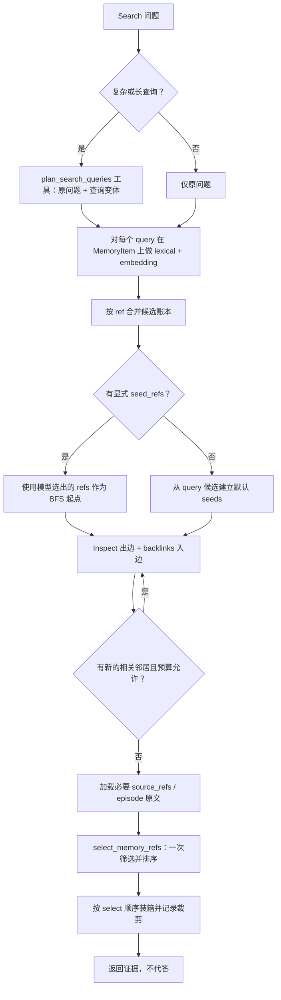
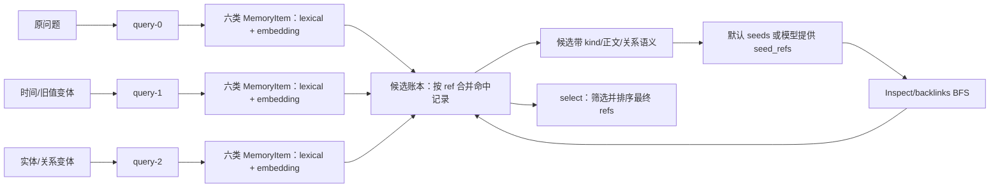

# AM-Link 二期记忆方法改进计划

状态：讨论稿；向量/select 默认启用和 select 兼具筛选、排序已确认，尚未实施。
更新日期：2026-10-10。
目的：把当前实现、TinySoul 的可复用设计原则、案例研究中暴露的断点，收敛成一套可验证的 Add/Search 改进方案。最终接口和默认值仍以代码及 amlink 文档为准。

## 设计目标

让 Search 主要在结构化 MemoryItem 上工作，并按 `episode/person/entity/concept/event/fact` 的问题需要分配候选预算；让 Reflection 在写入前主动寻找可能相关的旧记忆；让每次 Add 都能把新原文、旧结构化记忆和已召回证据放进一个有界的 Reflection 工作区；让 `raw` 保持来源真源但不与六类节点争夺默认候选名额；让类型、关系和原文证据分工清楚；让运行轨迹能说明一条证据在哪个阶段进入或离开链路。AM-Link 继续只实现 Add/Search，最终答案仍由比赛方生成。

## Search 的统一语义

Search 是 AM-Link 唯一的完整记忆检索抽象，可以近似写成：

```text
Search = 可选多通道 Query（BM25 / embedding）
       + 候选合并
       + BFS 多跳扩展（Inspect / backlinks）
       + select 引用精炼
       + 来源装箱
```

这里的“多通道”只指同一结构化节点集合上的 lexical 与向量发现，以及可选的 query 变体；不再把 raw lexical、node lexical、node embedding 设计成三套平行候选池。Inspect/backlinks 是 Search 的内部图算子：先由 query 或显式 `seed_refs` 确定起点，再逐层读取出边和入边，直到没有新的相关 frontier 或达到预算。BFS 完成后，`select` 才看到合并后的节点、路径和来源内容，负责同时筛选和排序。`raw` 通过 `source_refs` 作为来源证据进入，只有没有结构化节点或明确需要原话时才作为 fallback。

“火力全开”在这里意味着默认启用已选定的检索能力，并对真实调用和成本留痕；它不意味着无界候选、无限模型调用或吞掉依赖错误。Embedding 和 select 出错时显式失败，不静默退回较弱链路；比赛调用方负责约定内的重试，AM-Link 内部不重试。

## 现状与建议

| 主题 | 当前已验证 | 建议目标 |
| --- | --- | --- |
| 向量召回 | 已被真实切片调用，但配置默认关闭；只覆盖已整理的 MemoryItem，不覆盖 raw | 默认开启；BM25 与向量独立召回后融合，向量故障明确暴露 |
| 模型候选精炼 | 代码步骤名为 select，但只在复杂/长查询启用；观测类别和网页标签写成 rerank /“重新排序” | 每个有候选的 Search 默认执行一次 select；由同一次 LLM select 完成筛选和排序，不新增 rerank 操作 |
| Search 语义 | BM25/向量候选后做 Inspect、backlinks、图扩展，再由模型选择 | 固定理解为“可选 query 发现 → 合并 → BFS 多跳扩展 → select → 返回证据” |
| Reflection 旧记忆 | 已用新批次文本检索最多 24 个旧候选，并补一跳邻接；精确重复检查有限；每批上下文不跨 Add 保留 | 每次 Add 载入持久化 Reflection 工作区；工作区保留旧 refs、来源、查询分支和图路径；模型工具循环可多 query、多轮完整 Search 和多跳 Inspect/backlinks，再提交结构化 mutation |
| 节点类型平衡 | MemoryItem 可优先成为图遍历 seed，但所有类型共用候选窗口，容易被单一类型挤占 | 用 kind、正文和关系语义交给模型判断；Search 不设置固定 kind 准入阶段，显式 refs 作为可选 BFS 起点；不把 raw 作为默认平行通道 |
| 可观测 | native 轨迹能看到多数步骤，但两路融合贡献、部分截断原因和 select 语义存在缺口 | 记录每个方法步骤的输入、候选、输出、预算及排除原因，并接入专属可视化 |
| 模型协议 | OpenAI 兼容 Chat Completions 使用 response_format=json_object，没有发送 API tools/function tools | Reflection 和 select 使用 API tools 传递结构化调用；工具只由 AM-Link 执行，provider 能力需先做真实 smoke |

## 目标链路

### Add / Reflection

```mermaid
flowchart TD
  A[Add 原文提交 RawEvent + FTS] --> B[载入 Reflection Workspace]
  B --> C[合并新消息、WorkingMemory、旧 refs、来源和已知图路径]
  C --> D[有界 orientation：复用一次 Search，以当前 Add 为 query]
  D --> E[Search：Query 合并后 BFS Inspect/backlinks，再 select]
  E --> F{硬信号或工作区压力？}
  F -->|否| G[保留工作区；程序可选 compact]
  F -->|是| H[Reflection 模型读取工作区和工具说明]
  H --> I{模型发起哪种工具调用？}
  I -->|memory.search(query, seed_refs?)| J[完整 Search：Query + BFS + select]
  J --> K[返回选择后的 refs、来源和关系路径]
  K --> H
  I -->|memory.inspect(ref)| L[精确读取节点正文、来源和出边]
  L --> H
  I -->|memory.backlinks(ref)| M[精确读取真实入边及来源]
  M --> H
  I -->|reflection.finish(mutation)| N[本地校验来源、类型、身份和关系]
  N --> O[提交节点、边、索引；推进 working watermark]
  O --> P[清空已处理 WorkingMemory；保留结构化 refs 的工作区]
```

这张图把“每次 Add 的工作区”和“触发后的模型决策循环”放在一条链上。`WorkingMemory` 仍然只是尚未推进处理位置的 RawEvent 视图；`Reflection Workspace` 是可持久化的派生工作状态，保存旧 MemoryItem refs、来源 raw refs、query 分支、Inspect/backlinks 路径、已知冲突和未决线索。它不是第三份事实库，也不能替代 RawEvent 或已提交 MemoryItem。

目标 Search 不再把 raw lexical、node lexical、node embedding 当作三个平行候选池。它先在结构化 MemoryItem 上做词法和向量发现，再把节点 kind、正文和关系语义连同候选 refs 交给后续的 BFS 起点判断；不设置固定 kind 准入闸门。`raw` 主要通过已选节点的 `source_refs` 读取，作为原话证据和来源核对。只有还没有 episode/其它结构化节点、WorkingMemory 尚未整理，或问题明确要求原话时，raw 才作为有限 fallback。这样 raw 仍然不会丢，也不会因为原始消息数量大而挤掉结构化节点。

每条 query 分支仍会按 `ref` 写入同一个候选账本，账本保留 query、节点 kind、词法/向量来源的 rank/score、路径和来源。工作区下一次 Add 继续使用候选的 refs 和关系路径，但新消息、节点状态变化和撤回会使旧条目标记为待刷新，而不是无条件相信缓存。

一次 `memory.search` 是完整的复合检索原语：它接收一个 query（或同一轮的 query 变体），在结构化节点上发现候选，合并候选 refs，并可接受模型从当前上下文挑出的 `seed_refs`/扩展 refs；随后沿 frontier 多轮 Inspect/backlinks 做 BFS，把新邻居回写候选账本，加载必要 source refs，最后调用一次 `select` 返回有序 refs。Reflection 模型可以再次调用 `memory.search` 提出更窄的 query，或指定上一轮结果中的 refs 作为 BFS 参数。Inspect/backlinks 是 Search 内部的图算子，不必再作为 Reflection 的独立模型工具；这样模型只判断“是否需要继续 Search，以及下一轮要围绕哪些 refs 展开”，而不是手工编排每一跳。

**当前实现**不是这个循环：_reflection_context 将一批新消息拼成一个 query，调用一次 _discover，截取最多 24 个候选；之后从命中的旧 MemoryItem 取一跳出边和入边邻居。它没有多 query，也没有跨轮模型追加 Search。模型收到一次构造好的 JSON 上下文后产出 JSON mutation。这个基础方向能提供相关旧记忆，但检索粒度和图深度目前有限。

当前是否触发 Reflection 由确定性条件判断：对用户的未处理原文，待处理条数达到 8 条或字符数达到 6000，或出现遗忘/更新线索，或待处理内容跨会话时触发；随后按每批 32 条/18000 字符切分，最多 8 批。未触发时原文已经进入 FTS，可被 Search 找到。这个硬门槛应保留，用来保证明确的更新和遗忘不会被模型的工具调用绕过。

**建议目标**不额外增加一个只负责说“要不要 Reflection”的模型门卫。每次 Add 先加载工作区，并用当前 Add 文本对已有结构化节点执行一次有界 orientation；硬信号或工作区达到上下文压力时进入 Reflection tool loop。没有硬信号和上下文压力时，保存工作区即可；若本地字符预算接近上限，程序可以选择性 compact，去掉重复预览和已经失效的候选记录，但不删除来源、节点和边。compact 是本地预算动作，不暴露成模型工具，也不让模型决定暂缓。

### Orientation 是一次内部 Search

orientation 不是一套新的“轻量 query + 轻量 BFS”实现，而是 Search 的一次内部调用，区别只在调用者和目的：

```text
orientation Search
  输入：本次 Add 的新叙事 + Workspace 未决线索/已知 anchors
  query：原叙事（复杂时按 Search 规则生成变体）
  seeds：默认来自 query 候选；也可使用 Workspace 中已有的 seed_refs
  扩展：Search 内部有界 BFS（Inspect / backlinks）
  select：保留与当前 Add 相关的 refs 及顺序
  输出：更新 Workspace，不直接提交 MemoryItem mutation
```

因此，“Add 后的 orientation + BFS 是否就是一次 Search”的答案是：**是**。orientation 会使用和官方 Search 相同的 lexical/embedding 发现、query 合并、BFS、source_refs 展开和 select；它只把当前 Add 当作 query，把结果写入 Reflection Workspace。它的有界性来自 Search 的请求预算：query 变体数、候选数、`max_hops`、每入口邻居数、返回字符数、embedding 调用量和 deadline，而不是另设一个不同的检索器。

orientation 的结果不是最终答案，也不是结构化记忆提交。没有硬触发且 Workspace 未超过上下文压力时，保存这次 Search 的 selected refs、未选但可追溯的 refs、BFS 路径和未决线索即可；触发 Reflection 时，模型以这份 orientation 结果为初始上下文，决定是否需要下一次 `memory.search(query, seed_refs?)`。

触发后，模型看到的不只是本批 NEW，还包括 orientation 和工作区里之前 Add/Reflection 留下的旧 refs、来源、关系和检索路径。Add 协议本身没有外部 Search 问题，因此 orientation 的 query 来自当前新增叙事、工作区未决线索和已知实体/时间锚点；真正的用户问题仍由后续官方 Search 单独提供。模型只需判断上下文是否足够，若不足就再次调用完整 `memory.search`，并可从当前 refs 中选择 `seed_refs`；它不需要自己调用或逐跳编排 Inspect/backlinks。完成 mutation 提交后，已处理的 WorkingMemory 通过 `processed_through` 推进并从待处理视图清空；RawEvent 仍然保留，Reflection Workspace 则保留新旧结构化 refs、关系路径和未决线索，供下一次 Add 继续使用。

工具调用协议提供有结构的函数名、调用 ID 和参数；AM-Link 执行 allowlist 中的只读检索工具，并把真实结果作为 tool-result message 回放给模型。`finish` 只产生提案，来源、用户隔离、关系矩阵和数据库提交仍由 AM-Link 本地校验与提交。

不能把 tool calling 理解成“无需任何结构声明或校验”：API 工具本身需要参数定义，模型返回的 arguments 仍需按本地 Pydantic 合约验证，ref 仍需在当前 user scope 解析。借鉴 TinySoul 的 provider-neutral ToolSpec / ToolScope / ToolCallRecord / tool-result message 边界即可；不搬入它的 provider/model 重试、切换和复杂 runtime。AM-Link 的请求继续单次尝试、显式失败。

### Search



### Query expansion 是什么

Query expansion（查询扩展/查询改写）是先把一个复杂问题变成若干条更容易检索的搜索表达，再对每条表达做独立召回并合并结果。它只改变“拿什么文字去找候选”，不决定哪些候选最终保留，也不生成答案。它与 `seed_refs` 不同：query expansion 扩大文本发现范围，`seed_refs` 指定图扩展从哪些已知引用开始。

例如“之前和现在的每日配额分别是多少、发生了什么变化？”可扩成“每日配额”“之前的每日配额”“更新后的每日配额”“配额变更”。原问题仍保留；每条 query 都在六类 MemoryItem 上执行 lexical 与 embedding 发现，跨 query 合并时保留来源 query、节点 kind 和各路 rank，避免把候选为何出现抹掉。随后从 query 候选或模型明确给出的 `seed_refs` 开始，Inspect/backlinks 做 BFS，多跳结果回写候选账本，最后只调用一次 select 决定最终 refs 及顺序。

当前 Search 已有一段有限的 query expansion：仅当 COMPLEX 规则命中或问题超过 100 字符，且 graph 模式启用 search_model 时，先用 JSON mode 调用 query plan。它最多返回 3 条变体和一个 history 标记，原问题也始终检索，因此最多是“原问题 + 3 条变体”；每条分别执行一次 BM25 和（启用时）embedding。简单查询不做扩展。这里的“保留复杂查询触发规则”是指先不为了所有短问题额外调用一次模型规划查询；它不影响已确认的默认 embedding 和 select。当前 search_model 同时门控 query plan 与 select，实施时必须拆开语义：select 默认开启；query expansion 仍按复杂/长查询触发。工具化后，扩展阶段仅暴露 plan_search_queries function tool，不能调用任意检索或返回答案。未来可通过固定切片验证规则是否漏掉了短但需要拆解的问题，再调整触发方式。

三种粒度要分开：

| 粒度 | 做什么 | 当前 Search | Reflection 建议 |
| --- | --- | --- | --- |
| 多 query / query expansion | 同一次 Search 内对原问题及若干变体独立召回，再按 ref 融合 | 复杂/长问题最多 4 条 query | 由 Search 内部处理；模型无需逐条编排 query 分支 |
| 多轮 Search | 读上一轮结果后，形成新的 query 再搜索 | 当前没有模型驱动的 Search 轮次；只有前置 query plan | 可选：模型读结果后补搜，直到证据够用或预算/停止条件触发 |
| 多跳邻接 | 从 ref 读取相邻节点，沿新节点继续 Inspect/backlinks | 已有 BFS 式多跳，默认 max_hops=3；它沿图走，不会每一跳重跑词法/向量 Search | 模型只需在下一轮 Search 中提供 `seed_refs`；BFS 的逐跳执行由 Search 内部完成 |

当前 Mermaid 的条件回边表示真正的 BFS 控制流。Search 的 `_expand` 已按 frontier 逐层重复 Inspect 和 backlinks，递归加入新邻居直到没有新 frontier、达到 hop/neighbor/node 限制或请求 deadline；因此 Search 的多跳邻接已经实现。Reflection 当前仍是一次 `_discover` 加一跳直接边，目标改进是把 Add orientation 改成一次共用 Search，而不是再造一个 Reflection 专用 BFS。Reflection 的模型控制也简化为：读取当前 Search 结果，判断是否需要下一次 Search，并可从上下文 refs 中选择 `seed_refs`；每次 Search 内部自己完成 BFS 与 select，模型不逐跳编排 inspect/backlinks。

### 分支 query 在哪里合并

合并点位于“每条 query 的结构化节点发现”之后、“BFS 起点确定”之前，并且在工作区中保留为可追溯的候选账本，而不是只留下一个总分：



当前 Search 的 `by_ref` 已经在这个位置做了最小合并：同一 `ref` 只保留一行，并把各 query 的 `score` 相加；但它没有保存该 ref 被哪些 query、哪种发现来源（词法或向量）和哪次图路径命中，之后的候选截断也无法解释来源。下面的候选账本是对这段逻辑的可观测和可分析扩展，不是把同一证据复制多份。

具体处理分四步：

1. 每个 `query_id` 在结构化 MemoryItem 上独立执行 lexical 和 embedding 发现，按 `kind` 保存原始 rank/value、cosine/rank、命中片段和 query 来源。不同算法的数值不直接横比。
2. 以 canonical `ref` 去重，但不删除命中记录。例如同一 episode 同时被原问题和“旧配额”变体命中，只生成一个候选项，候选项内部保留两条 query 命中和各自 rank。重复 query 先按规范化文本去重；近似但不同的 query 仍保留分支 lineage。
3. 不在这里把六类节点硬分成固定比例，也不建立一个会先过滤 kind 的闸门。候选账本保留每个 ref 的 kind、正文、关系语义和 query 命中；这些内容随同上下文给模型。若模型已经知道某些引用值得沿图寻找，可在下一次 `memory.search` 中显式传入 `seed_refs`；没有显式起点时，Search 从 query 候选建立默认 seeds。
4. BFS 发现的新节点以 `source=graph`、`hop`、`path` 和关系来源回写同一账本。图邻居不重新走 lexical/embedding，除非模型在下一轮明确发起新的 query。必要时由 selected MemoryItem 的 `source_refs` 加载 raw 片段；raw 只作为来源和 fallback。最终 `select` 看到完整 lineage，再决定保留及顺序。

因此“分支查询后在哪里合并”的答案是：**在候选账本合并，BFS 前确定默认或显式 seeds，图扩展后回写同一账本，最后由 select 收敛**。Reflection 的下一轮 query 不会清空上一轮账本，只追加新的命中记录并对过期 refs 做状态标记。观测需要分别记录 `branch_hits`、`merged_refs`、`seed_refs`、`graph_refs` 和 `select_refs`，否则无法判断证据是在分支召回、BFS 起点、图扩展还是 select 阶段消失。

Reflection 的粒度建议是“模型控制器 + 共用有界 Search 原语”，而不是在 Add 开始时硬编码很多 query 或单独编排 BFS：

1. 初始模型上下文给出本批 NEW 叙事、已知 role/session/ordinal/time，以及 Workspace 中已有 refs、正文、关系和来源。模型可以提出 `memory.search(query, seed_refs?)`；每个调用内部都独立完成“query 变体合并 → 默认或显式 seeds → BFS → 一次 select”，调用方逐条回传。Workspace 只把这些调用的结果按 query、kind 和词法/向量来源记录到同一个 lineage 账本，不再在外面偷偷增加第二次全局 select。
2. 模型读完本轮结果后，可以跨轮补充更窄的 query，例如由找到的项目名、人物别名、旧金额、否定词或时间锚点引出下一次 Search。这才是多轮 Search。
3. Search 结果会返回 selected refs、有限未选 refs、关系路径和来源。模型不需要逐跳调用 `memory.inspect` 或 `memory.backlinks`；如果上下文仍不足，只需从已有 refs 中选择 `seed_refs`，发起下一次更窄的 Search。Inspect/backlinks 继续作为 Search 内部可观测的图算子，必要时可保留为调试或未来扩展接口。
4. 上下文足够或达到预算边界后，模型调用 `reflection.finish(mutation)`。同一次模型回合如果并行提交 Search 和 finish，编排器应先回放 Search 结果，再允许 finish；不能越过尚未回放的检索结果。

这里的“多次 query”和“多轮 Search”不应混为一项配置。前者是同一次 Search 内对原问题及变体的独立发现，由 Search 自己合并；后者依赖上一轮返回内容，由模型决定是否继续，并可以为下一次 Search 提供 `seed_refs`。因此 Reflection 不是完整 Agent runtime：每轮只需在 `memory_search` 和 `reflection_finish` 之间做一次有限选择。Inspect/backlinks 的多跳属于每次 Search 内部的 BFS，不再单独暴露成 Reflection 的逐跳循环。

工具循环属于正常的检索方法步骤，不能用“重试”来解释。需要为一次 Add 设有限的模型回合数、search 调用数、inspect/backlinks 节点数、邻接深度、返回字符数、embedding 调用量和总 deadline；达到预算却没有 finish 时显式失败，不静默生成一个看似完整的 mutation。具体上限先从固定切片测量覆盖、延迟、token/费用，再配置，不在方案中先猜数值。

Reflection 使用的 `memory.search` 仍复用同一完整 Search 原语：单条 query（内部可带 query 变体）经过结构化节点发现、默认或显式 seeds、BFS Inspect/backlinks、source_refs 展开，然后对合并后的非空候选执行一次 `select`。工具结果返回 selected refs、有限的未选 refs 及其排除/截断原因。Reflection 模型可以根据返回内容发起更窄的下一条 query，并从结果 refs 中选择下一次 Search 的 `seed_refs`；一次 Search 内部不把每个分支或每一跳再重复 select。外部官方 Search 也在所有 query 分支和图扩展合并后执行最终一次 select。两者都不引入名为 rerank 的操作。

select 可以在单次模型调用内同时完成筛选和排序：返回有序 refs 子集。API 工具 `select_memory_refs` 将这组 refs 作为有结构的 tool call 返回；query expansion 与 select 仍是独立阶段，前者扩大“找什么”的覆盖，后者收敛“留下什么”。

## 术语、引用与模型可见内容

### 统一术语

- query：BM25/embedding 发现候选。
- inspect：从已知 ref 读取内容与正向链接。
- backlinks：查找指向已知 ref 的真实入边。
- select：模型基于问题和候选内容同时完成筛选与排序，输出有序 refs 子集；这是本期唯一的模型候选精炼原语。

本期不引入 rerank 名称或第二种排序操作。现有 observation v1 的 operation enum 仍把该 span 归为 rerank，因此需设计 observation v2：operation、span 名、可视化阶段和文档统一写 select；旧 v1 轨迹可兼容读取，但界面需标注为历史记录中的旧分类，不可改写历史事件。

### Refs 形态

AM-Link 当前以 raw:&lt;id&gt; 和 memory:&lt;id&gt; 表示原文与节点；Reflection 暂用 new:&lt;label&gt; 提交新节点，由服务生成持久 opaque ref。来源关系通过 source_refs，图关系通过带类型和来源的边表达。模型看到 JSON 结构中的 ref、叙事文本、来源和边，不是 Markdown 超链接。

TinySoul 的 canonical ref 把记忆类型和可读 cite 放在地址中，例如 memory:daily/2026-10-09、memory:entity/mei-lin、memory:fact/f-digest。Markdown 关系正文也直接用这些链接表达“这是谁”“依据哪条 daily/fact”；Inspect 展示正文和 direct refs，backlinks 返回真实引用者。这让链接本身携带了类型/身份线索，而不是只有存储地址。

建议 AM-Link v2 先采用“语义 canonical cite，冲突时才差分”的方案，而不是强制每个 ref 都带随机 opaque ID：`memory:person/mei-lin`、`memory:person/mei-lin~2`、`memory:fact/daily-quota~2026-09`、`raw:message/r-701c`。类型和短 slug 让模型容易读懂；只有同一 slug 出现多个无法证明为同一身份的对象时，才追加稳定差分后缀。后缀可以是顺序号、短摘要或稳定 hash，具体形式由单用户串行写入和迁移规则决定。

直接把人名作为唯一标识是可行的，但必须提前接受三条规则：同名者不能复用同一 ref；ref 一旦发出不能因为后来发现重名而改名；显示名、别名或语言规范化变化放在节点正文和 alias 字段里，不修改 canonical cite。这样“有重复时再差分”不会迁移已有边和来源，只是在新对象创建时分配第二个 ref。它的风险是语义地址可能很长，且一个人改名后旧地址不再直观；因此可以提供 `memory:person/mei-lin` 的别名解析，但持久边仍使用当时分配的 canonical ref。若后续需要跨别名合并，保留旧 ref 并建立显式身份映射，不偷偷重写历史链接。

所以稳定 ID 不是为了让模型看到一串不可读字符，而是为了在重名、改名和身份纠错时保持地址不变；它是可选的冲突解决器，不应遮住语义标签。人物/实体的 slug 是地址 cite，不是身份判定；是否复用一个 person ref 仍需模型看到跨会话来源并有证据。原始用户/会话标识不直接拼入 ref，避免把外部身份编码进链接；ref 解析仍严格受 `user_id` 隔离。考虑到 AM-Link 数据含中文和多语言，slug 的规范化或转义策略需要讨论；实施时还需对现有 raw/memory refs、source_refs、边、向量和屏蔽状态做完整迁移。

给模型的正文也不应只是一组 ref 字段。应构造叙事化的链接上下文，例如：

> Mei Lin 的每日调用配额从 1,000 调整为 1,200。旧记录 [memory:fact/daily-quota~f-39d2] 的来源是 [raw:message/r-701c]（user，session s2，turn 14：“每天最多 1,000 次”）；新记录 [memory:fact/daily-quota~f-b430] 的来源是 [raw:message/r-82e1]（user，session s5，turn 6：“改为每天 1,200 次”）。新记录 --supersedes--> 旧记录，关系证据为 [raw:message/r-82e1]。

模型调用上下文应保留自然叙述，并在链接旁给出 kind、可读标签、实际正文、source_refs 与有向关系；结构字段帮助定位和校验，不把叙述压成标签拼盘。角色、session、ordinal、时间按真实可用信息呈现；缺失就留空/省略，不为数据集虚构 user_id 或 role。把 MemoryItem 与 source raw 分开展示，使“整理后的意思”和“原话证据”可以来回核查。

## 候选与图关系的平衡

TinySoul 的现有设计支持独立词法/向量发现、显式候选操作和多来源组合；它没有固定的 kind/relation 最低配额。AM-Link 也不应机械规定“每种节点至少一个”，因为简单事实题可能只需要一个 fact 和其来源。

当前 AM-Link 的实际竞争方式值得注意：FTS lexical 在 raw 和 memory 节点上共用一个 top-k；向量只搜 MemoryItem；两路按倒数排名融合后共用 candidate_limit；图 seeds 优先挑 MemoryItem；扩展节点随后又与 raw/MemoryItem 共用一个候选池；select 预览超字符预算时从末尾直接移除候选。它没有节点类型/关系类型配额，episode、fact/event 或 person/entity/concept 可能互相挤占。目标改进不是再增加 raw/node/vector 三个预算池，也不是另设 kind 闸门，而是把 lexical + embedding 视为结构化节点发现方式，把 kind/关系语义交给模型选择 BFS 起点，最后由 select 在 BFS 闭包上精炼。

这里要分清“结构化节点类型”和“来源证据的作用”：

| 结构化节点类型 / 来源 | 能表达什么 | 进入候选后的用途 |
| --- | --- | --- |
| `episode` | 连续会话或情景窗口的高保真重组日志，保留 speaker、顺序、条件、局部叙事和来源 refs | 默认上下文入口；承接 raw 的情景信息，但不是原文真源 |
| `fact` / `event` | 可独立核对的陈述或一次真实发生的事件，保留数量、时间、否定、状态和来源 | 精确问题、更新、冲突和多项事实的主要证据 |
| `person` / `entity` | 跨会话持续存在的人或对象，以及别名和身份线索 | 人物/对象定位、跨会话聚合和关系导航 |
| `concept` | 主题、兴趣、领域或抽象概念 | 语义入口和跨事件主题连接 |
| `raw` source | 不可变原始消息，含最细粒度角色、session、turn 和原话 | 由 selected nodes 的 `source_refs` 按需加载，用于核对和回溯；无结构化节点时作为 fallback |
| graph-neighbor | seeds 的真实 incoming/outgoing refs | 沿 `about/contains/supersedes/contradicts/same_event_as` 补足上下文 |

`episode` 不是 raw 的别名，也不是一句摘要。它是由连续原文切分、重组出的可读情景日志：例如保留“周三晚上，Mei 说她把车灯换成了 40 美元，随后又解释这是同一次购买”的局部顺序和说话者。它可以包含多个 fact/event 的上下文，但不应替代这些可独立检索的节点。RawEvent 仍然保留原文和来源定位；`raw → episode` 表示高保真整理和来源绑定，不表示删除或覆盖 raw。WorkingMemory 处理完成后，pending raw 从缓存视图清空，结构化 episode 和其它节点继续引用它们。

MemoryItem 可以按候选作用区分 context（episode）、claim/event（fact、event）与 navigation（person、entity、concept）。前两组承载情景、直接事实、日期和多条记录，后一组用于身份、主题和跨会话连接。它们是预算分组和分析视角，不等于强制每条数据同时创建所有类型。

### 节点类型由谁选择

不再单独增加一个 LLM 节点类型路由器，也不把 raw lexical、node lexical、node embedding 作为三个需要互相竞争的通道。每条 query 默认在六类结构化节点上执行 lexical 和 embedding，候选带着 kind、正文和关系语义进入 Search；不设置先过滤某种 kind 的准入闸门。LLM 可以做 query expansion，也可以从已有上下文的 refs 中选择下一轮 `seed_refs`，但不负责逐跳执行 Inspect/backlinks。

推荐的分工是：

- 短而明确的问题先用确定性线索标出 `exact-value`、`time`、`person/relationship`、`history/update/conflict`、`multi-item`；不额外调用分类模型。
- 复杂/长问题由 `plan_search_queries` tool 返回若干 query、每条 query 的 purpose/anchors 和可选 kind hints。Reflection 中也可以由 `memory.search` 的参数携带同样的意图提示，但它只是优先级提示，不是硬过滤器。
- 引擎对每条有效 query 默认执行六类节点的 lexical + embedding；将候选的 kind、正文和关系语义交给 Search 的 seed 规划，默认 seeds 来自 query 候选，也可以使用模型提供的 `seed_refs`，再进行 Search 内部的 BFS Inspect/backlinks。选中的节点需要 raw 证据时，通过 `source_refs` 加载原文。
- 若某个 kind 没有结果、索引未建立或被预算跳过，必须记录真实原因；不能把模型没有选择该 kind 误写成“无证据”。

例如，问题“之前和现在的每日配额分别是多少？”可以让模型标出 `history/update`，生成“每日配额”“旧配额”“更新后配额”三个 query，并提高 `fact/event/episode` 和 `supersedes` 两端的预算；它仍然保留六类节点的 lexical + embedding 发现，让 select 最后判断哪些内容真的需要交付。这样利用 LLM 的语义改写能力，又不让路由本身成为证据丢失的单点故障。

建议按四层组织，不预设固定比例：

1. **节点内分源召回**：每个 kind 分别保存 lexical rank/value、embedding cosine/rank、命中 query 和可读片段。不同算法分数不直接横比；raw 不作为默认平行候选池。
2. **构造导航与邻接**：MemoryItem 用作有类型的导航入口；来源 raw 随 selected node 按需展开；关系扩展只从被发现的 seeds 沿真实出边/入边加入邻居，并带上 relation、方向、路径及其来源。不要把整张图预先打散加入候选。
3. **模型可见的 seed 语义**：把 kind、正文、关系、时间和来源连同 refs 呈现给模型。模型可以根据“需要找人物关系、旧值、冲突另一端或同一事件”等语义选择 `seed_refs`，但不直接编排每一跳。没有显式 seeds 时，Search 使用 query 候选；图扩展始终由内部 BFS 完成。
4. **统一 Select**：在有限总字符/候选预算内给 LLM 一份经过 BFS 的候选闭包，带 refs、正文、关系路径和 source_refs，由一次 select 完成筛选和排序。被 select 排除与在 query/seed/BFS 或装箱阶段截断必须是独立观测事实。

具体执行可以分为“结构化节点发现 → seed 规划 → BFS 图扩展 → 共享预算装箱”：先为六类节点分别保留 lexical/embedding 结果；模型可在上下文中看到 kind 与关系语义并选择 `seed_refs`，否则由 query 候选建立默认 seeds；图扩展另记邻接来源与 hop；BFS 完成后，select 在共享字符预算内决定证据子集和顺序。关系证据组整体计入预算。selected node 的 raw 来源按需展开，计入所属证据组而不是新增一个 raw 类型池。

短查询先用可解释词面提示标识 exact-value、time、person/relationship、history/update/conflict、multi-item 等意图；复杂/长查询复用 plan_search_queries 工具返回的意图标签和变体，不再增加一个单独分类调用。意图主要用于 query expansion 和向模型解释“哪些 refs 值得沿图展开”，不能直接排除其它节点类型；最终 select 仍看到各 kind 的来路并作语义筛选。

关系候选也应避免度数高的通用节点垄断邻居窗口。每个 seed 的 outgoing/incoming、关系类型分开记录；按问题优先级扩展，留出剩余预算给另一方向/关系；冲突和 supersedes 两端作为一个证据组。没有 query-relevant neighbor 就停止该分支，不为“图看起来完整”而扩展所有边。Search 当前 _expand 使用每入口 max_neighbors 和全局 max_nodes，按单个 relation score 排序，没有关系类型保护；该限制需在切片上验证，避免一开始再堆复杂打分规则。

评估时对每个案例同时记录候选在各 kind、词法/向量来源中的排名、seed 选择与最终路径，逐层改变共享预算和 BFS 起点策略。切片至少覆盖：LM04 精确金额/重复购买、LoCoMo 人物共同兴趣、BEAM 新旧冲突、LM02 时间口径、遗忘与拒答。比较各 kind 的候选覆盖、seed 是否选对、各阶段流失、select 输入/输出、误截断、延迟和模型/embedding 次数；若案例提供来源标注，再计算来源召回作为额外效果指标。根据这些实测再定默认预算，不先拍一个 20/30/50 的比例。

## Reflection 稳定性与图质量

当前 AM-Link 的 API 请求没有使用 tools 或 tool_choice，也没有 Function Calling。Reflection 和 Search select 都使用 response_format=json_object，再由本地 Pydantic 模型解析；合法 JSON 只能保证外形，不保证身份、来源或关系语义正确。

建议采用 API function tools 作为模型输出/检索控制协议，而不再要求模型自由撰写 JSON 对象：

- Search 的 select 任务只暴露 select_memory_refs 工具，返回候选 refs 的有序子集；调用方校验 refs 都来自本轮候选。该工具负责筛选和排序两件事。
- Reflection 主要暴露 `memory_search` 只读工具和 `reflection_finish` 状态工具。`memory_search` 接受 query 和可选 `seed_refs`，内部完成 query、BFS、select；模型可以多轮找旧记忆，完成时以 finish 工具参数提交 items/links/forget 提案。`memory_inspect`/`memory_backlinks` 保留为 Search 内部算子和观测阶段，必要时再作为调试或后续扩展接口；上下文 compact 由编排器在工具循环前后按预算选择，不让模型把 compact 当成一个事实操作或暂缓出口。
- Tool call 参数仍要有工具定义，TinySoul 也是由 provider-neutral ToolSpec 携带参数定义，再由 provider adapter 映射成 API tools。这个参数定义不是另造一套模型输出 JSON Schema；本地仍必须用 Pydantic 和业务规则校验模型参数，不能把供应商结构化输出当成信任边界。
- AM-Link 只执行明确 allowlist 的内部工具，不接受模型给出的任意函数名、SQL、user_id 或跨用户 ref。`finish` 不直接绕过 Reflection 校验器和事务提交；Workspace compact 也不改变 RawEvent、MemoryItem 或关系真源。
- API 连接层要归一化 tool call id/name/arguments 和 tool-result message；工具输出作为下一条模型上下文回放。模型 API 调用失败、参数无效或循环预算耗尽都显式返回，不执行内部错误重试。计划中的多轮 tool call 是正常方法步骤，不是失败重试。

TinySoul 的可复用重点是分层：LLM 层定义 provider-neutral ToolSpec/ToolScope/ToolCallRecord/ToolResultMessage 并映射供应商协议；LLM 层不执行业务工具；Kernel/Action/Plugin 解释和执行调用、将结果回放并决定下一轮。AM-Link 可实现这个最小边界，不需要照搬 TinySoul 的多 provider/model chain、retry policy 或完整 runtime。真实 GPT-4o-mini 接入端是否支持所需 tools/tool_choice 语义，必须先用最小 smoke 验证；失败时显式阻断实现选择，不静默退回 JSON mode。

Reflection 的语义稳定性仍需独立验证：固定案例检查工具调用是否搜到旧证据、是否引用已有身份、是否对关系给出 raw 依据。向量相似度只提出候选，不自动合并人物或事实；同名人物需要身份依据，近义事实需要比较时间、实体、谓词和原文来源。

跨会话人物采取“别名候选 + 明确身份依据”策略，同名不等于同一人；近义事实采取“候选匹配 + 语义比较”，结果可为复用节点、补来源、建立同事件关系、建立冲突/更新关系，或保留为不同节点。relation 必须有原文依据，且按类型约束方向。单独统计重复、误合并、漏边和错误边，不能只看节点数。

## 延后议题：证据到答案的闭环

本期先不增加证据槽位模型输出、closure 检查或 AM-Link Answer 辅助。LM04 的多笔金额、LoCoMo L04 的多个共同兴趣、BEAM B02 的冲突表达和 LM02 的时间口径，仍作为后续研究切片：先通过 Search refs、来源与真实靶场 Answer/Eval 观察断点，再决定是否需要在 Search 结果里加入证据覆盖提示。比赛方仍负责最终 Answer/Eval。

## 专属观测与可视化

新 observation 语义应能逐段重建 mermaid 方法链路的输入、输出和损失位置。每个 artifact 包含 stage、request、输入 refs、输出 refs、内容预览、耗时、模型/向量调用和预算；候选排序信息不能把 BM25、cosine 与融合分数混成一个可横向比较的数。

| 阶段 | 必须可见的输入/输出 |
| --- | --- |
| raw commit / index | 原始消息 refs、实际持久化数量、FTS 建立/更新结果、待整理位置；明确区分未尝试、成功、失败和跳过；不根据成功状态推断 Reflection 已完成 |
| reflection workspace | 本次 Add 载入的旧 refs、上次保留的 query 分支/路径、追加和失效的 refs、compact 前后字符量、未决线索和状态版本 |
| query plan / tool query | 原问题、query 变体、来源于哪一轮、模型提出的搜索理由（简短结构字段，不保存隐藏思维链） |
| discover.lexical | 每条 query 的六类 MemoryItem refs、kind、原始 BM25 排名/值、命中文本 |
| discover.embedding | 每条 query 的六类 MemoryItem refs、kind、模型标识、cosine 与排名；不得记录密钥 |
| query merge / seed planning | 每个 ref 的 query 分支命中、kind、lexical/embedding 来源、各路排名、融合名次、默认或模型提供的 `seed_refs`、未选起点原因和预算余量；保留 branch lineage |
| inspect / backlinks | Search 内部 BFS 的种子 ref、出边/入边、关系来源、实际读取节点、当前 hop、visited 状态和不扩展原因 |
| select | 模型所见候选投影、select_memory_refs 调用参数/顺序、未选 refs、参数校验结果 |
| pack | 最终内容与来源；top-k/字符预算/状态过滤的剔除 refs 和理由 |
| reflection tool loop | 每轮模型调用、tool call、tool result、下一轮父子关系、停止/继续原因 |
| reflection.finish / commit | finish 工具参数、校验字段错误、创建/复用/边变更、提交或显式失败 |
| benchmark answer/eval（可选） | 实际 Search 返回内容、诊断 Answer、独立后验评注；用于分析下游是否使用证据，不要求 gold 预先绑定 |

可观测的首要目标是解释“这一条运行实际做了什么”，不要求每个案例先具备 gold evidence 标注。对已知 ref，可沿生命周期标出：未存储、已存但未索引/索引失败、未被 query 召回、候选预算截断、关系未扩展（并给出深度/方向/预算/相关性等停止原因）、被 select 排除、被装箱或输出预算丢弃、已送入 Answer 上下文。最后一种“Answer 收到但没有使用”需要 Answer/Eval 或人工评注提供可观察证据；不能仅凭 Search 返回推断。若没有已知的目标证据 ref，只能报告各阶段实际输入、输出和停止原因，不能断言“漏掉了正确证据”。gold 或人工标注只作为可选叠加层，把已知 ref 沿轨迹追踪；它不是采集、渲染或过程分析的前置条件。

可视化应突出每个实际阶段的输入/输出内容和状态，而不制造“正确性”标签。原文和完整运行载荷继续存于忽略的本地 artifact；过程事件通过稳定 refs/哈希链接它们，视图提供受限预览。只记录公开模型输入/输出和 tool calls，不记录隐藏思维链。

## 分步实施与验收

1. **Observation 与引用协议**：为 workspace、query branch merge、kind admission、select、候选来源、图 hop 和 tool loop 增加明确的 AM-Link 事件/产物字段；设计有语义的 typed refs 和可读叙事投影。验收：一条运行能从原文输入一路点到工作区、episode/其它 refs、边、模型工具调用、校验与返回内容。
2. **默认完整 Search**：embedding 默认开启；每个非空结构化节点候选集都执行一次 select_memory_refs 工具调用，select 一次完成筛选和排序；查询扩展暂保留复杂/长查询触发。Search 内部一次完成 query 分支合并、默认或显式 seed 规划、BFS Inspect/backlinks、source_refs 展开和 select。验收：成功轨迹确实包含六类节点发现、seed 选择、BFS 和 select；provider 错误显式可见；没有静默降级。
3. **Reflection Workspace 与工具循环**：为每次 Add 载入并更新持久化工作区；接入 provider-neutral tool call/result 消息最小子集；开放有界完整 `memory.search(query, seed_refs?)` 和 finish 提案工具，Inspect/backlinks 留在 Search 内部。compact 由编排器按预算选择，不暴露为模型的 defer 工具。验收：模型可复用上次 Add/Reflection 的旧 refs，跨 query 变体、有限的后续 Search 和图 hop 找旧记忆；finish 后 WorkingMemory watermark 推进并清空已处理缓存视图，工具结果可回放。
4. **查询分支合并与 seed 语义**：以 ref 候选账本合并 query 分支，保留 episode/person/entity/concept/event/fact 的语义标签，由模型按上下文选择 `seed_refs` 或由 Search 使用默认 seeds；raw 只通过 source_refs 或无结构化节点 fallback 进入上下文，不预设 raw 平行配额。验收：固定切片可比较分支覆盖、seed 选择、BFS 阶段流失、内容覆盖、关系组完整性和成本。
5. **episode、身份与关系质量**：把 episode 定义为高保真情景日志，建立 raw→episode 来源链；迁移 ref 到有语义类别的可读路径，并在同名时追加不可变差分；加强 alias 候选、同名保护、近重复对比和关系证据校验。验收：固定人物/更新/冲突/同事件案例分别统计 episode 完整性、错误合并、重复、漏边、错误边。
6. **小样本验证与真实 provider smoke**：先做真实 tool-call 最小 smoke，再运行 Reflection/Search 切片；不把语法合法等同于方法正确。分别报告 Add 成功率、工作区复用率、过程轨迹完整性、证据召回、图质量、诊断 Answer、延迟和真实模型/embedding 次数及费用。遇到接口失败不叠加内部重试。

## 讨论确认点

已明确的设计要求：embedding 与 select 默认启用；select 同时筛选和排序，不另设 rerank；Search 是“可选 query 发现 → 候选合并 → BFS Inspect/backlinks 多跳扩展 → source_refs 展开 → select”的完整复合原语；节点 kind 作为模型可见语义，不设置先过滤 kind 的固定闸门；query 变体由 Search 内部处理，Reflection 只在上下文不足时发起有限的后续 Search，并通过可选 `seed_refs` 控制下一次 Search 的起点；BFS 由每次 Search 内部完成；每次 Add 先以当前 Add 调用一次 orientation Search，硬信号或工作区压力才进入简化的 Reflection Search loop；compact 由编排器可选执行，不是模型的 defer 工具；WorkingMemory 处理后清空缓存视图，结构化 refs 留在 Workspace；优先使用 API tools 传递 query plan、select、`seed_refs` 和 Reflection finish 结构；query expansion 暂保留复杂/长查询触发规则；Answer 辅助暂缓；运行观测以真实过程为主，不以 gold 标注为前提。

建议下一步围绕两个仍需共同定形的实现问题讨论：一是 episode 的切分、合并和更新规则，以及模型如何从 kind、关系和正文中选择 `seed_refs`；二是 Reflection Workspace 的持久字段，以及完整 Search/Reflection loop 的调用、Search 轮数、BFS 深度、候选和字符上限如何用案例切片校准。具体上限应该由真实片段的覆盖/延迟/费用曲线决定，不能先拍数值。当前建议采用“类型/语义 slug 作为默认 canonical ref，重名时追加不可变差分”，完整 ref 在模型上下文中始终可见。

上述均为设计目标，不代表当前代码已采用工具调用、默认向量、typed ref 或 Reflection 多轮搜索。

## 依据

- [当前 Add/Search 设计总览](../../DESIGN.md)
- [AM-Link 二期协议](../../amlink/PROTOCOL.md) 与 [实现入口](../../amlink/README.md)
- [可观测性事件标准](../../benchmark/OBSERVABILITY.md)
- [TinySoul 记忆设计](../../reference/TinySoul-Agent/docs/design/memory.md)
- [TinySoul LLM 与工具调用设计](../../reference/TinySoul-Agent/docs/design/llm.md)、[工具协议](../../reference/TinySoul-Agent/tinysoul/llm/protocol/tools.py)与[供应商工具映射](../../reference/TinySoul-Agent/tinysoul/llm/provider/openai_sdk/payloads.py)
- [TinySoul canonical refs](../../reference/TinySoul-Agent/tinysoul/plugins/memory/refs.py)
- [TinySoul Inspect/Search 原语讨论](../../reference/TinySoul-Agent/docs/chat/04%20context-inspect-and-search-design.md)
- [2026-10-08 AM-Link 真实运行与案例分析](../doing/2026-10-08-amlink-answer-research.md)
